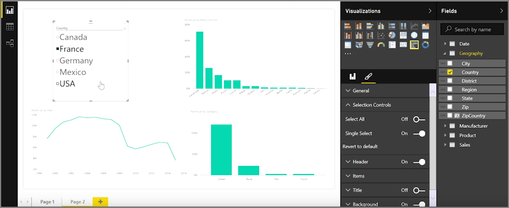
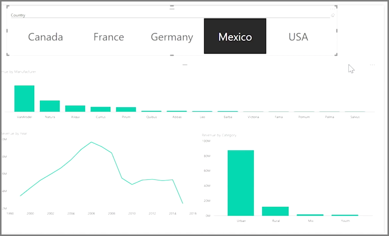

<properties
   pageTitle="Slicers"
   description="Use slicers to visually segment your data"
   services="powerbi"
   documentationCenter=""
   authors="davidiseminger"
   manager="mblythe"
   backup=""
   editor=""
   tags=""
   qualityFocus="no"
   qualityDate=""
   featuredVideoId="7rrvpa6KUto"
   featuredVideoThumb=""
   courseDuration="7m"/>

<tags
   ms.service="powerbi"
   ms.devlang="NA"
   ms.topic="get-started-article"
   ms.tgt_pltfrm="NA"
   ms.workload="powerbi"
   ms.date="09/29/2016"
   ms.author="davidi"/>

# Create and format slicers

Slicers are one of the most powerful types of visualizations, particularly as part of a busy report. A <bpt id="p1">**</bpt>slicer<ept id="p1">**</ept> is an on-canvas visual filter in <bpt id="p2">**</bpt>Power BI Desktop<ept id="p2">**</ept> that lets anyone looking at a report segment the data by a particular value, such as by year or by geographical location.

To add a slicer to your report, select <bpt id="p1">**</bpt>Slicer<ept id="p1">**</ept> from the <bpt id="p2">**</bpt>Visualizations<ept id="p2">**</ept> pane.

Drag the field by which you want to slice and drop it top of the slicer placeholder. The visualization turns into a list of elements with checkboxes. These elements are your filters - select the box next to one to segment, and all other visualizations on the same report page are filtered, or <bpt id="p1">*</bpt>sliced<ept id="p1">*</ept>, by your selection.

There are a few different options available to format your slicer. You can set it to accept multiple inputs at once, or toggle <bpt id="p1">**</bpt>Single Select<ept id="p1">**</ept> mode to use one at a time. You can also add a <bpt id="p1">**</bpt>Select All<ept id="p1">**</ept> option to your slicer elements, which is helpful when you have a particularly long list. Change the orientation of your slicer from the vertical default to horizontal, and it becomes a selection bar rather than a checklist.

