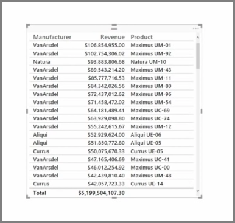
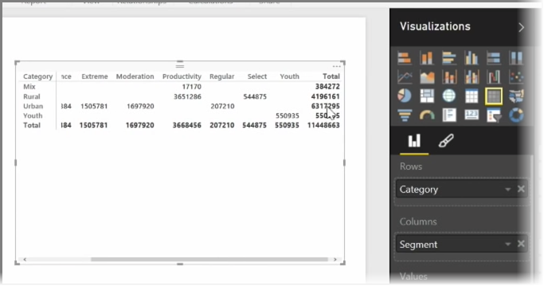

<properties
   pageTitle="Tablas y matrices"
   description="A veces una tabla o matriz es el elemento visual que necesita"
   services="powerbi"
   documentationCenter=""
   authors="davidiseminger"
   manager="mblythe"
   backup=""
   editor=""
   tags=""
   qualityFocus="no"
   qualityDate=""
   featuredVideoId="9xkErXYZQkU"
   featuredVideoThumb=""
   courseDuration="8m"/>

<tags
   ms.service="powerbi"
   ms.devlang="NA"
   ms.topic="get-started-article"
   ms.tgt_pltfrm="NA"
   ms.workload="powerbi"
   ms.date="09/29/2016"
   ms.author="davidi"/>

# Uso de tablas y matrices

Además de una gran cantidad de gráficos, Power BI Desktop también admite más visualizaciones tabulares. De hecho, al tomar un campo de categoría o campo de texto y arrástrelo al lienzo del informe, obtendrá una tabla de resultados de forma predeterminada. Puede desplazarse hacia arriba y hacia abajo por la tabla e inicialmente se ordenarán alfabéticamente.

Si tiene información numérica en una tabla, como los ingresos, una suma total aparecerá en la parte inferior. Puede ordenar manualmente por cada columna haciendo clic en el encabezado para alternar el orden ascendente o descendente. Si una columna no es lo suficientemente ancha para mostrar todo su contenido, haga clic y arrastre el encabezado lateralmente para expandirla.

El orden de los campos de la *valores* depósito en el **visualizaciones** panel determina el orden en que aparecen en la tabla.

Un **matriz** es similar a una tabla, pero tiene encabezados de categoría diferente en las columnas y filas. Al igual que con las tablas, la información numérica se suprimirán automáticamente a lo largo de la parte inferior y el lado derecho de la matriz.

Hay muchas opciones de cosméticos para matrices, como columnas de tamaño automático, Alternar fila totales de columna, establecer los colores y mucho más. Cuando se crea una matriz, asegúrese de que los datos de categorías (los datos no numérico) están a la izquierda de la matriz y los archivos numéricos a la derecha para asegurarse de la barra de desplazamiento horizontal aparece y para asegurarse de que ese comportamiento de desplazamiento funciona correctamente.
