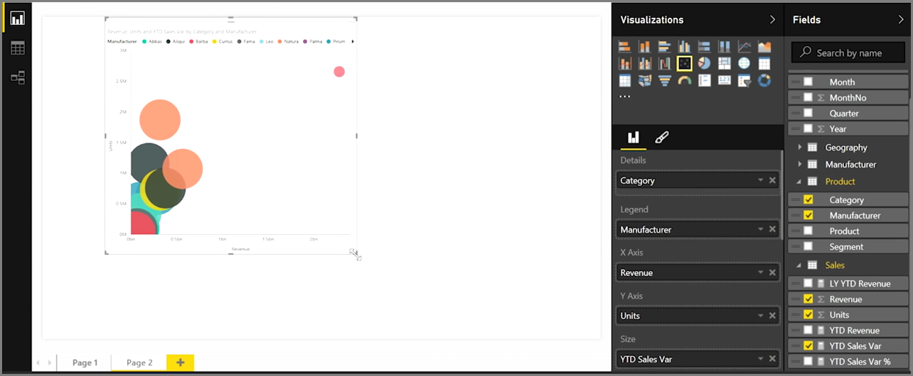

<properties
   pageTitle="Gráficos de dispersión"
   description="Long live burbujas - ver los gráficos de dispersión en acción"
   services="powerbi"
   documentationCenter=""
   authors="davidiseminger"
   manager="mblythe"
   backup=""
   editor=""
   tags=""
   qualityFocus="no"
   qualityDate=""
   featuredVideoId="xLQ_ZVScI60"
   featuredVideoThumb=""
   courseDuration="9m"/>

<tags
   ms.service="powerbi"
   ms.devlang="NA"
   ms.topic="get-started-article"
   ms.tgt_pltfrm="NA"
   ms.workload="powerbi"
   ms.date="09/29/2016"
   ms.author="davidi"/>

# Cómo utilizar los gráficos de dispersión

Si desea comparar dos medidas distintas, como los ingresos de ventas y unidad, una visualización habitual usar es un gráfico de dispersión.

Para crear un gráfico en blanco, seleccione **gráfico de dispersión** desde el **visualizaciones** panel. Arrastre y coloque los dos campos que desea comparar desde la **campos** panel para el *eje X* y *eje Y* Opciones de depósitos. En este punto, el gráfico de dispersión probablemente solo tiene una pequeña burbuja en el centro del objeto visual: necesita agregar una medida para el *detalles* depósitos para indicar cómo desea segmentar los datos. Por ejemplo, si se comparan las ventas de artículos y de ingresos, quizás desea dividir los datos por categoría, o el fabricante o el mes de venta.

Agregar un campo adicional para el *leyenda* depósito color sus burbujas según el valor del campo. También puede agregar un campo a la *tamaño* depósitos para modificar el tamaño de burbuja según ese valor.

Los gráficos de dispersión tienen muchas visuales opciones de formato, como la activación de un esquema de cada burbuja coloreado y alternar etiquetas individuales. Puede cambiar los colores de datos para otros tipos de gráfico.

Se puede crear una animación de la burbuja cambia del gráfico con el tiempo agregando un campo de tiempo para el *eje de reproducción* depósito. Haga clic en una burbuja durante una animación para ver un seguimiento de su ruta de acceso.

>Nota: Recuerde que si solo ve una burbuja en el gráfico de dispersión, es porque Power BI consiste en agregar los datos, que es el comportamiento predeterminado. Agregar una categoría a la *detalles* frentes, en la **visualizaciones** panel, para obtener más burbujas.
