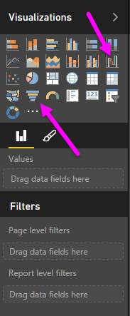

<properties
   pageTitle="Gráficos en cascada y de embudo"
   description="Obtenga información acerca de los gráficos de embudo y en cascada avanzados"
   services="powerbi"
   documentationCenter=""
   authors="davidiseminger"
   manager="mblythe"
   backup=""
   editor=""
   tags=""
   qualityFocus="no"
   qualityDate=""
   featuredVideoId="maTzOJSRB3g"
   featuredVideoThumb=""
   courseDuration="5m"/>

<tags
   ms.service="powerbi"
   ms.devlang="NA"
   ms.topic="get-started-article"
   ms.tgt_pltfrm="NA"
   ms.workload="powerbi"
   ms.date="09/29/2016"
   ms.author="davidi"/>

# Cómo usar en cascada y gráficos de embudo

Gráficos de embudo y de cascada son dos de las visualizaciones estándares más interesantes (y quizás poco frecuente) que se incluyen en Power BI. Para crear un gráfico en blanco de cualquier tipo, seleccione el icono de la **visualizaciones** panel.

            **Gráficos de cascada** se utilizan normalmente para mostrar los cambios en un valor determinado en el tiempo.

Cascadas sólo tienen depósito dos opciones: *categoría* y *eje Y*. Arrastre un campo de tiempo como *año* a la *categoría* depósitos y el valor que se desea realizar un seguimiento a la *eje Y* depósito. Períodos de tiempo donde se ha producido un aumento del valor se muestran en verde de forma predeterminada, aunque períodos con una disminución en el valor se muestran en rojo.

            **Gráficos de embudo** se utilizan normalmente para mostrar los cambios en un proceso determinado, como una venta esfuerzos de retención de canalización o el sitio Web.

Ambos **cascada** y **embudo** gráficos se pueden segmentar y personalizar visualmente.
