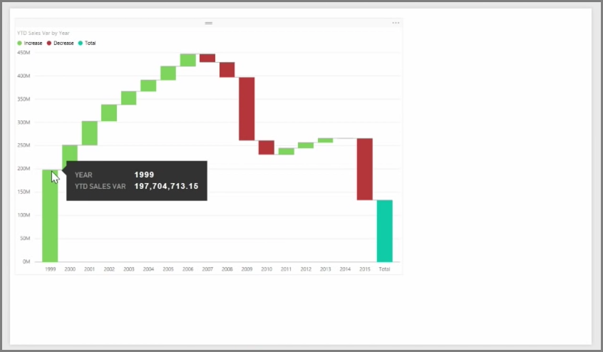

<properties
   pageTitle="Waterfall and funnel charts"
   description="Learn about advanced funnel and waterfall charts"
   services="powerbi"
   documentationCenter=""
   authors="davidiseminger"
   manager="mblythe"
   backup=""
   editor=""
   tags=""
   qualityFocus="no"
   qualityDate=""
   featuredVideoId="maTzOJSRB3g"
   featuredVideoThumb=""
   courseDuration="5m"/>

<tags
   ms.service="powerbi"
   ms.devlang="NA"
   ms.topic="get-started-article"
   ms.tgt_pltfrm="NA"
   ms.workload="powerbi"
   ms.date="09/29/2016"
   ms.author="davidi"/>

# How to Use Waterfall and Funnel Charts

Waterfall and funnel charts are two of the more interesting (and perhaps uncommon) standard visualizations that are included in Power BI. To create a blank chart of either type, select its icon from the <bpt id="p1">**</bpt>Visualizations<ept id="p1">**</ept> pane.

<bpt id="p1">**</bpt>Waterfall charts<ept id="p1">**</ept> are typically used to show changes in a particular value over time.

Waterfalls only have two bucket options: <bpt id="p1">*</bpt>Category<ept id="p1">*</ept> and <bpt id="p2">*</bpt>Y Axis<ept id="p2">*</ept>. Drag a time-based field such as <bpt id="p1">*</bpt>year<ept id="p1">*</ept> to the <bpt id="p2">*</bpt>Category<ept id="p2">*</ept> bucket, and the value you want to track to the <bpt id="p3">*</bpt>Y Axis<ept id="p3">*</ept> bucket. Time periods where there was an increase in value are displayed in green by default, while periods with a decrease in value are displayed in red.

<bpt id="p1">**</bpt>Funnel charts<ept id="p1">**</ept> are typically used to show changes over a particular process, such as a sales pipeline or website retention efforts.

Both <bpt id="p1">**</bpt>Waterfall<ept id="p1">**</ept> and <bpt id="p2">**</bpt>Funnel<ept id="p2">**</ept> charts can be sliced and visually customized.
