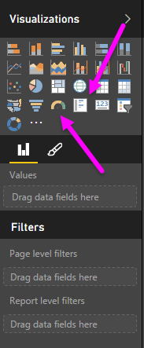

<properties
   pageTitle="Los medidores y tarjetas de número único"
   description="Impulsar rápida panel información con medidores y los números"
   services="powerbi"
   documentationCenter=""
   authors="davidiseminger"
   manager="mblythe"
   backup=""
   editor=""
   tags=""
   qualityFocus="no"
   qualityDate=""
   featuredVideoId="xmja6EpqaO0"   
   featuredVideoThumb=""
   courseDuration="7m"/>

<tags
   ms.service="powerbi"
   ms.devlang="NA"
   ms.topic="get-started-article"
   ms.tgt_pltfrm="NA"
   ms.workload="powerbi"
   ms.date="09/29/2016"
   ms.author="davidi"/>

# Cómo usar los medidores y tarjetas de número únicas

Generalmente, las visualizaciones se utilizan para comparar dos o más valores diferentes. Sin embargo, en ocasiones, al generar informes puede realizar un seguimiento de un indicador de rendimiento de una sola clave (KPI) o la métrica con el tiempo. La manera de hacerlo en Power BI Desktop es con un **medidor** o **único número** visual de la tarjeta. Para crear un gráfico en blanco de cualquier tipo, seleccione el icono de la **visualizaciones** panel.

Los medidores son especialmente útiles cuando se crean escritorios y desea mostrar el progreso hacia un objetivo determinado. Para crear un medidor, seleccione el icono de la **visualizaciones** panel y arrastre el campo que desea realizar el seguimiento de la *valor* depósito.

Indicadores aparecen de forma predeterminada en un 50% o doble la *valor*, y hay dos maneras de ajustar este valor. Para establecer los valores de forma dinámica, arrastre los campos a la *mínimo*, *máximo*, y *destino* depósitos de valor. Como alternativa, utilice las opciones de formato visuales para personalizar manualmente el intervalo de su medidor.

Visualizaciones de tarjeta simplemente muestran una representación numérica de un campo. Elementos visuales de tarjeta predeterminada utilizan unidades de visualización que el número corto, por ejemplo mostrando "$5bn" en lugar de "$5,000,000,000". Utilice las opciones de formato visuales para cambiar la unidad o deshabilitarlo totalmente.

Es una interesante aplicación de tarjetas para que muestre una medida personalizada que haya concatenado con el texto. Para utilizar el ejemplo anterior, con una medida personalizada puede incluir la tarjeta avanzadas funciones de DAX y mostrar algo como "Total de ingresos este año: $5bn" o "curso en ventas de unidades de este año:" y, a continuación, agregue el número que representa el progreso.

