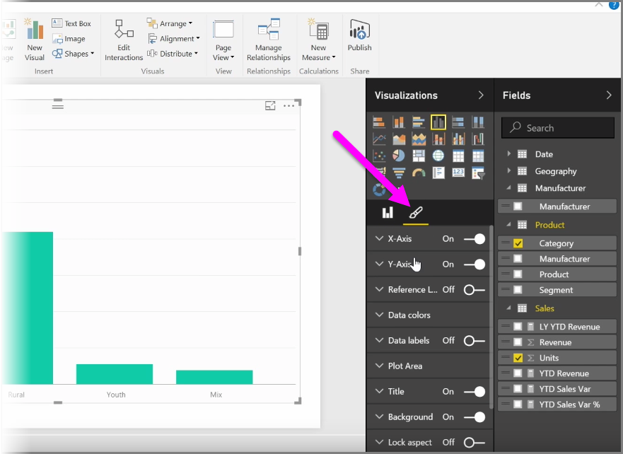
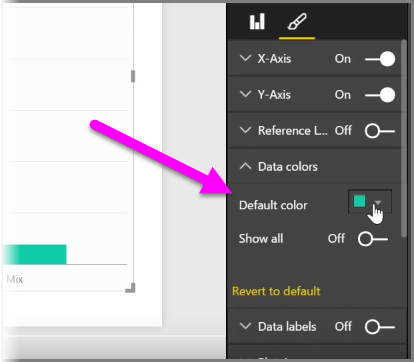

<properties
   pageTitle="Modificar colores en gráficos y elementos visuales"
   description="Su mundo visual con colores, sombras y escala de color"
   services="powerbi"
   documentationCenter=""
   authors="davidiseminger"
   manager="mblythe"
   backup=""
   editor=""
   tags=""
   qualityFocus="no"
   qualityDate=""
   featuredVideoId="oNME83EAvLw"   
   featuredVideoThumb=""
   courseDuration="5m"/>

<tags
   ms.service="powerbi"
   ms.devlang="NA"
   ms.topic="get-started-article"
   ms.tgt_pltfrm="NA"
   ms.workload="powerbi"
   ms.date="09/29/2016"
   ms.author="davidi"/>

# Cómo modificar los colores de gráficos y elementos visuales

Si desea modificar los colores utilizados en los gráficos o elementos visuales, hay muchas veces. Power BI le ofrece una gran cantidad de control sobre cómo se muestran los colores. Para empezar, seleccione un elemento visual, a continuación, en la **visualizaciones** panel, haga clic en el **pincel** icono.

Hay muchas opciones para cambiar los colores o el formato del objeto visual. Puede cambiar el color de todas las barras de un objeto visual seleccionando el selector de color junto a **color predeterminado**, a continuación, seleccione el color elegido.

También puede cambiar el color de cada barra (u otro elemento, según el tipo de objeto visual seleccionado) alternando el **Mostrar todo** control deslizante a on. Al hacerlo, aparece un selector de color para cada elemento.

También puede cambiar el color según un valor o una medida. Para ello, arrastre un campo en el **la saturación de Color** depósitos en el panel de visualizaciones (tenga en cuenta que esto está disponible en la **campo bien** sección, no el **pincel** sección).

Además, puede cambiar la escala y los colores que se utilizan al rellenar los colores del elemento de datos. También puede seleccionar una escala divergente activando el control deslizante de Diverging a, lo que permite la escala de colores entre tres colores. Y también puede establecer *mínimo*, *Center*, y *máximo* los valores mostrados en el gráfico.

También puede utilizar estos valores para crear reglas, por ejemplo, para establecer los valores por encima de cero un determinado color y los valores inferiores a otro color.

Otra herramienta útil para el uso de colores está estableciendo un *línea de referencia*. Puede establecer el valor de la línea de referencia, establecer su color e incluso tiene la línea de referencia contiene una etiqueta.

Por último, puede crear un borde alrededor de una visualización individual y, como otros controles, puede especificar el color de dicho borde también.
