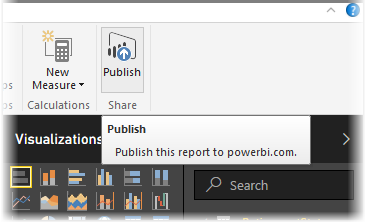
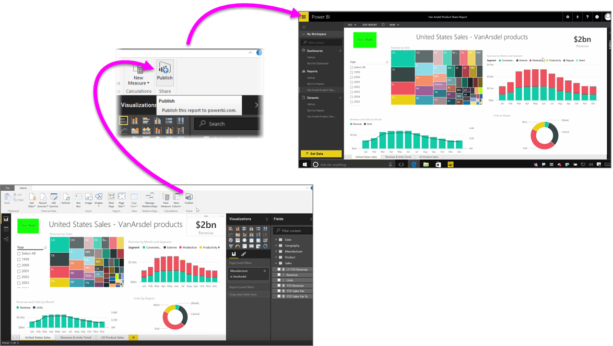

<properties
   pageTitle="Publicar informes de Power BI Desktop"
   description="Obtener fácilmente los informes de Power BI Desktop en el servicio"
   services="powerbi"
   documentationCenter=""
   authors="davidiseminger"
   manager="mblythe"
   backup=""
   editor=""
   tags=""
   qualityFocus="no"
   qualityDate=""
   featuredVideoId="i0zAvCRLScI"
   featuredVideoThumb=""
   courseDuration="2m"/>

<tags
   ms.service="powerbi"
   ms.devlang="NA"
   ms.topic="get-started-article"
   ms.tgt_pltfrm="NA"
   ms.workload="powerbi"
   ms.date="09/29/2016"
   ms.author="davidi"/>

# Publicar informes de Power BI Desktop para el servicio Power BI

Publicar los informes en el servicio Power BI es rápido y fácil.

Una vez haya completado la creación de informes en **Power BI Desktop**, simplemente seleccione el **publicar** situado en la **Inicio** ficha en Power BI Desktop y el proceso comienza.

El informe y los datos, incluidas visualizaciones, las consultas y las medidas personalizadas, se recopilan y cargarlo al servicio Power BI.

>NOTA: Es común para hacer referencia a los informes de Power BI Desktop como **.pbix** archivos, que es la extensión le asigna en Windows.

Una vez finalizada la carga, un cuadro de diálogo indica el proceso de publicación se realizó correctamente y se proporciona un vínculo en ese cuadro de diálogo para ir directamente a un informe en el servicio Power BI, en un explorador web.

Y eso es todo: es fácil publicar informes de Power BI Desktop al servicio Power BI.

