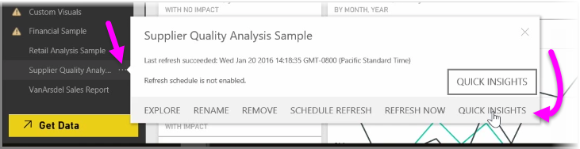

<properties
   pageTitle="Visión rápida de Power BI"
   description="Aprenda a obtener una visión rápida y elementos visuales en unos pocos clics"
   services="powerbi"
   documentationCenter=""
   authors="davidiseminger"
   manager="mblythe"
   backup=""
   editor=""
   tags=""
   qualityFocus="no"
   qualityDate=""
   featuredVideoId="bk_TSwIzVnI"
   featuredVideoThumb=""
   courseDuration="5m"/>

<tags
   ms.service="powerbi"
   ms.devlang="NA"
   ms.topic="get-started-article"
   ms.tgt_pltfrm="NA"
   ms.workload="powerbi"
   ms.date="09/29/2016"
   ms.author="davidi"/>

# Utilice la información rápidamente en el servicio Power BI

Cuando trabaja con un panel, un informe o un conjunto de datos en el servicio Power BI, puede tener que Power BI busque información rápidamente en los datos. En Power BI, desde el **conjuntos de datos** sección en el panel izquierdo, seleccione el *elipses* (tres puntos) al lado del conjunto de datos que le interesan. Aparece un menú de opciones y, en el extremo derecho, verá una opción denominada **profundas**.

Cuando se selecciona información rápidamente, Power BI realiza algunos aprendizaje automático y busca los datos, analizarlos para buscar información rápidamente. Verá una notificación en la esquina superior derecha del servicio que indicó Power BI está trabajando en búsqueda de visión.

Después de quince segundos o más, la notificación cambia para que sepa que Power BI encontró algo de información.

Cuando se selecciona el **Ver visión** botón en la notificación, se le presenta una página de elementos visuales que muestran la información que Power BI encontró similar a lo que ve en la siguiente imagen. Hay un montón de visión, lo que puede desplazarse hacia abajo por la página para ver y tener en cuenta.

Al igual que cualquier otro objeto visual, puede interactuar con los elementos visuales en la página de información rápidamente y también puede anclar cualquiera de ellos a un panel que es posible que tenga, o filtrar uno o varios de ellos (o tantas como desee), para buscar información adicional que podría estar esperando su curiosidad de descubrir.

Con **profundas**, puede permitir que Power BI realizan el trabajo para detectar valores atípicos y tendencias en los datos, a continuación, utilice las conclusiones de los paneles o perfeccionar y filtrarlos para obtener acceso a la información que son más importante para usted.
