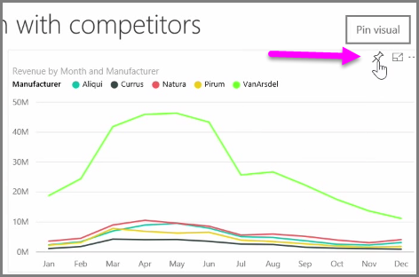
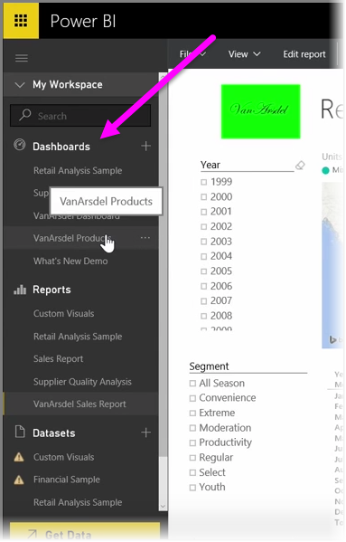

<properties
   pageTitle="Create and Configure a Dashboard"
   description="Customize dashboards in Power BI"
   services="powerbi"
   documentationCenter=""
   authors="davidiseminger"
   manager="mblythe"
   backup=""
   editor=""
   tags=""
   qualityFocus="no"
   qualityDate=""
   featuredVideoId="lJKgWnvl6bQ"
   featuredVideoThumb=""
   courseDuration="6m"/>

<tags
   ms.service="powerbi"
   ms.devlang="NA"
   ms.topic="get-started-article"
   ms.tgt_pltfrm="NA"
   ms.workload="powerbi"
   ms.date="09/29/2016"
   ms.author="davidi"/>

# Create and Configure A Dashboard

<bpt id="p1">**</bpt>Dashboards<ept id="p1">**</ept> in Power BI are one-page collections of visualizations that are created from within the Power BI service. You create dashboards by <bpt id="p1">**</bpt>pinning<ept id="p1">**</ept> visualizations from reports that you authored and published using Power BI Desktop, or visualizations you created within the Power BI service itself. <bpt id="p1">**</bpt>Pinning<ept id="p1">**</ept> a visual to a dashboard is a lot like pinning a picture to a corkboard on a wall - it sticks the visual there, in a particular spot, for others to see. To pin a visual, open its report on the Power BI service. Hover over the visual you want to pin and select the <bpt id="p1">**</bpt>pin<ept id="p1">**</ept> icon.

A dialog appears, where you select a destination dashboard for the visual from the drop-down menu, or you can create a new dashboard. You also get a preview of what the pinned visual will look like in the dashboard. You can pin visualizations from multiple reports and pages to a single dashboard, allowing you to combine different datasets and sources into a single page of insights.

On <bpt id="p1">**</bpt>Dashboards<ept id="p1">**</ept>, you can add any sort of visualization including graphs, maps, images, and shapes, by "pinning" them. Once a visual is pinned to a dashboard, it's called a <bpt id="p1">**</bpt>tile<ept id="p1">**</ept>.

Your dashboards, including any new ones, appear in the Dashboards section on the left side of the Power BI service. Select a dashboard from the list to view it.

You can change the layout of visuals on a dashboard however you'd like. To resize a tile, drag its handles in or out. To move a tile, simply click and drag it to a different location on the dashboard. Hover over a tile and click the <bpt id="p1">**</bpt>pencil<ept id="p1">**</ept> icon to open the <bpt id="p2">**</bpt>Tile Details<ept id="p2">**</ept>, where you can change the <bpt id="p3">**</bpt>Title<ept id="p3">**</ept> or <bpt id="p4">**</bpt>Subtitle<ept id="p4">**</ept>.

Click on a dashboard tile to view the report from which it originated. This lets you quickly view the underlying data beneath a visual. You can also change that link by using the <bpt id="p1">**</bpt>Set custom link<ept id="p1">**</ept> field in <bpt id="p2">**</bpt>Tile Details<ept id="p2">**</ept>.

You can pin tiles from one dashboard to another, for example if you have a collection of dashboards and want to create one summary board. The process is the same: hover over the tile and select the <bpt id="p1">**</bpt>pin icon<ept id="p1">**</ept>. Dashboards are easy to create, and to change. And you can customize them to make your one-page dashboard show exactly what it should.
