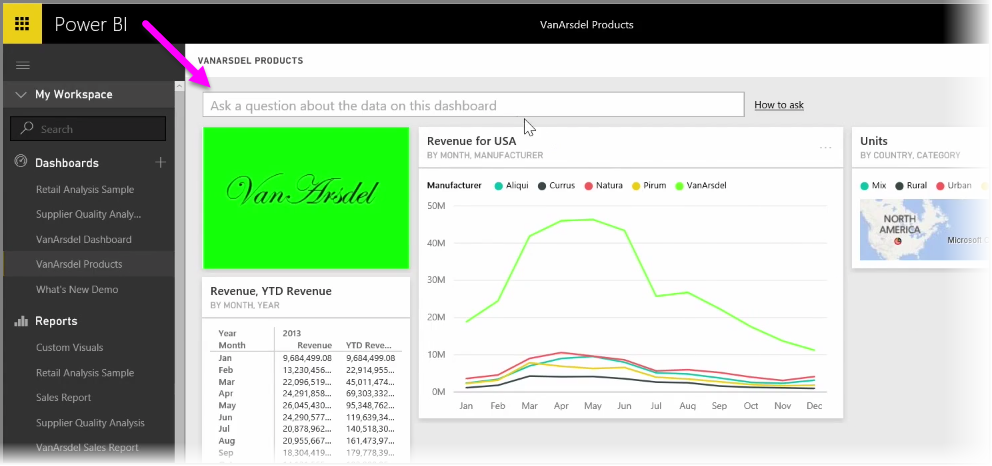
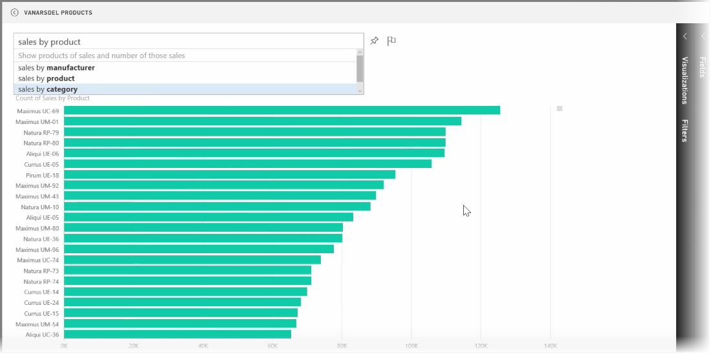
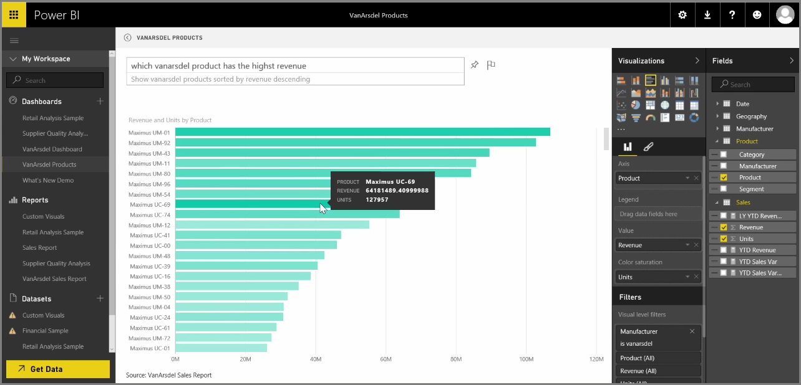

<properties
   pageTitle="Formule preguntas de los datos con lenguaje Natural"
   description="Usar preguntas y respuestas para obtener los elementos visuales y rapidísimas insights"
   services="powerbi"
   documentationCenter=""
   authors="davidiseminger"
   manager="mblythe"
   backup=""
   editor=""
   tags=""
   qualityFocus="no"
   qualityDate=""
   featuredVideoId="qMf7OLJfCz8"
   featuredVideoThumb=""
   courseDuration="9m"/>

<tags
   ms.service="powerbi"
   ms.devlang="NA"
   ms.topic="get-started-article"
   ms.tgt_pltfrm="NA"
   ms.workload="powerbi"
   ms.date="09/29/2016"
   ms.author="davidi"/>

# Formule preguntas de los datos con lenguaje Natural

Power BI incluye un motor de reconocimiento de lenguaje eficaz que le permite solicitar sus datos mediante conversacionales frases y las preguntas. Así junto con creación de informes y visualizaciones con Power BI, puede crear diagramas y gráficos formulando preguntas sencillas.

Para hacer una pregunta de sus datos, abrir un panel en Power BI y la parte superior de la pantalla verá un cuadro de entrada, donde puede plantear preguntas acerca de los datos mostrados. Esta característica se conoce a veces como *preguntas y respuestas*, o más, esta característica es sólo conoce a menudo como **preguntas y respuestas**.

Al hacer clic en el cuadro, Power BI muestra los mensajes con algunos de los términos sugeridos basadas en los datos, como "Ingresos Anuales". Puede hacer clic en un término sugerido para ver el resultado, a menudo se muestra como una tabla sencilla o una tarjeta. Al seleccionar una de las frases sugeridas, Power BI crea automáticamente un objeto visual en función de su selección, en tiempo real.

También puede hacer preguntas con lenguaje natural, como "Lo que nuestros ingresos del año pasado fue?" o bien, "¿qué producto tenía las ventas más altas en marzo de 2014?". Power BI muestra su interpretación de su pregunta y elige el mejor tipo de visual para representar la respuesta. Y al igual que otros visual en Power BI, puede **pin** para el panel de su elección seleccionando la **pin** icono.

En cualquier punto del camino, puede editar el objeto visual creado por su pregunta de lenguaje natural o frase. Utilice la **visualizaciones** y **campos** paneles en el lado derecho de la pantalla. Al igual que otros visual en Power BI, puede modificar el diseño, ajustar los filtros y cambiar las entradas de campo.

Para guardar la visualización a un panel después de crear el objeto visual perfecto, simplemente seleccione el **pin** icono situado junto al cuadro de entrada de pregunta.
