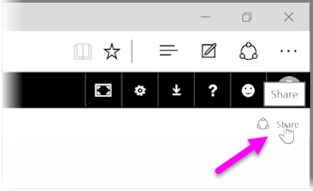

<properties
   pageTitle="Share Dashboards with your organization"
   description="Let others see your amazing dashboards with ease"
   services="powerbi"
   documentationCenter=""
   authors="davidiseminger"
   manager="mblythe"
   backup=""
   editor=""
   tags=""
   qualityFocus="no"
   qualityDate=""
   featuredVideoId="0tUwn8DHo3s"
   featuredVideoThumb=""
   courseDuration="7m"/>

<tags
   ms.service="powerbi"
   ms.devlang="NA"
   ms.topic="get-started-article"
   ms.tgt_pltfrm="NA"
   ms.workload="powerbi"
   ms.date="09/29/2016"
   ms.author="davidi"/>

# Share Dashboards with your organization

We've already seen how Power BI helps you find data, collect it in a data model, and build reports and visualizations on using that data. We've also seen how you can publish those reports to the Power BI service, and create dashboards that help you monitor your information over time. All these features are even more powerful when you share your insights with others in your organization. Fortunately, sharing your dashboards is easy.

To share a dashboard, open it in the Power BI service and select the <bpt id="p1">**</bpt>Share<ept id="p1">**</ept> link in the top right-hand corner.

The <bpt id="p1">**</bpt>Share Dashboard<ept id="p1">**</ept> page appears, where you can select the <bpt id="p2">**</bpt>Invite<ept id="p2">**</ept> section, then fill in the <bpt id="p3">**</bpt>Email address<ept id="p3">**</ept> input box with people you'd like to grant access to your dashboard. Power BI checks the email addresses as you type them with accounts in your domain and Office 365 domain, and auto-complete when possible. You can also copy and paste email addresses into this box, or use a distribution list, security group, or Office 365 group to reach multiple people at once.

If you selected the checkbox (near the bottom) to <bpt id="p1">*</bpt>send email notification to recipients<ept id="p1">*</ept>, then your recipients will receive an email letting them know that you shared a dashboard with them, including a link with the dashboard. You can add a note to the email they will receive, or send the note that Power BI created for you (it's in the box directly below where you enter their email addresses).

> Note: Recipients without an existing Power BI account will be taken through the sign-up process before viewing your dashboard.

Anyone with whom you share a dashboard can see and interact with it exactly as you do. However, they have <bpt id="p1">*</bpt>read-only<ept id="p1">*</ept> access to the underlying reports, and they have <bpt id="p2">*</bpt>no access<ept id="p2">*</ept> to the underlying datasets.

You can also select the <bpt id="p1">**</bpt>Shared With<ept id="p1">**</ept> tab on the Share Dashboard page to see the people with whom you have previously shared this dashboard.
