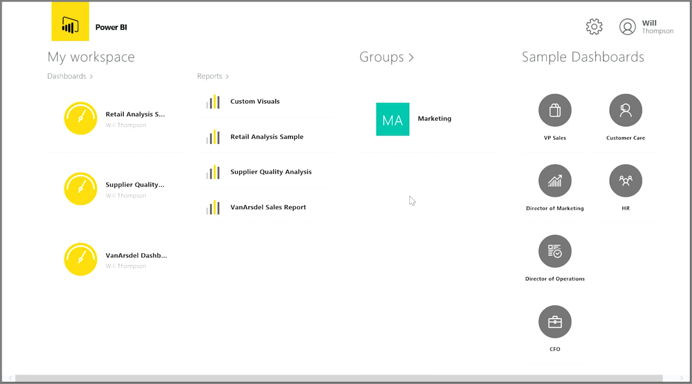
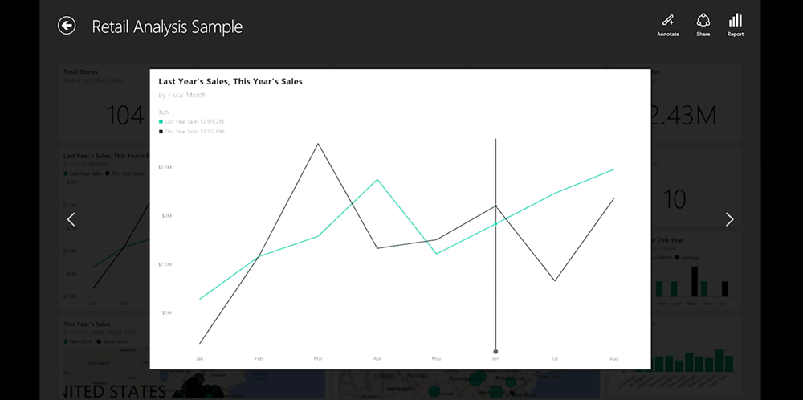

<properties
   pageTitle="Presentación de Power BI Mobile"
   description="Aplicaciones móviles de Power BI mostrar información en casi cualquier dispositivo"
   services="powerbi"
   documentationCenter=""
   authors="davidiseminger"
   manager="mblythe"
   backup=""
   editor=""
   tags=""
   qualityFocus="no"
   qualityDate=""
   featuredVideoId="Sfb_vDIb6Dc"
   featuredVideoThumb=""
   courseDuration="7m"/>

<tags
   ms.service="powerbi"
   ms.devlang="NA"
   ms.topic="get-started-article"
   ms.tgt_pltfrm="NA"
   ms.workload="powerbi"
   ms.date="09/29/2016"
   ms.author="davidi"/>

# Presentación de Power BI Mobile

Si desea realizar un seguimiento de los datos mientras está de viaje, puede utilizar una de las aplicaciones móviles de Power BI para iOS, Android y Windows dispositivos.

Cuando se utiliza la aplicación Power BI, primero inicie sesión en la cuenta con la información de su cuenta de servicio de Power BI. En un dispositivo móvil de Windows (en este caso un Tablet PC), el inicio de sesión se ve como la siguiente.

La primera pantalla que verá muestra todo el contenido al que tiene acceso, incluidos los informes, paneles y grupos. También hay paneles de ejemplo que puede utilizar para obtener inspiración, o para ver las capacidades de Power BI. La aplicación está diseñada para ser táctil: pulsar en un panel o informe para verlo a pantalla completa y desplazarse por ellos con el dedo.

Puede abrir cualquiera de los paneles pulsando en ellos. Dentro de un panel, puede pulsar en un icono de panel para centrarse en él en una vista más grande.

También puede anotar cualquier información que detectar pulsando el **anotar** botón en la esquina superior derecha. Esto le permite dibujar en un mosaico especializado para resaltar áreas específicas de interés. Las herramientas de anotación se encuentran en la parte inferior de la pantalla.

Compartir su mosaico anotado, puntee en el **compartido** vínculo en la esquina superior derecha.

Puntee en el **informe** vínculo en la esquina superior derecha para ver el informe subyacente de un mosaico. Esto mostrará las visualizaciones mismas exactas que vería en un explorador web o en Power BI Desktop y también incluye la capacidad de interactuar con el informe punteando en las barras, obtención de detalles o usar segmentaciones de datos.
