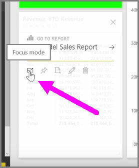
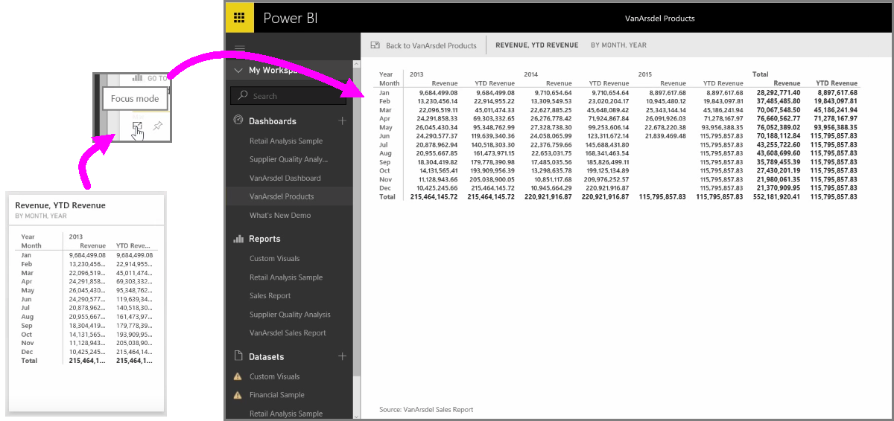

<properties
   pageTitle="Display visuals and tiles full-screen"
   description="Get a big view of select report visuals and dashboard tiles"
   services="powerbi"
   documentationCenter=""
   authors="davidiseminger"
   manager="mblythe"
   backup=""
   editor=""
   tags=""
   qualityFocus="no"
   qualityDate=""
   featuredVideoId="LoApjhwTse0"
   featuredVideoThumb=""
   courseDuration="4m"/>

<tags
   ms.service="powerbi"
   ms.devlang="NA"
   ms.topic="get-started-article"
   ms.tgt_pltfrm="NA"
   ms.workload="powerbi"
   ms.date="10/12/2016"
   ms.author="davidi"/>

# Display Visuals and Tiles Full-Screen

When you're looking at Power BI dashboards or reports in the service, it can sometimes be helpful to focus on an individual chart or visualization. You can do that in two different ways.

When you're on a dashboard, hover over a tile to see a few different icon options in the top right-hand corner. When you select the ellipses (the three dots) you see a collection of icons that represent actions you can take on the tile.

The left-most icon is labeled <bpt id="p1">**</bpt>Focus mode<ept id="p1">**</ept>. Select that icon to expand the tile to encompass the full dashboard space.

<bpt id="p1">**</bpt>Focus mode<ept id="p1">**</ept> allows you to see a lot more detail on your visuals and legends. For example, when you resize a tile in Power BI, some of the columns may not be shown because of the space available in the tile.

In <bpt id="p1">**</bpt>Focus mode<ept id="p1">**</ept>, you can see all the data. You can also pin the visual directly from Focus mode to a different dashboard by selecting the <bpt id="p1">**</bpt>Pin<ept id="p1">**</ept> icon. To exit <bpt id="p1">**</bpt>Focus mode<ept id="p1">**</ept>, select the <bpt id="p2">**</bpt>Back to...<ept id="p2">**</ept> icon in the top-left corner of <bpt id="p3">**</bpt>Focus mode<ept id="p3">**</ept>.

The process is similar when viewing a report. Hover over a visual to see the three icons in the top-right corner, and select the <bpt id="p1">**</bpt>Focus mode<ept id="p1">**</ept> icon. Selecting this expands your visualization to encompass the full report canvas. The visual is still interactive in this mode, although you temporarily lose any cross-filter effect between visualizations.

Hover over an expanded tile or report and select the <bpt id="p1">**</bpt>Back to...<ept id="p1">**</ept> left-caret icon in the top-left corner to return to the previous view.
