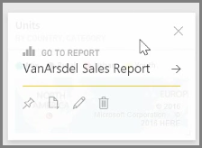
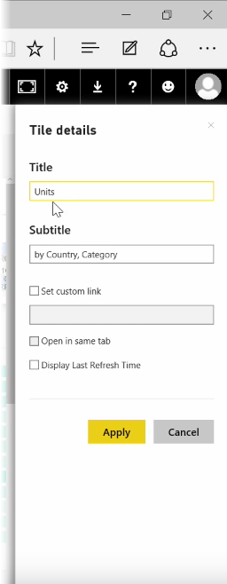

<properties
   pageTitle="Editar detalles de mosaico y agregar widgets"
   description="Cambiar el comportamiento de título y vínculo y agregar widgets"
   services="powerbi"
   documentationCenter=""
   authors="davidiseminger"
   manager="mblythe"
   backup=""
   editor=""
   tags=""
   qualityFocus="no"
   qualityDate=""
   featuredVideoId="XhqVbHqd5jQ"
   featuredVideoThumb=""
   courseDuration="6m"/>

<tags
   ms.service="powerbi"
   ms.devlang="NA"
   ms.topic="get-started-article"
   ms.tgt_pltfrm="NA"
   ms.workload="powerbi"
   ms.date="09/29/2016"
   ms.author="davidi"/>

# Editar detalles de mosaico

Una vez que ha creado un panel, puede editar su **mosaicos* en Power BI que unos formato servicio cambia.

Para realizar cambios en un mosaico, mantenga el mouse sobre el icono y seleccione el botón de puntos suspensivos (tres puntos) para mostrar una colección de iconos que le permiten realizar cambios en el mosaico.

Seleccione el **lápiz** icono para abrir la **Detalles del mosaico** panel. Desde aquí puede cambiar el icono **título**, **subtítulo**, incluyen su última hora de actualización y de fecha y otros detalles como la creación de un vínculo personalizado.

De forma predeterminada, al hacer clic en un icono de panel pasará al informe de origen. Para cambiar este comportamiento, use la **conjunto de vínculos personalizados** campo la **Detalles del mosaico** panel. Un uso popular de esta característica es tomar los usuarios a la página principal de la organización, al hacer clic en una imagen de logotipo.

## Agregar Widgets al panel

También puede agregar Widgets a su panel. Un **widget** es un icono de panel especial que, en lugar de contener una visualización contiene otros elementos, como una imagen, un vídeo en línea, un cuadro de texto o contenido web enriquecidas.

Cuando se selecciona el vínculo Agregar Widget en la esquina superior derecha de un panel, el **Agregar un widget** aparece el cuadro de diálogo.

Al agregar un cuadro de texto, por ejemplo, una **icono detalles** panel aparece en el lado derecho, donde puede editar detalles similares lo que está disponible al editar los detalles de un mosaico. Pero con widgets, también hay una sección para definir o modificar el contenido de widget, como un editor de texto enriquecido para un cuadro de texto.

Con widgets y la capacidad de editar los detalles del mosaico, puede personalizar el panel y darle un aspecto simplemente cómo desea que sea.
