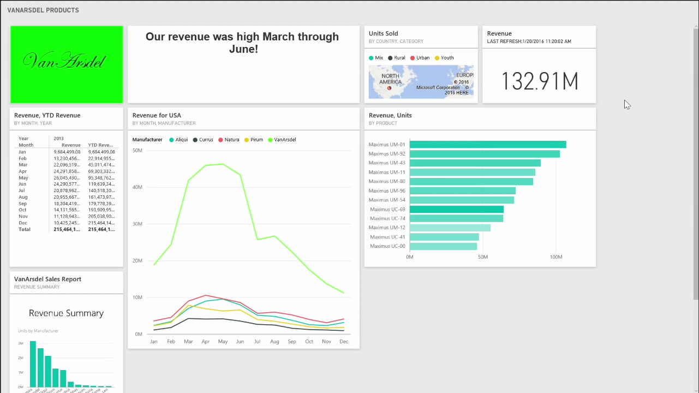
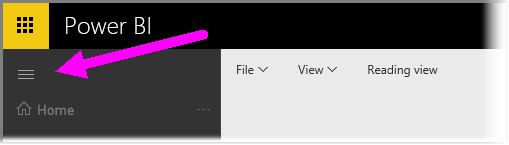

<properties
   pageTitle="Obtener más espacio en el escritorio"
   description="Usar el modo de pantalla completa para administrar de forma más eficaz el espacio del panel"
   services="powerbi"
   documentationCenter=""
   authors="davidiseminger"
   manager="mblythe"
   backup=""
   editor=""
   tags=""
   qualityFocus="no"
   qualityDate=""
   featuredVideoId="c31gZkyvC54"
   featuredVideoThumb=""
   courseDuration="5m"/>

<tags
   ms.service="powerbi"
   ms.devlang="NA"
   ms.topic="get-started-article"
   ms.tgt_pltfrm="NA"
   ms.workload="powerbi"
   ms.date="09/29/2016"
   ms.author="davidi"/>

# Obtener más espacio en el escritorio

Es posible que en ocasiones al crear los paneles, tiene más contenido que lo que puede caber en el lienzo. Hay algunas soluciones que le ayudarán a administran cómo se muestra el espacio de escritorio, por lo que puede obtener una vista completa del contenido del panel.

Selecciona el método más sencillo para mostrar el panel todo en una pantalla la **el modo de pantalla completa** botón en la esquina superior derecha del panel.

Seleccione el **modo de pantalla completa** botón coloca el explorador en modo de pantalla completa, quitar todos los elementos de cromo de alrededor del panel y, lo que aumenta la cantidad de espacio visible.

Desde **modo de pantalla completa**, puede seleccionar el **Ajustar a la pantalla** opción reducir todos los iconos para que quepan en una sola pantalla, sin necesidad de barras de desplazamiento. Esto se denomina comúnmente *el modo de televisión*, y es útil para realizar presentaciones con los paneles o mostrar un panel en los monitores de pasillo.

Otra forma de administrar el espacio del panel contrae el panel de navegación en el lado izquierdo de la página seleccionando el icono de la hamburguesa. Para expandir el panel de navegación, haga clic en el icono.

Para asegurarse de que un panel siempre tendrá una barra de exploración contraído agregando lo siguiente al final de la dirección URL:

>? collapseNavigation = true

Los usuarios que siguen este vínculo abren el panel con una barra de exploración contraído.
