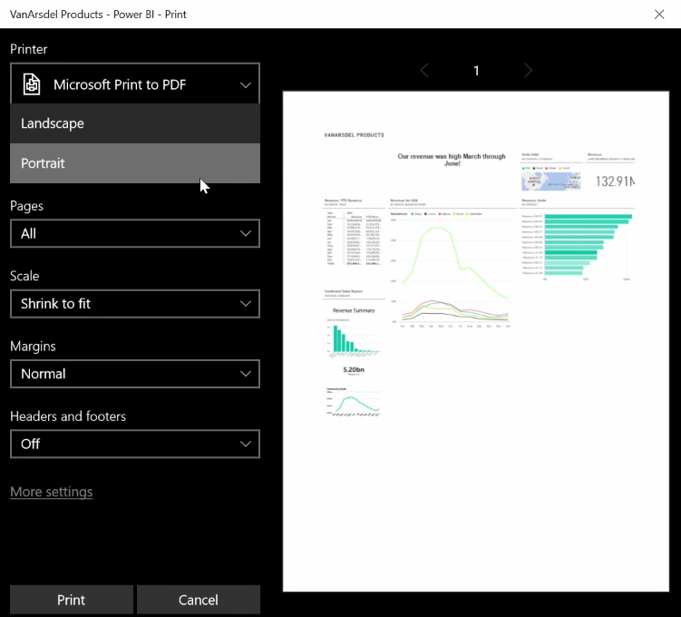

<properties
   pageTitle="Imprimir y exportar informes y paneles"
   description="Poner sus manos en informes impresos y paneles"
   services="powerbi"
   documentationCenter=""
   authors="davidiseminger"
   manager="mblythe"
   backup=""
   editor=""
   tags=""
   qualityFocus="no"
   qualityDate=""
   featuredVideoId="gauDt5ZV74I"
   featuredVideoThumb=""
   courseDuration="4m"/>

<tags
   ms.service="powerbi"
   ms.devlang="NA"
   ms.topic="get-started-article"
   ms.tgt_pltfrm="NA"
   ms.workload="powerbi"
   ms.date="09/29/2016"
   ms.author="davidi"/>

# Imprimir y exportar paneles de Power BI

A veces deseará que un informe impreso o un panel a una reunión o para que pueda compartir con otros usuarios. Con Power BI, hay unos cuantos días puede hacer copias impresas de los objetos visuales.

En el servicio Power BI, seleccione el botón de puntos suspensivos (tres puntos) en la parte superior derecha del servicio y seleccione **panel imprimir**.

Un **Imprimir** aparece el cuadro de diálogo donde puede seleccionar la impresora a la que desea enviar el panel, así como el estándar de opciones de impresión como *vertical* o *horizontal* orientación.

## Exportar datos desde un objeto visual

También puede exportar los datos desde cualquier objeto visual en el servicio Power BI. Seleccione el botón de puntos suspensivos en cualquier elemento visual y, a continuación, seleccione la **Exportar datos** botón (el botón intermedio). Al hacerlo, un. Archivo CSV se crea y se descargará en el equipo local, y aparece un mensaje en el explorador (al igual que cualquier otra descarga iniciada por el explorador) informarle de que la descarga.

También puede imprimir o exportar directamente desde un informe. Al ver un informe en el servicio Power BI, seleccione **archivo > Imprimir** para abrir el cuadro de diálogo de impresión.

Y al igual que con un panel, puede exportar datos desde un objeto visual en un informe, seleccionando el botón Exportar en un objeto visual.
