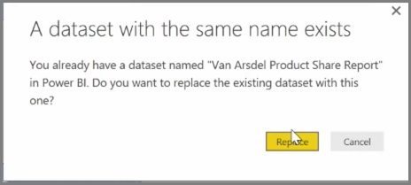

<properties
   pageTitle="Volver a publicar manualmente y actualizar los datos"
   description="Actualizar manualmente el conjunto de datos y el informe"
   services="powerbi"
   documentationCenter=""
   authors="davidiseminger"
   manager="mblythe"
   backup=""
   editor=""
   tags=""
   qualityFocus="no"
   qualityDate=""
   featuredVideoId="O60a1Acdpkc"
   featuredVideoThumb=""
   courseDuration="5m"/>

<tags
   ms.service="powerbi"
   ms.devlang="NA"
   ms.topic="get-started-article"
   ms.tgt_pltfrm="NA"
   ms.workload="powerbi"
   ms.date="09/29/2016"
   ms.author="davidi"/>

# Volver a publicar y actualizar los datos manualmente

Puede actualizar los informes y conjuntos de datos que ya se han publicado desde Power BI Desktop al servicio Power BI. Para ello, seleccione **publicar** desde el **Inicio** ficha en la cinta de opciones.

Cuando se publica un informe que ya existe en el servicio Power BI, se le pedirá que confirme que desea reemplazar el conjunto de datos anterior y los informes con la versión editada que decide actualizar.

Al seleccionar **reemplazar**, los conjuntos de datos y los informes en el servicio Power BI se sobrescriben con los conjuntos de datos e informes de la versión más reciente de Power BI Desktop del archivo.

Y como cualquier otro **publicar** eventos de Power BI Desktop, verá un cuadro de diálogo que indica si el evento de publicación tuvo éxito y obtener un vínculo al informe en el servicio Power BI.

Se trata de una manera de actualizar los datos manualmente. Puede actualizar automáticamente los conjuntos de datos e informes; Este proceso se trata en otro tema de aprendizaje.
