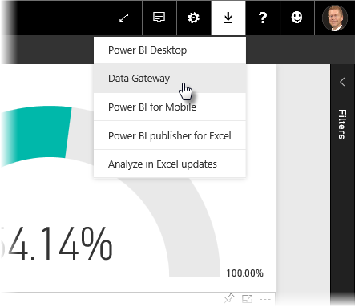
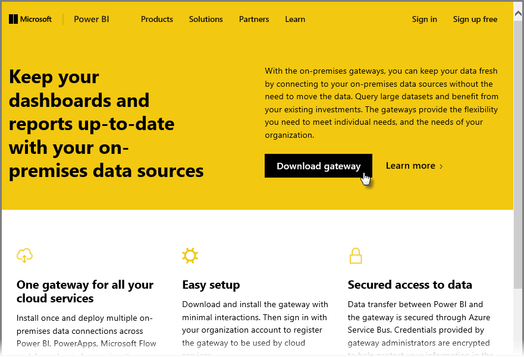
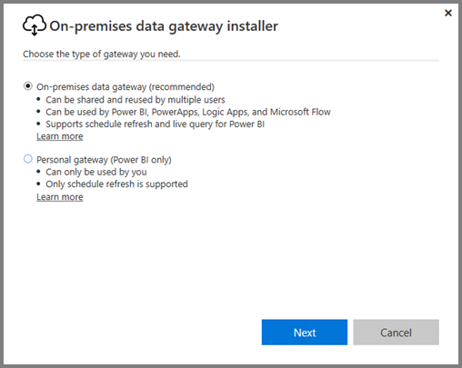
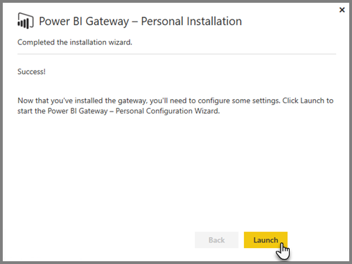
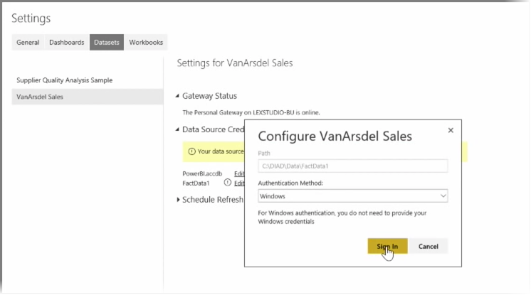

<properties
   pageTitle="Install and configure a Personal Gateway"
   description="Use a Personal Gateway to automatically update on-premises data"
   services="powerbi"
   documentationCenter=""
   authors="davidiseminger"
   manager="mblythe"
   backup=""
   editor=""
   tags=""
   qualityFocus="no"
   qualityDate=""
   featuredVideoId="UwSaTCke5MU"
   featuredVideoThumb=""
   courseDuration="11m"/>

<tags
   ms.service="powerbi"
   ms.devlang="NA"
   ms.topic="get-started-article"
   ms.tgt_pltfrm="NA"
   ms.workload="powerbi"
   ms.date="09/29/2016"
   ms.author="davidi"/>

# Install and Configure a Personal Gateway

In previous topics we've looked at how you can use Power BI to connect to data sources, and how to manually refresh your datasets on the Power BI service. However, you're not going to want to manually refresh things every time your data changes, so you can use Power BI to set up a scheduled refresh that will connect to your data sources and publish them into the Power BI Service automatically. This also gives you a way to connect the service with any on-premises data sources, including Excel files, Access databases, SQL databases, and more.

The system that lets you connect your on-premises data sources to the Power BI service is called the <bpt id="p1">**</bpt>Data Gateway<ept id="p1">**</ept>. It's a small application that runs on your computer, and uses a prearranged schedule to connect to your data, gather any updates, and push them up to the Power BI service. The <bpt id="p1">**</bpt>Personal Gateway<ept id="p1">**</ept> is a version of the <bpt id="p2">**</bpt>Data Gateway<ept id="p2">**</ept> that can be used without any administrator configuration.

> Note: The computer  that is running the Power BI Personal Gateway <bpt id="p1">*</bpt>must<ept id="p1">*</ept> be on and connected to the Internet for <bpt id="p2">**</bpt>Personal Gateway<ept id="p2">**</ept> to work properly.

To set up your <bpt id="p1">**</bpt>Personal Gateway<ept id="p1">**</ept>, first login to the Power BI service. Select the <bpt id="p1">**</bpt>Download<ept id="p1">**</ept> icon in the top right-hand corner of the screen, and then select <bpt id="p2">**</bpt>Data Gateways<ept id="p2">**</ept> from the menu.

From there you'll be taken to a web page where you can select the <bpt id="p1">**</bpt>Power BI Gateway - Personal<ept id="p1">**</ept>, as shown below.

Run the application once it finishes downloading, and complete the installation wizard.

You'll then be prompted to launch the configuration wizard to set up your gateway.

You'll be asked first to login to your Power BI service account, and then to login to the machine's Windows account, since the Gateway service runs under your account.

Return to the Power BI service. Select the ellipsis (three dots) menu next to the dataset you want to refresh, and then select <bpt id="p1">**</bpt>Schedule Refresh<ept id="p1">**</ept>. This opens the <bpt id="p1">**</bpt>Refresh Settings<ept id="p1">**</ept> page. Power BI detects that you've installed a <bpt id="p1">**</bpt>Personal Gateway<ept id="p1">**</ept>, and lets you know its status.

Select <bpt id="p1">**</bpt>Edit credentials<ept id="p1">**</ept> next to each applicable data source and set up authentication.

Finally, set the options under <bpt id="p1">**</bpt>Schedule Refresh<ept id="p1">**</ept> to activate automatic updates and set when and how frequently they occur.

And that's it. On the scheduled times, Power BI will go out to those data sources, using the credentials you provided and the connection to the computer that has your <bpt id="p1">**</bpt>Personal Gateway<ept id="p1">**</ept> running, and update the reports and datasets according to your schedule. The next time you go to Power BI, those dashboards, reports, and datasets will reflect data as of the most recent scheduled refresh.

## What's Next

**Enhorabuena.** You've completed this <bpt id="p1">**</bpt>Exploring Data<ept id="p1">**</ept> section of the <bpt id="p2">**</bpt>Guided Learning<ept id="p2">**</ept> course for Power BI. The Power BI service is full of interesting ways to explore data, share insights, and interact with visuals. And it's all accessible from a browser, from a service that you can connect to wherever you are.

One powerful and well-known partner of Power BI is <bpt id="p1">**</bpt>Excel<ept id="p1">**</ept>. Power BI and Excel are designed to work well together; your workbooks will feel at home in Power BI, and it's easy to get them there.

How easy? In the next section, <bpt id="p1">**</bpt>Power BI and Excel<ept id="p1">**</ept> you learn exactly that.

See you in the next section!
