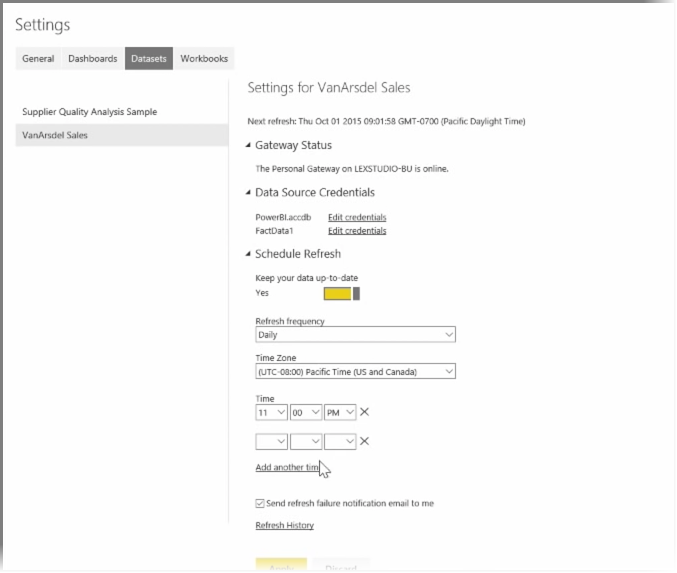

<properties
   pageTitle="Instalar y configurar una puerta de enlace Personal"
   description="Usar una puerta de enlace Personal para actualizar automáticamente los datos locales"
   services="powerbi"
   documentationCenter=""
   authors="davidiseminger"
   manager="mblythe"
   backup=""
   editor=""
   tags=""
   qualityFocus="no"
   qualityDate=""
   featuredVideoId="UwSaTCke5MU"
   featuredVideoThumb=""
   courseDuration="11m"/>

<tags
   ms.service="powerbi"
   ms.devlang="NA"
   ms.topic="get-started-article"
   ms.tgt_pltfrm="NA"
   ms.workload="powerbi"
   ms.date="09/29/2016"
   ms.author="davidi"/>

# Instalar y configurar una puerta de enlace Personal

En los temas anteriores hemos observado cómo puede usar Power BI para conectarse a orígenes de datos y cómo actualizar manualmente los conjuntos de datos en el servicio Power BI. Sin embargo, no va a desea manualmente las cosas de actualización cada vez que actualización los cambios de datos, por lo que puede usar Power BI para configurar un programado que se conectará a los orígenes de datos y publicar en el servicio Power BI automáticamente. Esto también le ofrece una forma de conectarse al servicio con los orígenes de datos locales, incluidos los archivos de Excel, las bases de datos de Access, bases de datos SQL y mucho más.

El sistema que le permite conectarse a los orígenes de datos locales para el servicio Power BI se llama el **puerta de enlace de datos**. Es una pequeña aplicación que se ejecuta en el equipo y utiliza una programación concertados de antemano para conectarse a los datos, recopilar todas las actualizaciones y los insertará en el servicio Power BI. El **Personal Gateway** es una versión de la **puerta de enlace de datos** que se puede utilizar sin ninguna configuración de administrador.

> Nota: El equipo que ejecuta Power BI Personal Gateway *debe* en y conectado a Internet para **Personal Gateway** funcione correctamente.

Para configurar su **Personal Gateway**, primer inicio de sesión para el servicio Power BI. Seleccione el **descargar** icono en la esquina superior derecha de la pantalla y, a continuación, seleccione **puertas de enlace de datos** en el menú.

Desde allí se le dirigirá a una página web donde puede seleccionar la **Power BI Gateway - Personal**, tal como se muestra a continuación.

Ejecute la aplicación una vez finalizada la descarga y complete el Asistente de instalación.

Se solicitará para iniciar el Asistente de configuración para configurar la puerta de enlace.

Se le preguntará primero en el inicio de sesión a su cuenta de servicio de Power BI y, a continuación, inicie sesión en la cuenta del equipo Windows, ya que se ejecuta el servicio de puerta de enlace en su cuenta.

Se devuelven al servicio Power BI. Seleccione el menú de puntos suspensivos (tres puntos) al lado del conjunto de datos que desea actualizar y, a continuación, seleccione **Programar actualización**. Se abrirá la **Actualizar configuración** página. Power BI detecta que ha instalado un **Personal Gateway**, y le permite conocer su estado.

Seleccione **Editar credenciales** junto a cada origen de datos correspondiente y la configuración de la autenticación.

Por último, establezca las opciones de **Programar actualización** para activar las actualizaciones automáticas y establecer cuándo y con qué frecuencia se producen.

Y eso es todo. En el trabajo programado veces, Power BI pasará a esos orígenes de datos, utilizando las credenciales que proporcionó y la conexión con el equipo que tiene la **Personal Gateway** ejecutando y actualizar los informes y conjuntos de datos según la programación. La próxima vez vaya a Power BI, esos paneles, informes y conjuntos de datos reflejará los datos a partir de la última actualización programada.

## Próxima Novedades

**Enhorabuena.** Ha completado este **Explorar los datos** sección de la **aprendizaje guiado** curso para Power BI. El servicio Power BI está lleno de formas interesantes para explorar datos, compartir conocimientos e interactuar con elementos visuales. Y todo está disponible desde un explorador, desde un servicio que se puede conectar a donde te encuentres.

Es un socio conocido y eficaz de Power BI **Excel**. Power BI y Excel están diseñados para funcionar bien juntos; los libros se sentirán como en casa en Power BI y es fácil hasta este punto.

¿Qué tan fácil? En la siguiente sección, **Power BI y Excel** aprenderá exactamente eso.

Ver, en la sección siguiente.
