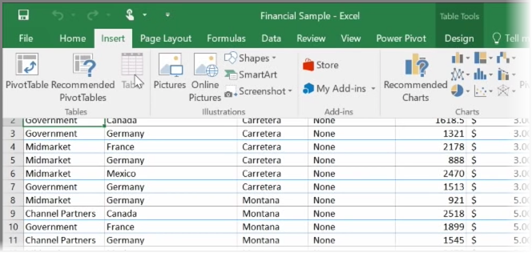
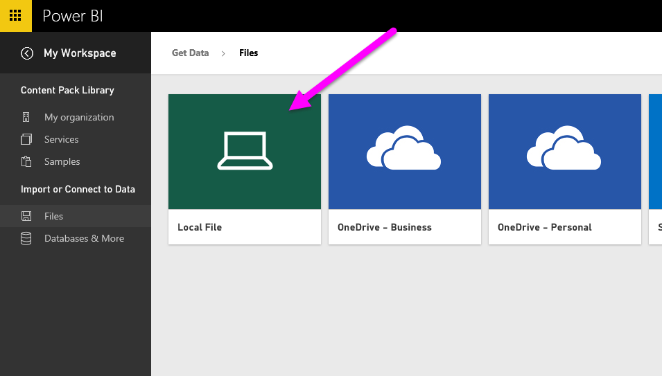
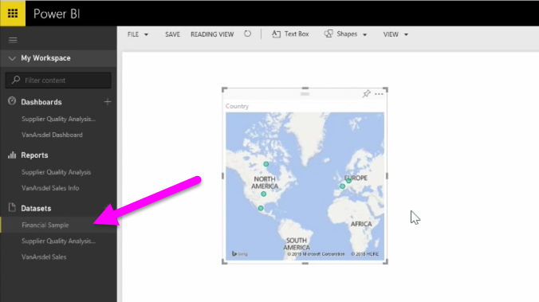

<properties
   pageTitle="Upload Excel data to Power BI"
   description="See how easy it is to upload an Excel workbook to Power BI"
   services="powerbi"
   documentationCenter=""
   authors="davidiseminger"
   manager="mblythe"
   backup=""
   editor=""
   tags=""
   qualityFocus="no"
   qualityDate=""
   featuredVideoId="pZ8XnFfNJtc"
   featuredVideoThumb=""
   courseDuration="4m"/>

<tags
   ms.service="powerbi"
   ms.devlang="NA"
   ms.topic="get-started-article"
   ms.tgt_pltfrm="NA"
   ms.workload="powerbi"
   ms.date="09/29/2016"
   ms.author="davidi"/>

# Import an Excel table into Power BI

In this topic, we'll first take a look at how you can import an Excel workbook file containing a simple <bpt id="p1">**</bpt>table<ept id="p1">**</ept> from a local drive into Power BI. You'll then learn how you can begin exploring that table's data in Power BI by creating a report.

## Make sure your data is formatted as a table
In order for Power BI to import data from your workbook, that data needs to be  <bpt id="p1">**</bpt>formatted as a table<ept id="p1">**</ept>. It's easy. In Excel, you can highlight a range of cells, then on the <bpt id="p1">**</bpt>Insert<ept id="p1">**</ept> tab of the Excel ribbon, click <bpt id="p2">**</bpt>Table<ept id="p2">**</ept>.

You'll want to make sure each column has a good name. It will make it easier to find the data you want when creating your reports in Power BI.

## Import from a local drive
Wherever you keep your files, Power BI makes it easy to import them. In Power BI, you can use <bpt id="p1">**</bpt>Get Data<ept id="p1">**</ept><ph id="ph1"> &gt; </ph><bpt id="p2">**</bpt>Files<ept id="p2">**</ept><ph id="ph2"> &gt; </ph><bpt id="p3">**</bpt>Local File<ept id="p3">**</ept>, to find and select the Excel file we want.

Once imported into Power BI, you can begin creating reports.

Your files don't have to be on a local drive, of course. If you save your files on OneDrive or SharePoint Team Site, that's even better. We'll go into more details about that in a later topic.

## Start creating reports
Once your workbook's data has been imported, a dataset is created in Power BI. It appears under <bpt id="p1">**</bpt>Datasets<ept id="p1">**</ept>. Now you can begin exploring your data by creating reports and dashboards. Just click on the <bpt id="p1">**</bpt>Open menu<ept id="p1">**</ept> icon next to the dataset and then click <bpt id="p2">**</bpt>Explore<ept id="p2">**</ept>. A new blank report canvas appears. Over on the right, under <bpt id="p1">**</bpt>Fields<ept id="p1">**</ept>, you'll see your tables and columns. Just select the fields you want to create a new visualization on the canvas.

You can change the type of visualization and apply <bpt id="p1">**</bpt>filters<ept id="p1">**</ept> and other properties under <bpt id="p2">**</bpt>Visualizations<ept id="p2">**</ept>.
