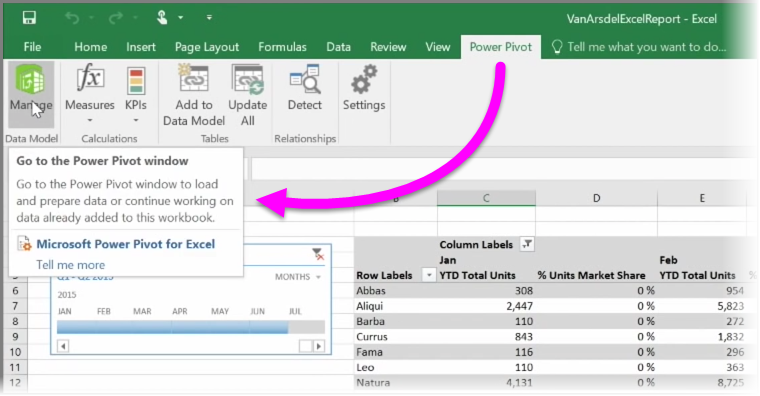

<properties
   pageTitle="Import Power View and Power Pivot to Power BI"
   description="Excel workbooks with Power tools work seamlessly with Power BI"
   services="powerbi"
   documentationCenter=""
   authors="davidiseminger"
   manager="mblythe"
   backup=""
   editor=""
   tags=""
   qualityFocus="no"
   qualityDate=""
   featuredVideoId="nVkpj0tB4Yk"
   featuredVideoThumb=""
   courseDuration="4m"/>

<tags
   ms.service="powerbi"
   ms.devlang="NA"
   ms.topic="get-started-article"
   ms.tgt_pltfrm="NA"
   ms.workload="powerbi"
   ms.date="09/29/2016"
   ms.author="davidi"/>

# Import Excel files with data models and Power View sheets

If you use any of Excel's advanced BI features like <bpt id="p1">**</bpt>Power Query<ept id="p1">**</ept> (called <bpt id="p2">**</bpt>Get &amp; Transform<ept id="p2">**</ept> in Excel 2016), to query and load data, <bpt id="p3">**</bpt>Power Pivot<ept id="p3">**</ept> to create powerful data models, and <bpt id="p4">**</bpt>Power View<ept id="p4">**</ept> to create dynamic reports, you can import those into Power BI, too.

If you use <bpt id="p1">**</bpt>Power Pivot<ept id="p1">**</ept> to create advanced data models, like those with multiple related tables, measures, calculated columns, and hierarchies, Power BI will import all of that as well.

If your workbook has <bpt id="p1">**</bpt>Power View sheets<ept id="p1">**</ept>, no problem. Power BI will re-create them as new <bpt id="p1">**</bpt>Reports<ept id="p1">**</ept> in Power BI. You can start pinning visualizations to dashboards right away.

And here's one of the great features of Power BI: If you use Power Query or Power Pivot to connect to, query, and load data from an external data source, once you've imported your workbook into Power BI, you can setup <bpt id="p1">**</bpt>scheduled refresh<ept id="p1">**</ept>. By using scheduled refresh, Power BI will use the connection information from your workbook to connect directly to the datasource and query and load any data that has changed. Any visualizations in reports will automatically be updated, too.
