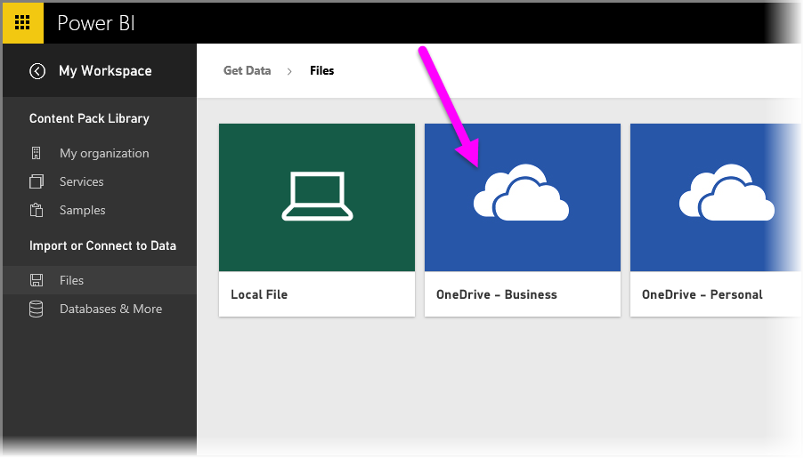
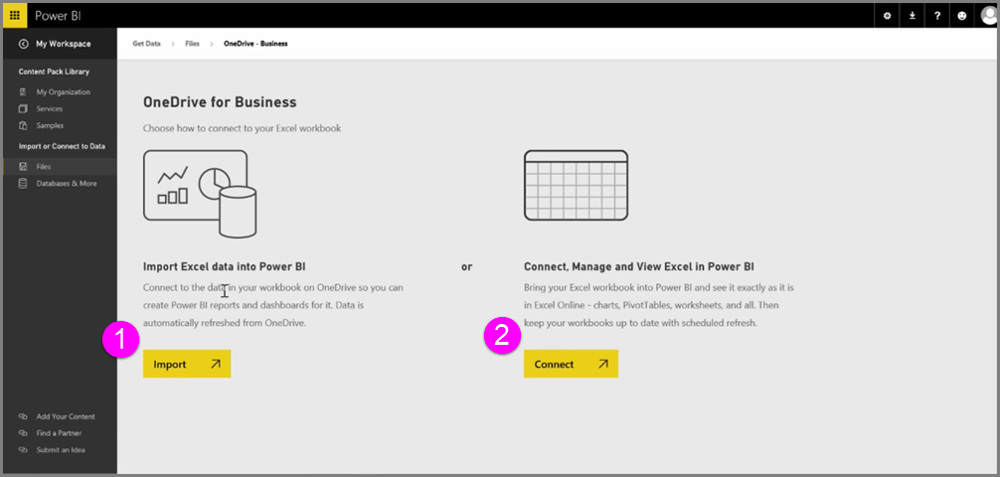

<properties
   pageTitle="Conectarse a OneDrive para la empresa a Power BI"
   description="OneDrive para archivos de Excel y de negocio son una coincidencia encontrada en la nube"
   services="powerbi"
   documentationCenter=""
   authors="davidiseminger"
   manager="mblythe"
   backup=""
   editor=""
   tags=""
   qualityFocus="no"
   qualityDate=""
   featuredVideoId="WK7OZF-hVZA"
   featuredVideoThumb=""
   courseDuration="8m"/>

<tags
   ms.service="powerbi"
   ms.devlang="NA"
   ms.topic="get-started-article"
   ms.tgt_pltfrm="NA"
   ms.workload="powerbi"
   ms.date="09/29/2016"
   ms.author="davidi"/>

# Conectarse a OneDrive para la empresa a Power BI

Obtenga una integración perfecta entre Power BI y Excel al guardar los libros de Excel en OneDrive.

Dado que es OneDrive en la nube, al igual que Power BI, se realiza una conexión activa entre Power BI y OneDrive. Si realiza cambios en el libro en OneDrive, esos cambios son *sincronizados automáticamente* con Power BI. Las visualizaciones en informes y paneles se mantienen actualizadas. Si el libro se conecta a orígenes de datos externos como una fuente de OData o una base de datos, puede usar Power BI **programar la actualización** características para buscar actualizaciones. ¿Necesita realizar preguntas sobre datos de un libro? No hay problema. Puede usar Power BI **preguntas y respuestas** características para hacerlo.

Hay dos maneras de conectarse a los archivos de Excel en OneDrive para la empresa:

1.   Importar datos de Excel en Power BI
2.   Conectar, administrar y ver Excel en Power BI

### Importar datos de Excel en Power BI
Cuando se elige importar datos de Excel en Power BI, datos de tabla del libro se cargan en un nuevo conjunto de datos en Power BI. Si tiene algún **Power View** hojas en el libro, se importan los y automáticamente se crean nuevos informes en Power BI, demasiado.

Power BI mantendrá la conexión entre éste y el archivo de libro en su OneDrive para la empresa. Si realiza los cambios en el libro al guardar, esos cambios serán *sincronizados automáticamente** con Power BI, normalmente dentro de una hora. Si el libro se conecta a orígenes de datos externos, puede configurar actualización programada para que el conjunto de datos en Power BI se mantiene actualizada. Porque visualizaciones en informes y paneles de Power BI usará los datos del conjunto de datos, cuando explore, las consultas sean muy veloces.

### Conectar, administrar y ver Excel en Power BI
Cuando elige conectar con el libro de Excel, obtendrá una experiencia perfecta de trabajar con el libro en Excel y Power BI. Cuando se conecta de este modo, los informes del libro tiene un pequeño icono de Excel junto a ella.

En el informe, consulte el libro de Excel en Power BI tal como haría en **Excel Online**. Puede explorar y editar las hojas de cálculo en Excel Online seleccionando Editar en el menú del botón de puntos suspensivos. Cuando realice cambios, cualquier visualizaciones anclados a los paneles se actualizan automáticamente.

Ningún conjunto de datos se crea en Power BI. Todos los datos permanecen en el libro en OneDrive. Una de las muchas ventajas de este enfoque es que puede configurar **actualización programada** Si el libro se conecta a orígenes de datos externos. Puede seleccionar elementos como tablas dinámicas y gráficos y **pin** les secundario a paneles en Power BI. Si realiza algún cambio, se reflejan automáticamente en Power BI. Además, puede usar Power BI Maravilla **preguntas y respuestas** características formular preguntas acerca de los datos en el libro.  
