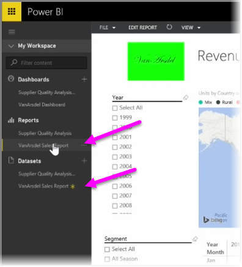

<properties
   pageTitle="Integrar OneDrive para la empresa con Power BI"
   description="Colaborar fácilmente con OneDrive para archivos de negocio y Power BI"
   services="powerbi"
   documentationCenter=""
   authors="davidiseminger"
   manager="mblythe"
   backup=""
   editor=""
   tags=""
   qualityFocus="no"
   qualityDate=""
   featuredVideoId="mxjakuVGgnU"
   featuredVideoThumb=""
   courseDuration="3m"/>

<tags
   ms.service="powerbi"
   ms.devlang="NA"
   ms.topic="get-started-article"
   ms.tgt_pltfrm="NA"
   ms.workload="powerbi"
   ms.date="09/29/2016"
   ms.author="davidi"/>

# Integrar OneDrive para la empresa con Power BI

En un artículo anterior, revisamos la creación de grupos para ayudar a su organización a administrar y colaborar en el contenido que se encuentra en Power BI. También puede usar el Power BI / Office 365 grupos para colaborar y compartir mediante **OneDrive para la empresa**.

Con OneDrive para la empresa como origen para su Power BI contenido proporciona acceso a un número de herramientas útiles, como el historial de versiones. También puede compartir los archivos con un grupo de Office 365 desde OneDrive para la empresa proporcionar acceso y permitir que varias personas trabajen en el mismo Power BI o los archivos de Excel.

Para conectarse a un archivo PBIX (Power BI Desktop) en OneDrive para la empresa, inicie sesión en el servicio Power BI y seleccione **obtener datos**. Elija **archivos** en Importar o conectarse a datos y, a continuación, seleccione **OneDrive - Business**. Resalte el archivo deseado y seleccione **Conectar**.

El contenido aparece en la barra de navegación izquierda.

Ahora, los cambios realizados en el archivo en **OneDrive para la empresa** se automáticamente reflejados en el entorno de Power BI también y registran en el historial de versiones.
