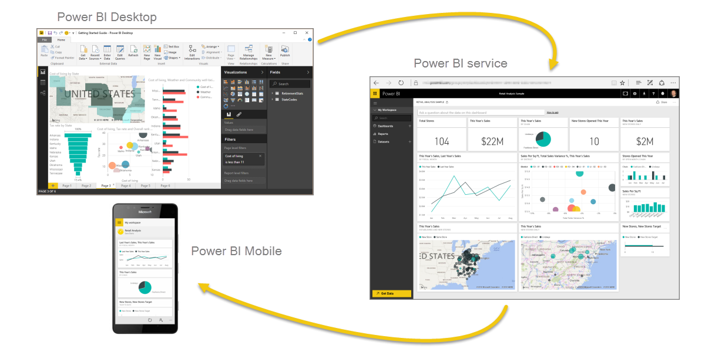
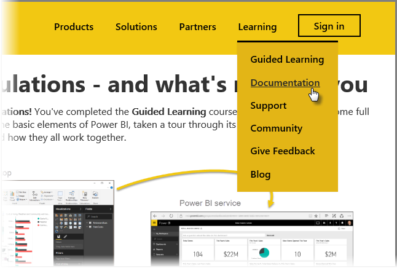

<properties
   pageTitle="Finalización de Power BI guiada de aprendizaje"
   description="Camino por recorrer - además un resumen y una gran cantidad de vínculos útiles"
   services="powerbi"
   documentationCenter=""
   authors="davidiseminger"
   manager="mblythe"
   backup=""
   editor=""
   tags=""
   qualityFocus="no"
   qualityDate=""
   featuredVideoId=""
   featuredVideoThumb=""
   courseDuration="4m"/>

<tags
   ms.service="powerbi"
   ms.devlang="NA"
   ms.topic="get-started-article"
   ms.tgt_pltfrm="NA"
   ms.workload="powerbi"
   ms.date="09/29/2016"
   ms.author="davidi"/>

# Enhorabuena - y pasos adicionales para usted

¡Lo logró! **Enhorabuena.** Ha completado la **aprendizaje guiado** curso para Power BI. Ha proceden los elementos básicos de Power BI de aprendizaje de círculo completo, realiza un recorrido por sus elementos y características del software y aprendió cómo funcionan en conjunto.

Se trata de la última sección (y el tema final, a menos que desee saber más sobre DAX) en el curso, por lo que si ha realizado a través de todas estas secciones en orden, dedique un momento a felicitarán usted mismo. ¡Buen trabajo! Ahora está bien versado en todos estos **conceptos importantes**:

-   ¿Qué [Power BI](powerbi-learning-0-0-what-is-power-bi.md)
-   El [pilares](powerbi-learning-0b-building-blocks-power-bi.md) de Power BI
-   
            [Obtener](powerbi-learning-1-2-connect-to-data-sources-in-power-bi-desktop.md) y [modelado](powerbi-learning-2-1-intro-modeling-data.md) datos
-   [Visualizaciones](powerbi-learning-3-1-intro-visualizations.md)
-   
            [Exploración de datos](powerbi-learning-4-0-intro-power-bi-service.md) en el servicio Power BI
-   Mediante [Excel y Power BI](powerbi-learning-5-1-intro-excel-data.md) juntos
-   Y [publicar y compartir](powerbi-learning-6-0-intro-content-packs-groups.md) su trabajo

Es una gran cantidad de conocimientos y ahora que tiene todo esto en mente, está preparado para comenzar a usarlo. Estos son algunos **vínculos a descargas** u obtener el explorador **conectado al servicio Power BI**:

-   Siempre puede [obtener la versión más reciente de Power BI Desktop](https://powerbi.microsoft.com/desktop)
-   Título para el [servicio Power BI](https://powerbi.microsoft.com/) es fácil
-   Obtener [aplicaciones móviles para Power BI](https://powerbi.microsoft.com/mobile/) es una derivación ausente

Hay más **Ayuda y hacer referencia a** de contenido disponibles, demasiado. Simplemente vaya a la parte superior de esta página y seleccione **aprendizaje > documentación** para ver el amplio conjunto de contenido de referencia de Power BI.

Esperamos que haya disfrutado de su viaje a través de este **aprendizaje guiado de Power BI** experimentar. Mejor para usted y mayo los objetos visuales de Power BI siempre sea envolventes y atractivas.

## Una sección más para los usuarios DAX

¿Aún desea más? ¿Está interesado en usar **DAX (expresiones de análisis de datos)** para crear, filtrar o utilizar tablas y columnas personalizadas en Power BI? Hay una sección más dirigida a los desarrolladores tender a realizar algún trabajo de código en Power BI y se llama **Introducción a DAX**. Si está interesado, sino que usa el mismo enfoque descriptivo como el resto de aprendizaje guiado, eche un vistazo.
