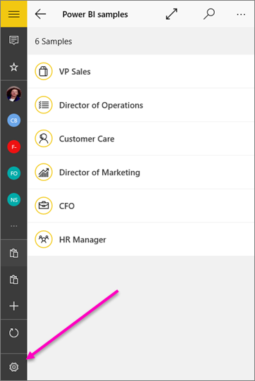

<properties 
   pageTitle="Ajustar la configuración de la aplicación móvil de Power BI para Windows 10"
   description="Ajustar la configuración de la aplicación móvil de Power BI para Windows 10"
   services="powerbi" 
   documentationCenter="" 
   authors="maggiesMSFT" 
   manager="erikre" 
   backup=""
   editor=""
   tags=""
   qualityFocus="no"
   qualityDate=""/>
 
<tags
   ms.service="powerbi"
   ms.devlang="NA"
   ms.topic="article"
   ms.tgt_pltfrm="NA"
   ms.workload="powerbi"
   ms.date="10/14/2016"
   ms.author="maggies"/>

# Ajustar la configuración de la aplicación móvil de Power BI para Windows 10

Puede ver y ajustar la configuración de la [aplicación móvil de Power BI para Windows 10](powerbi-mobile-win10phone-app-get-started.md).

1. En la aplicación móvil de Power BI para Windows 10, pulse **configuración** en la esquina inferior izquierda .

    

2. Aquí puede:

 -   Activar [el modo de presentación de Microsoft Surface Hub](powerbi-mobile-win10-app-presentation-mode.md).
 -   Consulte los términos de uso y la información de privacidad, la versión de la aplicación. 
 -   Configurar opciones como su consentimiento para enviar datos de telemetría genérico de Microsoft (no su información personal).
 -   
            [Obtener ayuda acerca de la aplicación móvil de Power BI para Windows 10](powerbi-mobile-win10phone-app-get-started.md).
 -   
            [Póngase en contacto con la Comunidad de aplicaciones móviles de Power BI](http://community.powerbi.com/t5/Mobile-Apps/bd-p/power-bi-mobile).
 -   
            [Enviar comentarios acerca de las aplicaciones móviles de Power BI](https://ideas.powerbi.com/forums/265200-power-bi/category/105939-mobile).

### Consulte también

- 
            [Descargar la aplicación móvil de Power BI para Windows 10](http://go.microsoft.com/fwlink/?LinkID=526478) desde la tienda Windows  
- 
            [Introducción a la aplicación móvil de Power BI para Windows 10](powerbi-mobile-win10phone-app-get-started.md)  
- ¿Tiene preguntas? 
            [Pruebe a formular a la Comunidad de Power BI](http://community.powerbi.com/)

