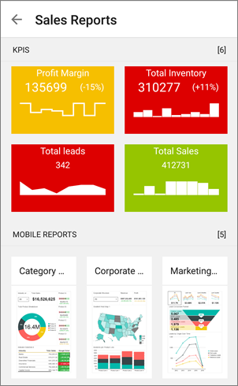

<properties 
   pageTitle="Get started with the Power BI for Android mobile app"
   description="The Android mobile app for Microsoft Power BI brings Power BI to your pocket, with up-to-date, touch-enabled mobile access to business information."
   services="powerbi" 
   documentationCenter="" 
   authors="maggiesMSFT" 
   manager="mblythe" 
   backup=""
   editor=""
   tags=""
   qualityFocus="monitoring"
   qualityDate="05/18/2016"/>
 
<tags
   ms.service="powerbi"
   ms.devlang="NA"
   ms.topic="article"
   ms.tgt_pltfrm="NA"
   ms.workload="powerbi"
   ms.date="09/30/2016"
   ms.author="maggies"/>

# Get started with the Power BI for Android mobile app

The Android app for Microsoft Power BI brings Power BI to your pocket, with up-to-date, touch-enabled mobile access to your business information. View and interact with your company dashboards from anywhere.

You <bpt id="p1">[</bpt>create dashboards and reports in the Power BI service<ept id="p1">](powerbi-service-get-started.md)</ept> with your data. 

Then interact with your dashboards and reports, explore the data, and share them, all from the Android app for Power BI.

## Lo primero es lo primero

-   <bpt id="p1">**</bpt>Get the app<ept id="p1">**</ept>  <bpt id="p2">[</bpt>Get the Power BI for Android app<ept id="p2">](http://go.microsoft.com/fwlink/?LinkID=544867)</ept> from Google Play.

    ><bpt id="p1">**</bpt>Note:<ept id="p1">**</ept> Power BI can run on a number of different Android phones. Your phone needs to be running the Android 4.4 operating system, or later. To check on your phone, go to <bpt id="p1">**</bpt>Settings<ept id="p1">**</ept><ph id="ph1"> &gt; </ph><bpt id="p2">**</bpt>About device<ept id="p2">**</ept><ph id="ph2"> &gt; </ph><bpt id="p3">**</bpt>Android version<ept id="p3">**</ept>. 

-   <bpt id="p1">**</bpt>Start when you open the app<ept id="p1">**</ept>    Even without signing up or signing in, after you open the app you can flip through the sign-in pages for a quick overview of things you can do with the Power BI app on your Android phone. Tap <bpt id="p1">**</bpt>Skip<ept id="p1">**</ept> to view and explore the samples, and get hands-on experience with the app. You can go back to the samples whenever you want from the dashboards home page.

-   Find out <bpt id="p1">[</bpt>what's new in the Power Bi mobile apps<ept id="p1">](powerbi-mobile-whats-new-in-the-mobile-apps.md)</ept>.

## Sign up for the Power BI service on the web

If you haven't signed up yet, go to the <bpt id="p1">[</bpt>Power BI service (http://powerbi.com/)<ept id="p1">](http://powerbi.com/)</ept> to sign up for your own account for creating and storing dashboards and reports, and bringing your data together. Then sign in to Power BI from your Android phone to see your own dashboards from anywhere.

1.  In the Power BI service, tap <bpt id="p1">[</bpt>Sign up<ept id="p1">](http://go.microsoft.com/fwlink/?LinkID=513879)</ept> to create a Power BI account.

2.   Start <bpt id="p1">[</bpt>creating your own dashboards and reports<ept id="p1">](powerbi-service-get-started.md)</ept>.

## Get started with the Power BI app on your phone

2.  On your Android phone, from the start screen open the Power BI for Android app.

    

3.  To view your Power BI dashboards and reports, tap <bpt id="p1">**</bpt>Power BI<ept id="p1">**</ept>.  
   To view your Reporting Services mobile reports and KPIs, tap <bpt id="p1">**</bpt>SQL Server Reporting Services<ept id="p1">**</ept>.

    

## Try the Power BI and Reporting Services samples  
Even without signing up, you can play with the Power BI and Reporting Services samples. After you download the app, you can view the samples or get started. Go back to the samples whenever you want from the dashboards home page.

### Power BI samples

You can view and interact with the Power BI dashboard samples, but there are a few things you can't do with them. You can't open the reports behind the dashboards, share the samples with others, or make them your favorites.

1.   Tap the global navigation button <ph id="ph1"></ph> in the upper-left corner.
  
2.   Tap <bpt id="p1">**</bpt>Power BI samples<ept id="p1">**</ept>, then pick a role and explore the sample dashboard for that role.  

    

    ><bpt id="p1">**</bpt>Note<ept id="p1">**</ept>:  Not all features are available in the samples. For example, you can't view the sample reports that underlie the dashboards. 

### Reporting Services mobile report samples

1.   Tap the global navigation button <ph id="ph1"></ph> in the upper-left corner.

2.  Tap <bpt id="p1">**</bpt>Reporting Services samples<ept id="p1">**</ept>, then open either the Retail Reports or the Sales Reports folder to explore their KPIs and mobile reports.

    

## ¿Qué debo hacer a continuación?

See what else you can do in the Android phone app for Power BI with dashboards and reports in Power BI, and Reporting Services mobile reports and KPIs in the Reporting Services web portal

### Power BI dashboards

-   View your <bpt id="p1">[</bpt>dashboards<ept id="p1">](powerbi-mobile-dashboards-in-the-android-app.md)</ept>.
-   Explore the <bpt id="p1">[</bpt>tiles on your dashboards<ept id="p1">](powerbi-mobile-tiles-in-the-android-app.md)</ept>.
-   View <bpt id="p1">[</bpt>report page tiles<ept id="p1">](powerbi-mobile-report-page-tiles-in-the-android-app.md)</ept>.
-   Open <bpt id="p1">[</bpt>Power BI reports<ept id="p1">](powerbi-mobile-reports-in-the-android-app.md)</ept>.
-   View <bpt id="p1">[</bpt>your groups<ept id="p1">](powerbi-mobile-groups-in-the-android-app.md)</ept>.
-   <bpt id="p1">[</bpt>Annotate and share tiles<ept id="p1">](powerbi-mobile-annotate-and-share-a-tile-from-the-android-app.md)</ept>.
-   Share <bpt id="p1">[</bpt>dashboards<ept id="p1">](powerbi-mobile-share-a-dashboard-from-the-android-app.md)</ept>.
-   <bpt id="p1">[</bpt>Scan a Power BI QR code<ept id="p1">](powerbi-mobile-qr-code-for-tile.md)</ept> from your Android phone to open a related dashboard. 
-   View <bpt id="p1">[</bpt>notifications about updates to your Power BI account<ept id="p1">](powerbi-mobile-notification-center.md)</ept>, such as dashboards that colleagues share with you.

    

### Reporting Services mobile reports and KPIs

- <bpt id="p1">[</bpt>View Reporting Services mobile reports and KPIs<ept id="p1">](powerbi-mobile-android-kpis-mobile-reports.md)</ept> in the Android phone app for Power BI.
- Create <bpt id="p1">[</bpt>KPIs on the Reporting Services web portal<ept id="p1">](https://msdn.microsoft.com/library/mt683632.aspx)</ept>.
- <bpt id="p1">[</bpt>Create your own mobile reports with the SQL Server Mobile Report Publisher<ept id="p1">](https://msdn.microsoft.com/library/mt652547.aspx)</ept>, and publish them to the Reporting Services web portal.

### Consulte también

-  <bpt id="p1">[</bpt>Download the Android app<ept id="p1">](http://go.microsoft.com/fwlink/?LinkID=544867)</ept> from the Android app store.
-  [Get started with Power BI](powerbi-service-get-started.md)
- Questions? [Try asking the Power BI Community](http://community.powerbi.com/)
