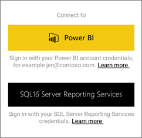

<properties 
   pageTitle="Introducción a la aplicación Power BI para Android móvil"
   description="La aplicación móvil Android para Microsoft Power BI le trae Power BI a su bolsillo, con acceso móvil actualizado y táctil a la información empresarial."
   services="powerbi" 
   documentationCenter="" 
   authors="maggiesMSFT" 
   manager="mblythe" 
   backup=""
   editor=""
   tags=""
   qualityFocus="monitoring"
   qualityDate="05/18/2016"/>
 
<tags
   ms.service="powerbi"
   ms.devlang="NA"
   ms.topic="article"
   ms.tgt_pltfrm="NA"
   ms.workload="powerbi"
   ms.date="09/30/2016"
   ms.author="maggies"/>

# Introducción a la aplicación Power BI para Android móvil

La aplicación Android para Microsoft Power BI le trae Power BI a su bolsillo, con acceso móvil actualizado y táctil a la información empresarial. Ver e interactuar con los paneles de la empresa desde cualquier lugar.

Se [crear paneles e informes en el servicio de Power BI](powerbi-service-get-started.md) con los datos. 

A continuación, interactuar con los paneles e informes, explorar los datos y compartirlos desde la aplicación Android para Power BI.

## Lo primero es lo primero

-   
            **Obtención de la aplicación**[Descargue Power BI para aplicación Android](http://go.microsoft.com/fwlink/?LinkID=544867) de Google Play.  

    >
            **Nota:** Power BI puede ejecutar en una serie de diferentes teléfonos Android. El teléfono debe tener instalado el sistema operativo Android 4.4, o posterior. Para comprobar su teléfono, vaya a **configuración** > **sobre el dispositivo** > **versión Android**. 

-   
            **Iniciar al abrir la aplicación**    incluso sin registrarse o iniciar sesión, después de abrir la aplicación puede desplazarse por las páginas de inicio de sesión para obtener una introducción rápida de cosas que puede hacer con la aplicación Power BI en su teléfono Android. Puntee en **omitir** para ver y explorar los ejemplos y obtener experiencia práctica con la aplicación. Puede volver a los ejemplos siempre que lo desee desde la página principal de paneles.

-   Descubra [Novedades en las aplicaciones móviles de Power Bi](powerbi-mobile-whats-new-in-the-mobile-apps.md).

## Registrarse para el servicio Power BI en la web

Si no ha aceptado todavía, vaya a la [servicio Power BI (http://powerbi.com/)](http://powerbi.com/) para suscribirse a su propia cuenta para crear y almacenar informes y paneles para reunir los datos. A continuación, inicie sesión en Power BI desde tu teléfono Android para ver sus propios escritorios desde cualquier lugar.

1.  En el servicio Power BI, pulse [registrarse](http://go.microsoft.com/fwlink/?LinkID=513879) para crear una cuenta de Power BI.

2.   Iniciar [crear sus propios paneles e informes](powerbi-service-get-started.md).

## Introducción a la aplicación de Power BI en su teléfono

2.  En tu teléfono Android, desde la pantalla de inicio, abra la aplicación Power BI para Android.

    

3.  Para ver los informes y paneles de Power BI, puntee **Power BI**.  
   Para ver los informes de Reporting Services móviles y KPI, puntee **SQL Server Reporting Services**.

    

## Pruebe los ejemplos de Power BI y Reporting Services  
Incluso sin registrarse, puede reproducir con los ejemplos de Power BI y Reporting Services. Después de descargar la aplicación, puede ver los ejemplos o empezar a trabajar. Volver a los ejemplos siempre que lo desee desde la página principal de paneles.

### Ejemplos de Power BI

Puede ver e interactuar con los ejemplos de panel de Power BI, pero hay algunas cosas que no puede hacer con ellos. No se puede abrir los informes de los paneles, compartir los ejemplos con otros usuarios o que sean sus favoritos.

1.   Puntee en el botón de navegación global  en la esquina superior izquierda.
  
2.   Puntee en **ejemplos de Power BI**, elija un rol y explore el panel de ejemplo para ese rol.  

    

    >
            **Nota**: no todas las características están disponibles en los ejemplos. Por ejemplo, no puede ver los informes de ejemplo que subyacen a los paneles. 

### Ejemplos de Reporting Services informe móvil

1.   Puntee en el botón de navegación global  en la esquina superior izquierda.

2.  Puntee en **ejemplos de Reporting Services**, a continuación, abra los informes de venta directa o la carpeta de informes de ventas para explorar sus KPI y los informes de dispositivos móviles.

    

## ¿Qué debo hacer a continuación?

Vea lo que puede hacer en la aplicación de teléfono Android para Power BI con paneles e informes en Power BI y los informes de Reporting Services móviles y KPI en el portal web de Reporting Services

### Paneles de Power BI

-   Ver su [paneles](powerbi-mobile-dashboards-in-the-android-app.md).
-   Explorar el [iconos en los paneles](powerbi-mobile-tiles-in-the-android-app.md).
-   Vista [iconos de página de informe](powerbi-mobile-report-page-tiles-in-the-android-app.md).
-   Abra [informes de Power BI](powerbi-mobile-reports-in-the-android-app.md).
-   Vista [los grupos](powerbi-mobile-groups-in-the-android-app.md).
-   
            [Anotar y compartir mosaicos](powerbi-mobile-annotate-and-share-a-tile-from-the-android-app.md).
-   Recurso compartido [paneles](powerbi-mobile-share-a-dashboard-from-the-android-app.md).
-   
            [Analizar un código QR de Power BI](powerbi-mobile-qr-code-for-tile.md) desde su dispositivo Android phone abrir un panel de información relacionado. 
-   Vista [notificaciones sobre las actualizaciones a su cuenta de Power BI](powerbi-mobile-notification-center.md), como paneles de colegas compartan con usted.

    

### Informes informes de servicios móviles y KPI

- 
            [Ver informes de Reporting Services móviles y KPI](powerbi-mobile-android-kpis-mobile-reports.md) en la aplicación de teléfono Android para Power BI.
- Crear [KPI en el portal web de Reporting Services](https://msdn.microsoft.com/library/mt683632.aspx).
- 
            [Crear sus propios informes móviles con el publicador de informes de SQL Server Mobile](https://msdn.microsoft.com/library/mt652547.aspx), y publíquelos en el portal web de Reporting Services.

### Consulte también

-  
            [Descargue la aplicación Android](http://go.microsoft.com/fwlink/?LinkID=544867) desde la tienda de aplicaciones Android.
-  [Introducción a Power BI](powerbi-service-get-started.md)
- ¿Tiene preguntas? [Pruebe a formular a la Comunidad de Power BI](http://community.powerbi.com/)
