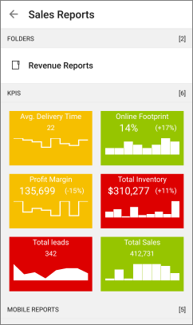
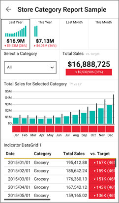
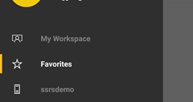

<properties 
   pageTitle="View Reporting Services mobile reports and KPIs in the Android app"
   description="The Android app for Power BI offers live, touch-enabled mobile access to your important on-premises business information."
   services="powerbi" 
   documentationCenter="" 
   authors="maggiesMSFT" 
   manager="mblythe" 
   backup=""
   editor=""
   tags=""
   qualityFocus="no"
   qualityDate=""/>
 
<tags
   ms.service="powerbi"
   ms.devlang="NA"
   ms.topic="article"
   ms.tgt_pltfrm="NA"
   ms.workload="powerbi"
   ms.date="09/26/2016"
   ms.author="maggies"/>

# View Reporting Services mobile reports and KPIs in the Android app for Power BI 
The Android app for Power BI offers live, touch-enabled mobile access to your important on-premises business information. 

<bpt id="p1">[</bpt>Create Reporting Services mobile reports<ept id="p1">](https://msdn.microsoft.com/library/mt652547.aspx)</ept> with SQL Server Mobile Report Publisher and publish them to the <bpt id="p2">[</bpt>Reporting Services web portal<ept id="p2">](https://msdn.microsoft.com/library/mt637133.aspx)</ept>. Create KPIs right in the web portal. Organize them in folders and mark your favorites, so you can find them easily. 

Then in the Android app for Power BI, view the mobile reports and KPIs, organized in folders or collected as favorites. 

## Explore samples without an SSRS server

Even if you don't have access to a Reporting Services web portal, you can still explore the features of Reporting Services mobile reports. 

-  Tap the options icon <ph id="ph1"></ph> in the upper-left corner, scroll down and tap SQL Server RS Samples.

Browse the samples to interact with KPIs and mobile reports.

## Connect to a server to view Reporting Services mobile reports 

1.  In your Android phone, open the Power BI app.
  
3. Tap the options icon <ph id="ph1"></ph> in the upper-left corner, and tap <bpt id="p1">**</bpt>Connect to SSRS server<ept id="p1">**</ept>.

4. Fill in the server address and your user name and password, in this format:

    

    ><bpt id="p1">**</bpt>Note<ept id="p1">**</ept>: Include <bpt id="p2">**</bpt>http<ept id="p2">**</ept> or <bpt id="p3">**</bpt>https<ept id="p3">**</ept> in front of the connection string. For example, http://<bpt id="p1">*</bpt>servername<ept id="p1">*</ept>.com/reports.

    Tap <bpt id="p1">**</bpt>Advanced option<ept id="p1">**</ept> to give the server a name, if you'd like.

3. Tap the check mark in the upper-right corner.

5.  Now you see the server in the left navigation bar.

    

><bpt id="p1">**</bpt>Tip<ept id="p1">**</ept>: Tap the options icon <ph id="ph1"></ph> anytime to go between your Reporting Services mobile reports and your dashboards in the Power BI service. 

## View Reporting Services KPIs and mobile reports in the Power BI app

Reporting Services KPIs and mobile reports are displayed in the same folders they're in on the Reporting Services web portal. 

- Tap a KPI to see it in focus mode &amp;#151; then tip your phone to see it in landscape mode.

    

- Tap a mobile report to open and interact with it in the Power BI app.

    

## View your favorite KPIs and reports

You can mark KPIs and mobile reports as favorites on your Reporting Services web portal, and then view them in one convenient folder on your phone, along with your Power BI favorite dashboards and reports.

-  Tap <bpt id="p1">**</bpt>Favorites<ept id="p1">**</ept>.

    
   
    Your favorites from the web portal are all on this page.

    

## Remove a connection to a report server

You can only be connected to one report server at a time from your Android app. If you want to connect to a different server, you need to disconnect from the current one.

1. At the bottom of the left navigation bar, tap <bpt id="p1">**</bpt>Settings<ept id="p1">**</ept>.
2. Tap the ellipsis (<bpt id="p1">**</bpt>...<ept id="p1">**</ept>) next to the server name you don't want to be connected to.
3. Tap <bpt id="p1">**</bpt>Remove Connection<ept id="p1">**</ept>.

## Create Reporting Services mobile reports and KPIs

You don't create Reporting Services KPIs and mobile reports in the Power BI mobile app. You create them in SQL Server Mobile Report Publisher and a SQL Server 2016 Reporting Services web portal.

- <bpt id="p1">[</bpt>Create your own Reporting Services mobile reports<ept id="p1">](https://msdn.microsoft.com/library/mt652547.aspx)</ept> and publish them to the Reporting Services web portal.
- Create <bpt id="p1">[</bpt>KPIs on the Reporting Services web portal<ept id="p1">](https://msdn.microsoft.com/library/mt683632.aspx)</ept>

### Consulte también  
- [Get started with the Android app for Power BI](powerbi-mobile-android-app-get-started.md)  
- [Get started with Power BI](powerbi-service-get-started.md)  
- Questions? [Try asking the Power BI Community](http://community.powerbi.com/)
