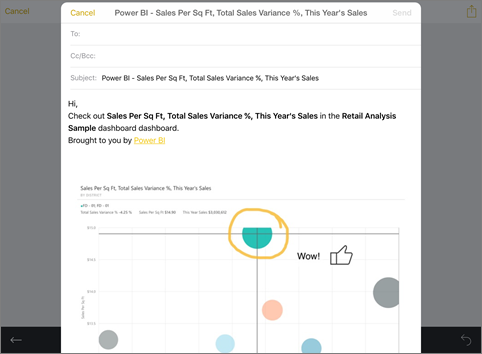

<properties 
   pageTitle="Annotate and share a snapshot of a tile from the iPad app"
   description="Read about sharing snapshots of tiles from the Microsoft Power BI app for iOS on the iPad. You can send tile snapshots to anyone, not just colleagues."
   services="powerbi" 
   documentationCenter="" 
   authors="maggiesMSFT" 
   manager="erikre" 
   backup=""
   editor=""
   tags=""
   qualityFocus="no"
   qualityDate=""/>
 
<tags
   ms.service="powerbi"
   ms.devlang="NA"
   ms.topic="article"
   ms.tgt_pltfrm="NA"
   ms.workload="powerbi"
   ms.date="10/11/2016"
   ms.author="maggies"/>

# Annotate and share a snapshot of a tile from the iPad app (Power BI for iOS)  

When you share a tile from the <bpt id="p1">[</bpt>iPad app for Microsoft Power BI<ept id="p1">](http://go.microsoft.com/fwlink/?LinkId=522062)</ept> for iOS, you're sharing a snapshot of the tile. Your recipients see the tile exactly as it was when you sent the mail. They can't open the dashboard. You can send snapshots of tiles to anyone — not just colleagues in the same email domain.

You can add annotations — lines, text, or stamps — to a tile before you share a snapshot.

1.  Tap a tile to open it in focus mode.

    

2.  Tap the share icon <ph id="ph1"></ph> in the upper-right corner of the tile.

3.  To annotate the tile, in the Edit window:  
    

    -   To draw lines of different colors and thicknesses, tap the paintbrush icon, then tap the arrow in the lower-left corner.  

    -   To type comments, tap the <bpt id="p1">**</bpt>A<ept id="p1">**</ept>, then tap the arrow on the left end of the black bar at the center.  

    -   To paste stamps (like emoticons) on the tile, tap the smiley face, then tap the arrow in the lower-left corner.   
        

    -   After annotating, to send it tap the share icon <ph id="ph1"></ph> in the upper-right corner again.

4.  Tap the Mail icon, type the recipients' names, and modify the message, if you want.  

    

5.  Tap <bpt id="p1">**</bpt>Send<ept id="p1">**</ept>.

### Consulte también  
<bpt id="p1">[</bpt>Get started with the iPad app<ept id="p1">](powerbi-mobile-iphone-app-get-started.md)</ept> (Power BI for iOS)  
<bpt id="p1">[</bpt>Share dashboards from the iPad app<ept id="p1">](powerbi-mobile-share-dashboards-from-the-ipad-app.md)</ept>
