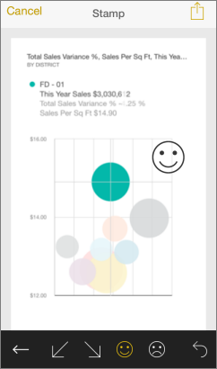

<properties 
   pageTitle="Anotar y compartir un icono de la aplicación de iPhone"
   description="Obtenga información acerca de anotar y compartir instantáneas de iconos de la aplicación móvil de Power BI para iOS en su iPhone. Destinatarios ver el icono, pero no pueden abrir el panel."
   services="powerbi" 
   documentationCenter="" 
   authors="maggiesMSFT" 
   manager="mblythe" 
   backup=""
   editor=""
   tags=""
   qualityFocus="no"
   qualityDate=""/>
 
<tags
   ms.service="powerbi"
   ms.devlang="NA"
   ms.topic="article"
   ms.tgt_pltfrm="NA"
   ms.workload="powerbi"
   ms.date="10/03/2016"
   ms.author="maggies"/>
# Anotar y compartir un icono de la aplicación de iPhone (Power BI para iOS)

Cuando comparte una instantánea de un mosaico de la aplicación de iPhone para Microsoft Power BI para iOS, los destinatarios verán la instantánea del mosaico exactamente igual que cuando se envió el correo. No pueden abrir el panel. Instantáneas de iconos puede enviar a cualquier persona, no sólo compañeros en el mismo dominio de correo electrónico.

Puede agregar anotaciones, líneas, texto o marcas, a un mosaico antes de compartir una instantánea.

1.  En un [panel](powerbi-mobile-dashboards-in-the-iphone-app.md) en la aplicación de iPhone, puntee en un mosaico para abrirlo en modo de enfoque.

2.  Puntee en el icono de recurso compartido  en la esquina superior derecha del mosaico.

3.  Para anotar el mosaico, puntee en un icono en la barra inferior de la ventana de edición:

    

    -   Puntee en el icono de lápiz para dibujar líneas de distintos colores y grosores.

    -   Puntee en el globo de texto para escribir comentarios.

    -   Puntee en la cara sonriente para pegar marcas (por ejemplo, iconos gestuales) en el icono.

4.  Después de anotar, puntee en el icono de recurso compartido  en la esquina superior derecha.

5.  Escriba los nombres de destinatarios en la aplicación de correo electrónico de su elección, modifique el mensaje si desea y enviar.

### Consulte también

- [Compartir un panel de la aplicación de iPhone \(Power BI para iOS\)](powerbi-mobile-share-a-dashboard-from-the-iphone-app.md)
- [Introducción a la aplicación de iPhone para Power BI](powerbi-mobile-iphone-app-get-started.md)
- ¿Tiene preguntas? [Pruebe a formular a la Comunidad de Power BI](http://community.powerbi.com/)
