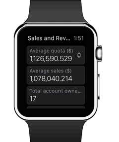
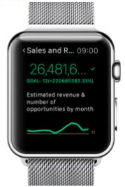
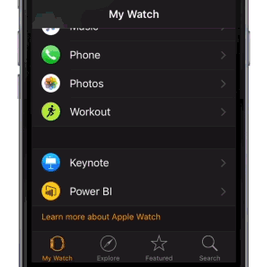

<properties 
   pageTitle="Power BI Apple Watch aplicación"
   description="Power BI Apple Watch aplicación"
   services="powerbi" 
   documentationCenter="" 
   authors="maggiesMSFT" 
   manager="erikre" 
   backup=""
   editor=""
   tags=""
   qualityFocus="no"
   qualityDate=""/>
 
<tags
   ms.service="powerbi"
   ms.devlang="NA"
   ms.topic="article"
   ms.tgt_pltfrm="NA"
   ms.workload="powerbi"
   ms.date="10/14/2016"
   ms.author="maggies"/>

# Power BI Apple Watch aplicación

Con la aplicación Power BI Apple Watch, puede ver los KPI y tarjeta mosaicos desde los paneles de Power BI, justo en el reloj. Los KPI y los iconos de tarjeta son más adecuadas para proporcionar una medida de latido en una pantalla pequeña. Compruebe la entrada de blog.
 
## Instalar el Apple Watch aplicación
La aplicación de Power BI Apple Watch se incluye con la aplicación Power BI para iOS, cuando así se [Descargar la aplicación Power BI en su iPhone](http://go.microsoft.com/fwlink/?LinkId=522062 "Descargar la aplicación de iPhone") desde la tienda de aplicaciones de Apple está automáticamente también descarga la aplicación de Power BI inspección. La Guía de Apple explica cómo [instalar aplicaciones de Apple Watch](https://support.apple.com/en-us/HT204784).

## Sincronizar el panel con Power BI en su Apple Watch
1. En Power BI en su iPhone, abra el panel que desee sincronizar con el Apple Watch. 

2. Seleccione los puntos suspensivos (...) > **sincronización con inspección**.

Power BI muestra un indicador de que el panel se ha sincronizado con el reloj.

Puede sincronizar sólo un panel simultáneamente con la inspección.

> 
            **Sugerencia**: para ver los iconos de varios paneles en su reloj, cree un nuevo panel en el servicio Power BI y anclar todas las fichas relevantes a él.

## Utilizar la aplicación de Power BI en el Apple Watch
Ir a la aplicación de Power BI Apple Watch desde springboard de inspección, o haciendo clic en el widget de Power BI (si está configurado) directamente desde la cara del reloj.

La aplicación de Power BI Apple Watch consta de dos partes.

-   El **pantalla índice** permite una breve descripción de todos los KPI y tarjeta mosaicos desde el panel sincronizado.

    

-   El **foco mosaico**: haga clic en un icono en la pantalla de índice de una vista detallada de un mosaico concreto.

    
 
## Establecer un widget de Power BI personalizado
También puede mostrar un icono específico de Power BI directamente en la cara de Apple Watch, por lo que es visible y accesible en todo momento.

El widget de Power BI Apple Watch actualiza cerca del momento en las actualizaciones de datos, mantener la información necesaria siempre actualizado.

### Agregar un widget de Power BI a la cara del reloj

Consulte [personalizar su cara Apple Watch](https://support.apple.com/en-us/HT205536) en la Guía de Apple.

### Cambiar el texto del widget
Dado el pequeño espacio en la cara de Apple Watch, la aplicación de Power BI Apple Watch permite cambiar el título del widget para ajustarse al espacio pequeño.

-   En su iPhone, vaya a la aplicación de control de Apple Watch, seleccione Power BI, desplácese hasta el campo de nombre de widget y escriba un nombre nuevo.

    

 
> [AZURE.NOTE]  Si no cambia el nombre, el widget de Power BI Acorte el nombre para el número de caracteres que se ajustan el pequeño espacio en la cara del reloj. 

### Consulte también

Sus comentarios nos ayudarán a decidirlo que lo implemente en el futuro, por favor, no se olvide de votar para otras características que le gustaría ver en aplicaciones móviles de Power BI. 

-   Descargue el [aplicación móvil de iPhone de Power BI](http://go.microsoft.com/fwlink/?LinkId=522062)
-   Siga [@MSPowerBI en Twitter](https://twitter.com/MSPowerBI)
-   Únase a la conversación en el [Comunidad de Power BI](http://community.powerbi.com/)

            [Introducción a la aplicación de iPhone para Power BI](powerbi-mobile-iphone-app-get-started.md)

