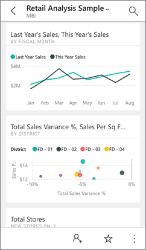
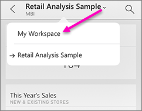

<properties 
   pageTitle="View dashboards in the Power BI mobile apps"
   description="You create or connect to dashboards in the Power BI service. Then you can view them in the Power BI mobile apps."
   services="powerbi" 
   documentationCenter="" 
   authors="maggiesMSFT" 
   manager="mblythe" 
   backup=""
   editor=""
   tags=""
   qualityFocus="complete"
   qualityDate="07/08/2016"/>
 
<tags
   ms.service="powerbi"
   ms.devlang="NA"
   ms.topic="article"
   ms.tgt_pltfrm="NA"
   ms.workload="powerbi"
   ms.date="10/03/2016"
   ms.author="maggies"/>
# View dashboards in the Power BI mobile apps

Dashboards are a portal to your company's life cycle and processes. A dashboard is an overview, a single place to monitor the current state of the business.

## Create dashboards in the Power BI service
**You don't create dashboards in the mobile apps.** 

To see more dashboards on your mobile device, you need to create or connect to them on your computer. 

1. Go to the Power BI service (<bpt id="p1">[</bpt>https://www.powerbi.com<ept id="p1">](https://www.powerbi.com)</ept>) and <bpt id="p2">[</bpt>sign up for an account<ept id="p2">](powerbi-service-self-service-signup-for-power-bi.md)</ept>.

2. <bpt id="p1">[</bpt>Create your own Power BI dashboards<ept id="p1">](powerbi-service-create-a-dashboard.md)</ept>, or connect to existing <bpt id="p2">[</bpt>content packs for a variety of services<ept id="p2">](powerbi-content-packs-services.md)</ept>.

Here's a Power BI dashboard in the Power BI service:

## View dashboards in the Power BI mobile apps

Then these same dashboards will appear automatically in your Power BI mobile app. Dashboards refresh in real time, automatically, so no need to manually refresh them.

Here's the same dashboard as seen on a mobile phone:

From here, you can:

- Share the dashboard with colleagues <ph id="ph1"></ph>.
- <bpt id="p1">[</bpt>Make the dashboard one of your favorites<ept id="p1">](powerbi-mobile-favorites.md)</ept> <ph id="ph1"></ph>.
- Tap the arrow next to the dashboard name to go back to My Workspace.

    

## Create a phone view of a dashboard in the Power BI service

If you're the dashboard owner, <bpt id="p1">*</bpt>in the Power BI service<ept id="p1">*</ept> you can create a view of the dashboard specifically for phones in portrait mode. 

Read more about <bpt id="p1">[</bpt>creating a phone view of a dashboard<ept id="p1">](powerbi-service-create-dashboard-phone-view.md)</ept>.

### More about dashboards in the Power BI mobile apps
- [Dashboards in the iPad app for Power BI for iOS](powerbi-mobile-dashboards-on-the-ipad-app.md)
- [Dashboards in the iPhone app for Power BI for iOS](powerbi-mobile-dashboards-in-the-iphone-app.md)
- [Dashboards in the Power BI mobile app for Windows 10 devices](powerbi-mobile-dashboards-in-the-win10phone-app.md)
- [Dashboards in the Power BI app for Android phones](powerbi-mobile-dashboards-in-the-android-app.md)
- Questions? [Try asking the Power BI Community](http://community.powerbi.com/)