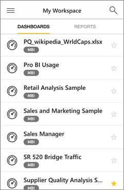
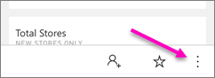
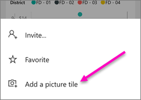

<properties 
   pageTitle="Paneles de la aplicación de iPhone"
   description="Los paneles son un portal para el ciclo de vida de su empresa. Obtenga información acerca de cómo ver, explorar y compartir sus paneles en la aplicación Power BI para iOS en el iPhone." 
   services="powerbi" 
   documentationCenter="" 
   authors="maggiesMSFT" 
   manager="mblythe" 
   backup=""
   editor=""
   tags=""
   qualityFocus="monitoring"
   qualityDate="03/11/2016"/>
 
<tags
   ms.service="powerbi"
   ms.devlang="NA"
   ms.topic="article"
   ms.tgt_pltfrm="NA"
   ms.workload="powerbi"
   ms.date="09/30/2016"
   ms.author="maggies"/>

# Paneles de la aplicación de iPhone (Power BI para iOS)  

Los paneles son un portal para el ciclo de vida de su empresa. Obtenga información acerca de cómo ver, explorar y compartir sus paneles en la aplicación Power BI para iOS en el iPhone.  

No cree paneles en la aplicación Power BI en su iPhone. Se [crear paneles](powerbi-service-dashboards.md) o [conectarse a los paneles de información para servicios](powerbi-content-packs-services.md) como Salesforce en el servicio Power BI ([https://www.powerbi.com](https://www.powerbi.com)) en el equipo.

A continuación, en la aplicación de iPhone para Microsoft Power BI para iOS, puede explorar estos paneles de la mismos. Los paneles se actualización en tiempo real, automáticamente, por lo que no es necesario actualizarlos manualmente.

## Paneles de la vista en su iPhone  
1.  Abra la aplicación de Power BI en su iPhone e inicie sesión.

    ¿Necesita [Descargar la aplicación de iPhone](http://go.microsoft.com/fwlink/?LinkId=522062) de Apple App Store?

3.  Puntee en un panel para abrirlo.  

     

    De forma predeterminada, paneles de Power BI parecer un poco diferentes en su iPhone. Todos los mosaicos aparecen el mismo tamaño y que estén organizadas uno tras otro de arriba a abajo.

     

    >
            **Sugerencia**: si es el propietario del panel, en el servicio Power BI puede [crear una vista del panel específicamente para teléfonos](powerbi-service-create-dashboard-phone-view.md) en modo vertical. 

     O simplemente activar el teléfono lateralmente [Ver el panel en modo horizontal](#view-dashboards-in-landscape-mode) en su teléfono.

     

4.  Deslice el dedo hacia arriba y hacia abajo para ver todos los iconos en el panel. Puede:

    -   
            [Puntee en un mosaico](powerbi-mobile-tiles-in-the-iphone-app.md) para abrirlo en modo de enfoque e interactuar con él.

    -   
            [Interactuar con un icono de página de informe](powerbi-mobile-report-page-tiles-in-the-iphone-app.md) en la aplicación de iPhone.

    -   Toque la estrella  a [convertir favorita](powerbi-mobile-favorites.md).

    -  Puntee en **Invitar a**  a [Invitar a un colega](powerbi-mobile-share-a-dashboard-from-the-iphone-app.md) para ver el panel.

    -  Puntee en el botón de puntos suspensivos para abrir el menú panel...

        

        A continuación, puntee en [Agregar un icono de imagen](powerbi-mobile-picture-tiles-in-the-iphone-app.md) al panel.

        

    -  
            [Sincronizar el panel con sus Apple Watch](powerbi-mobile-apple-watch.md).

6.  Para volver a la lista de paneles, puntee en la flecha situada junto al título del panel y, a continuación, puntee en **Mi área de trabajo**.

    

## Paneles de la vista en modo horizontal

Simplemente activar su teléfono lateralmente para ver los paneles en modo horizontal. El diseño del panel cambia de una serie de mosaicos a una vista de todo el panel & #151; ver todos los iconos del escritorio tal como aparecen en el servicio Power BI.

Puede usar el gesto de "alejar" para acercar y alejar en distintas áreas de su escritorio, panorámica para navegar en él. Y aún así puede [toque un icono](powerbi-mobile-tiles-in-the-win10phone-app.md) para abrir el mosaico en el modo de enfoque e interactuar con los datos.

### Consulte también  
- [Introducción a la aplicación de iPhone para Power BI](powerbi-mobile-iphone-app-get-started.md)  
- [Introducción a Power BI](powerbi-service-get-started.md) 
- [Crear una vista de teléfono de un panel en Power BI](powerbi-service-create-dashboard-phone-view.md) 
- ¿Tiene preguntas? [Pruebe a formular a la Comunidad de Power BI](http://community.powerbi.com/)