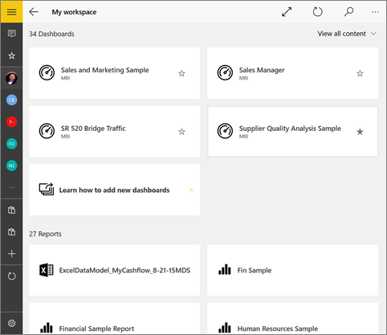
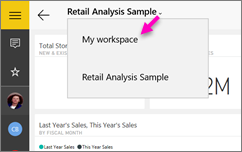
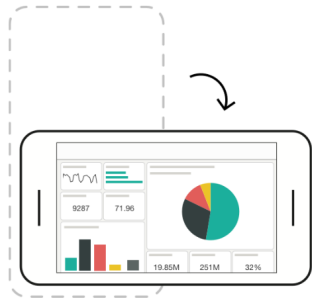

<properties 
   pageTitle="Paneles de la aplicación móvil de Power BI para Windows 10"
   description="Los paneles son un portal para el ciclo de vida de su empresa. Obtenga información acerca de cómo ver, explorar y compartir sus paneles en la aplicación móvil de Power BI para Windows 10"
   services="powerbi" 
   documentationCenter="" 
   authors="maggiesMSFT" 
   manager="mblythe" 
   backup=""
   editor=""
   tags=""
   qualityFocus="complete"
   qualityDate="09/28/2016"/>
 
<tags
   ms.service="powerbi"
   ms.devlang="NA"
   ms.topic="article"
   ms.tgt_pltfrm="NA"
   ms.workload="powerbi"
   ms.date="09/28/2016"
   ms.author="maggies"/>

# Ver, explorar y compartir los paneles de la aplicación móvil de Power BI para Windows 10  

Los paneles son un portal para el ciclo de vida y los procesos de su empresa. Un panel es una introducción, un único lugar para supervisar el estado actual de la empresa. 

No cree paneles en Power BI en su dispositivo móvil de Windows 10. Se [crear paneles](powerbi-service-dashboards.md) o [conectarse a los paneles de información para servicios](powerbi-content-packs-services.md) como Salesforce en el servicio Power BI ([https://www.powerbi.com](https://www.powerbi.com)) en el equipo.

A continuación, en la [aplicación móvil de Power BI para Windows 10](powerbi-mobile-win10phone-app-get-started.md), puede explorar estos paneles de la mismos.

## Paneles de la vista en el dispositivo de Windows 10  
1.  Abra la aplicación de Power BI en el dispositivo de Windows 10 e inicie sesión.

    ¿Necesita [Descargar la aplicación](http://go.microsoft.com/fwlink/?LinkID=526478) primera?

2.  Puntee en un panel para abrirlo.   

    

    Paneles de Power BI parecer un poco diferentes en su teléfono de Windows 10. Todos los mosaicos aparecen el mismo ancho, y que estén organizadas uno tras otro de arriba a abajo.

    

     También puede activar el teléfono lateralmente [Ver los paneles en modo horizontal](#view-dashboards-in-landscape-mode) en su teléfono.

    >
            **Sugerencia**: si es el propietario del panel, en el servicio Power BI puede [crear una vista del panel específicamente para teléfonos](powerbi-service-create-dashboard-phone-view.md) en modo vertical. 

5.  En el panel, puede:

    -   
            [Puntee en un mosaico](powerbi-mobile-tiles-in-the-win10phone-app.md) Abrir e interactuar con él.
    -   Puntee en el **pantalla completa** icono  para presentar su panel de Power BI sin bordes o menús, como **presentación** view en PowerPoint.
    -   Puntee en el **Invitar** icono  para [compartir el escritorio](powerbi-mobile-share-a-dashboard-from-the-win10phone-app.md) con un colega.
    -   Toque la estrella  a [convertir el panel favorita](powerbi-mobile-favorites.md).
    -   Puntee en el **Anclar a inicio** icono para [anclar el panel de la pantalla de inicio de Windows](powerbi-mobile-pin-dashboard-from-win10phone-app.md). 
    

6.  Para volver a la página principal de paneles, puntee en el nombre del panel para abrir la ruta de exploración y, a continuación, puntee en **Mi área de trabajo**:
   
     

## Paneles de la vista en modo horizontal
También puede ver los paneles en modo horizontal, activando el teléfono. El diseño del panel cambia de una serie de mosaicos a una vista de todo el panel & #151; ver todos los iconos del panel dispuestos en el servicio Power BI.

Puede usar el gesto de "alejar" para acercar y alejar en distintas áreas de su escritorio, panorámica para navegar en él. Y aún así puede [toque un icono](powerbi-mobile-tiles-in-the-win10phone-app.md) para abrir el mosaico en el modo de enfoque e interactuar con los datos.

### Consulte también  
- 
            [Descargar la aplicación móvil de Power BI para Windows 10](http://go.microsoft.com/fwlink/?LinkID=526478) desde la tienda Windows  
- [Introducción a la aplicación móvil de Power BI para Windows 10](powerbi-mobile-win10phone-app-get-started.md)  
- [Crear una vista de teléfono de un panel en Power BI](powerbi-service-create-dashboard-phone-view.md)
- ¿Tiene preguntas? [Pruebe a formular a la Comunidad de Power BI](http://community.powerbi.com/)