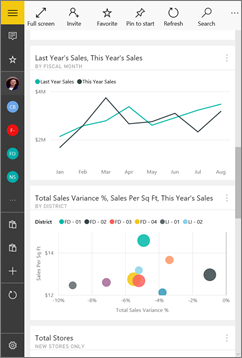

<properties 
   pageTitle="Dashboards in the Power BI mobile app for Windows 10"
   description="Dashboards are a portal to your company's life cycle. Learn how you can view, explore, and share your dashboards in the Power BI mobile app for Windows 10"
   services="powerbi" 
   documentationCenter="" 
   authors="maggiesMSFT" 
   manager="mblythe" 
   backup=""
   editor=""
   tags=""
   qualityFocus="complete"
   qualityDate="09/28/2016"/>
 
<tags
   ms.service="powerbi"
   ms.devlang="NA"
   ms.topic="article"
   ms.tgt_pltfrm="NA"
   ms.workload="powerbi"
   ms.date="09/28/2016"
   ms.author="maggies"/>

# View, explore, and share dashboards in the Power BI mobile app for Windows 10  

Dashboards are a portal to your company's life cycle and processes. A dashboard is an overview, a single place to monitor the current state of the business. 

You don't create dashboards in Power BI on your Windows 10 mobile device. You <bpt id="p1">[</bpt>create dashboards<ept id="p1">](powerbi-service-dashboards.md)</ept> or <bpt id="p2">[</bpt>connect to built-in dashboards for services<ept id="p2">](powerbi-content-packs-services.md)</ept> such as Salesforce in the Power BI service (<bpt id="p3">[</bpt>https://www.powerbi.com<ept id="p3">](https://www.powerbi.com)</ept>) on your computer.

Then in the <bpt id="p1">[</bpt>Power BI mobile app for Windows 10<ept id="p1">](powerbi-mobile-win10phone-app-get-started.md)</ept>, you can explore these same dashboards.

## View dashboards on your Windows 10 device  
1.  Open the Power BI app on your Windows 10 device and sign in.

    Need to <bpt id="p1">[</bpt>download the app<ept id="p1">](http://go.microsoft.com/fwlink/?LinkID=526478)</ept> first?

2.  Tap a dashboard to open it.   

    

    Power BI dashboards look a little different on your Windows 10 phone. All the tiles appear the same width, and they're arranged one after another from top to bottom.

    

     You can also turn your phone sideways to <bpt id="p1">[</bpt>view dashboards in landscape mode<ept id="p1">](#view-dashboards-in-landscape-mode)</ept> on your phone.

    ><bpt id="p1">**</bpt>Tip<ept id="p1">**</ept>: If you're the dashboard owner, in the Power BI service you can <bpt id="p2">[</bpt>create a view of the dashboard specifically for phones<ept id="p2">](powerbi-service-create-dashboard-phone-view.md)</ept> in portrait mode. 

5.  In the dashboard, you can:

    -   <bpt id="p1">[</bpt>Tap a tile<ept id="p1">](powerbi-mobile-tiles-in-the-win10phone-app.md)</ept> to open and interact with it.
    -   Tap the <bpt id="p1">**</bpt>Full Screen<ept id="p1">**</ept> icon <ph id="ph1"></ph> to present your Power BI dashboard without borders or menus, like <bpt id="p2">**</bpt>Slide Show<ept id="p2">**</ept> view in PowerPoint.
    -   Tap the <bpt id="p1">**</bpt>Invite<ept id="p1">**</ept> icon <ph id="ph1"></ph> to <bpt id="p2">[</bpt>share your dashboard<ept id="p2">](powerbi-mobile-share-a-dashboard-from-the-win10phone-app.md)</ept> with a colleague.
    -   Tap the star <ph id="ph1"></ph> to <bpt id="p1">[</bpt>make the dashboard a favorite<ept id="p1">](powerbi-mobile-favorites.md)</ept>.
    -   Tap the <bpt id="p1">**</bpt>Pin to Start<ept id="p1">**</ept> icon to <bpt id="p2">[</bpt>pin the dashboard to your Windows Start screen<ept id="p2">](powerbi-mobile-pin-dashboard-from-win10phone-app.md)</ept>. 
    

6.  To go back to the dashboards home page, tap the dashboard name to open the breadcrumb trail, then tap <bpt id="p1">**</bpt>My Workspace<ept id="p1">**</ept>:
   
     

## View dashboards in landscape mode
You can also view dashboards in landscape mode, just by turning your phone. The dashboard layout changes from a series of tiles to a view of the whole dashboard &amp;#151; you see all of the dashboard’s tiles laid out as they are in the Power BI service.

You can use the “pinch” gesture to zoom in and out on different areas of your dashboard, pan to navigate it. And you can still <bpt id="p1">[</bpt>tap a tile<ept id="p1">](powerbi-mobile-tiles-in-the-win10phone-app.md)</ept> to open the tile in focus mode and interact with your data.

### Consulte también  
- <bpt id="p1">[</bpt>Download the Power BI mobile app for Windows 10<ept id="p1">](http://go.microsoft.com/fwlink/?LinkID=526478)</ept> from the Windows Store  
- [Get started with the Power BI mobile app for Windows 10](powerbi-mobile-win10phone-app-get-started.md)  
- [Create a phone view of a dashboard in Power BI](powerbi-service-create-dashboard-phone-view.md)
- Questions? [Try asking the Power BI Community](http://community.powerbi.com/)