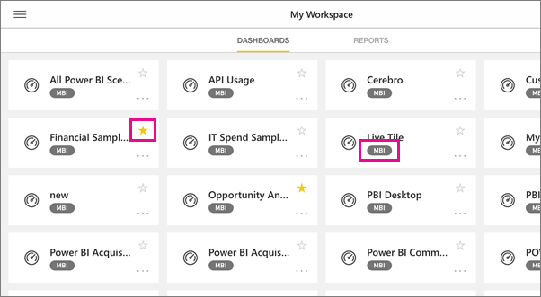

<properties 
   pageTitle="Dashboards on the iPad app"
   description="Dashboards are a portal to your company's life cycle. Learn how you can view, explore, and share your dashboards in the Power BI app for iOS on your iPad."
   services="powerbi" 
   documentationCenter="" 
   authors="maggiesMSFT" 
   manager="erikre" 
   backup=""
   editor=""
   tags=""
   qualityFocus="monitoring"
   qualityDate="03/11/2016"/>
 
<tags
   ms.service="powerbi"
   ms.devlang="NA"
   ms.topic="article"
   ms.tgt_pltfrm="NA"
   ms.workload="powerbi"
   ms.date="10/11/2016"
   ms.author="maggies"/>
# Dashboards on the iPad app (Power BI for iOS)

Dashboards are a portal to your company's life cycle. Learn how you can view, explore, and share your dashboards in the Power BI app for iOS on your iPad.

You don't create dashboards on your iPad. In the Power BI service (<bpt id="p1">[</bpt>https://www.powerbi.com<ept id="p1">](https://www.powerbi.com)</ept>) on your computer, you <bpt id="p2">[</bpt>create dashboards<ept id="p2">](powerbi-service-dashboards.md)</ept> or <bpt id="p3">[</bpt>connect to built-in dashboards for services<ept id="p3">](powerbi-content-packs-services.md)</ept> such as Salesforce.

Then you see these same dashboards in the iPad app for Microsoft Power BI for iOS, along with dashboards your colleagues share with you.

## View dashboards on your iPad

1.  Open the Power BI app.

    Need to <bpt id="p1">[</bpt>download the iPad app<ept id="p1">](http://go.microsoft.com/fwlink/?LinkId=522062)</ept> from the Apple App Store first?

2.  Tap <bpt id="p1">**</bpt>Dashboards<ept id="p1">**</ept> at the top of the app.  

    

     -     The yellow stars <ph id="ph1"></ph> show which dashboards are favorites. 

     -     The notation below each dashboard name <ph id="ph1"></ph> shows how the data in each dashboard is classified. Read more about <bpt id="p1">[</bpt>data classification in Power BI<ept id="p1">](powerbi-service-data-classification.md)</ept>.

3.  You can share a dashboard from your workspace. Tap the ellipsis (...) in the lower-right corner of the dashboard tile, and tap <bpt id="p1">**</bpt>Invite Others<ept id="p1">**</ept>.

    

4.  You can also tap a dashboard to open it and see the tiles in that dashboard. While on the dashboard you can interact with it:

    - <bpt id="p1">[</bpt>Tap a tile to interact<ept id="p1">](powerbi-mobile-tiles-in-the-ipad-app.md)</ept> with the tile.

    - <bpt id="p1">[</bpt>Open the reports<ept id="p1">](powerbi-mobile-reports-on-the-ipad-app.md)</ept> behind the tiles.

    - <bpt id="p1">[</bpt>Invite others to view the dashboard<ept id="p1">](powerbi-mobile-share-dashboards-from-the-ipad-app.md)</ept>.

    - <bpt id="p1">[</bpt>Annotate and share a snapshot<ept id="p1">](powerbi-mobile-annotate-and-share-a-snapshot-from-the-ipad-app.md)</ept> of a tile.

4.  To go back to My Workspace, tap the name of the dashboard in the upper-left corner, then tap <bpt id="p1">**</bpt>My Workspace<ept id="p1">**</ept>.

    

### Consulte también

-   <bpt id="p1">[</bpt>Get started with the iPad app<ept id="p1">](powerbi-mobile-iphone-app-get-started.md)</ept> for Power BI.
- Questions? [Try asking the Power BI Community](http://community.powerbi.com/)

