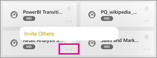

<properties 
   pageTitle="Paneles en la aplicación de iPad"
   description="Los paneles son un portal para el ciclo de vida de su empresa. Obtenga información acerca de cómo ver, explorar y compartir sus paneles en la aplicación de Power BI para iOS en su iPad."
   services="powerbi" 
   documentationCenter="" 
   authors="maggiesMSFT" 
   manager="erikre" 
   backup=""
   editor=""
   tags=""
   qualityFocus="monitoring"
   qualityDate="03/11/2016"/>
 
<tags
   ms.service="powerbi"
   ms.devlang="NA"
   ms.topic="article"
   ms.tgt_pltfrm="NA"
   ms.workload="powerbi"
   ms.date="10/11/2016"
   ms.author="maggies"/>
# Paneles en la aplicación de iPad (Power BI para iOS)

Los paneles son un portal para el ciclo de vida de su empresa. Obtenga información acerca de cómo ver, explorar y compartir sus paneles en la aplicación de Power BI para iOS en su iPad.

No cree paneles en su iPad. En el servicio Power BI ([https://www.powerbi.com](https://www.powerbi.com)) en el equipo, se [crear paneles](powerbi-service-dashboards.md) o [conectarse a los paneles de información para servicios](powerbi-content-packs-services.md) como Salesforce.

A continuación, verá estos mismos paneles en la aplicación de iPad para Microsoft Power BI para iOS, junto con sus colegas compartan con usted los paneles.

## Paneles de la vista en su iPad

1.  Abra la aplicación de Power BI.

    ¿Necesita [Descargar la aplicación de iPad](http://go.microsoft.com/fwlink/?LinkId=522062) desde la aplicación de Apple almacenar primero?

2.  Puntee en **paneles** en la parte superior de la aplicación.  

    

     -     Las estrellas amarillas  Mostrar paneles de qué son los favoritos. 

     -     La notación debajo de cada nombre de panel  muestra cómo se clasifican los datos de cada panel. Obtenga más información sobre [clasificación de datos en Power BI](powerbi-service-data-classification.md).

3.  Puede compartir un panel del área de trabajo. Puntee en los puntos suspensivos (...) en la esquina inferior derecha del icono de panel y en **Invitar a otros**.

    

4.  También puede pulsar un panel para abrirlo y ver los iconos en ese panel. Mientras está en el panel puede interactuar con él:

    - 
            [Puntee en un mosaico para interactuar](powerbi-mobile-tiles-in-the-ipad-app.md) con el mosaico.

    - 
            [Abrir los informes](powerbi-mobile-reports-on-the-ipad-app.md) detrás de los mosaicos.

    - 
            [Invitar a otros usuarios para ver el panel](powerbi-mobile-share-dashboards-from-the-ipad-app.md).

    - 
            [Anotar y compartir una instantánea](powerbi-mobile-annotate-and-share-a-snapshot-from-the-ipad-app.md) de un mosaico.

4.  Para volver a mi área de trabajo, puntee en el nombre del panel en la esquina superior izquierda y, a continuación, puntee en **Mi área de trabajo**.

    

### Consulte también

-   
            [Introducción a la aplicación de iPad](powerbi-mobile-iphone-app-get-started.md) para Power BI.
- ¿Tiene preguntas? [Pruebe a formular a la Comunidad de Power BI](http://community.powerbi.com/)

