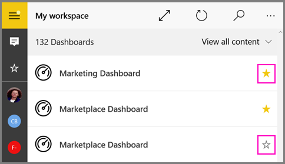

<properties 
   pageTitle="Paneles de Power BI favoritos y móviles informes de Reporting Services en las aplicaciones de Power BI"
   description="Obtenga información acerca de la creación y visualización de los paneles de Power BI favoritos, junto con Reporting Services KPI e informes móviles, en las aplicaciones móviles de Power BI."
   services="powerbi" 
   documentationCenter="" 
   authors="maggiesMSFT" 
   manager="mblythe" 
   backup=""
   editor=""
   tags=""
   qualityFocus="no"
   qualityDate=""/>
 
<tags
   ms.service="powerbi"
   ms.devlang="NA"
   ms.topic="article"
   ms.tgt_pltfrm="NA"
   ms.workload="powerbi"
   ms.date="09/29/2016"
   ms.author="maggies"/>

# Paneles de Power BI favoritos y Reporting Services KPI y móviles informes en las aplicaciones móviles de Power BI 

Al realizar un panel un *favorito* en las aplicaciones móviles de Power BI, puede tener acceso desde todos los dispositivos, incluido el servicio Power BI. Puede ver todos los paneles de Power BI favoritos, junto con Reporting Services KPI e informes móviles, en la página Favoritos de las aplicaciones móviles.

También puede [realizar un panel de Power BI favorito en el servicio de Power BI](powerbi-service-favorite-dashboards.md). A continuación, se vea en la página Favoritos en la aplicación móvil.

> 
            **Nota**: favoritos de la página está disponible en todas las aplicaciones móviles de Power BI y puede administrar los favoritos en las aplicaciones móviles de Power BI para iOS y dispositivos Windows 10.
 

## Convertir un panel de Power BI favorita en las aplicaciones móviles
Puede establecer un panel favorito en la lista de paneles o del panel, en la aplicación móvil de Power BI para iOS y dispositivos Windows 10.

* En la lista de los paneles de la aplicación móvil, toque la estrella vacía situada junto al nombre de panel . La estrella cambia a amarilla .

    

* En el panel, toque la estrella vacía en la cinta de opciones en la parte superior . La estrella cambia a amarilla .

    

## Ver informes de Reporting Services móviles y su KPI paneles de Power BI favoritos y

*   Puntee en el menú de navegación superior , a continuación, puntee **favoritos**.

    

    Ahora ver todos los paneles de Power BI favoritos, además de sus informes favoritos de móvil de Reporting Services y KPI juntos en un solo lugar.

    

## Hacer que un informe de Reporting Services móvil o KPI favorito

No realice informes de Reporting Services móviles o Favoritos de KPI en las aplicaciones móviles de Power BI, pero puede verlos en las aplicaciones móviles. 

1. Abra el explorador web. 

2. En la barra de direcciones del explorador web, escriba el portal web de dirección URL.
 
    De forma predeterminada, la dirección URL es http://[ComputerName]/reports.

1. Desplácese hasta el KPI o informe móvil que desea realizar un favorito, seleccione el botón de puntos suspensivos (**...**) en la esquina superior derecha y seleccione **Agregar a favoritos**.

    

2. Seleccione **favoritos** en la cinta de opciones de portal web para ver junto con los otros favoritos en la página Favoritos en el portal web.

    

    Y ahora puede ver junto con los favoritos del panel de Power BI en la aplicación móvil.

### Consulte también

* [Paneles de favoritos en el servicio Power BI](powerbi-service-favorite-dashboards.md) 

Ver informes de Reporting Services móviles y KPI en: 

* [La aplicación de iPad (Power BI para iOS)](powerbi-mobile-ipad-kpis-mobile-reports.md)
* [La aplicación de iPhone (Power BI para iOS)](powerbi-mobile-iphone-kpis-mobile-reports.md)
* [La aplicación Android para Power BI](powerbi-mobile-android-kpis-mobile-reports.md)
* [La aplicación móvil de Power BI para Windows 10](powerbi-mobile-win10-kpis-mobile-reports.md)

### ¿Tiene preguntas? 
[Pruebe a formular a la Comunidad de Power BI](http://community.powerbi.com/)
