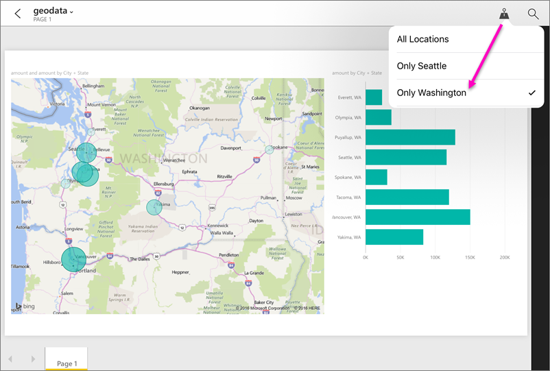

<properties 
   pageTitle="Filtrar un informe por la ubicación en las aplicaciones móviles de Power BI para iOS"
   description="Aprenda cómo puede filtrar un informe por su ubicación en las aplicaciones móviles de Microsoft Power BI para iOS, si el propietario del informe establece etiquetas geográficas."
   services="powerbi" 
   documentationCenter="" 
   authors="maggiesMSFT" 
   manager="erikre" 
   editor=""
   tags=""
   qualityFocus="no"
   qualityDate=""/>
 
<tags
   ms.service="powerbi"
   ms.devlang="NA"
   ms.topic="article"
   ms.tgt_pltfrm="NA"
   ms.workload="powerbi"
   ms.date="10/12/2016"
   ms.author="maggies"/>

# Filtrar un informe por la ubicación en las aplicaciones móviles de Power BI para iOS

¿Al examinar un informe de Power BI en su iPad, iPhone o iPod Touch, no verá un pequeño icono de alfiler en la esquina superior derecha? Si es así, puede filtrar ese informe según su ubicación geográfica.

> [AZURE.NOTE] Puede que solo filtrar por ubicación si los nombres geográficos en el informe en inglés & #150; por ejemplo, "Nueva York" o "Germany".

## Filtrar el informe por su ubicación

1. Abra un informe en la aplicación móvil de Power BI en el dispositivo iOS.

3. Puntee en el icono de alfiler  en la esquina superior derecha. Puede filtrar en Ciudad, estado o provincia o país o región, dependiendo de la configuración del informe el creador del informe. El filtro sólo muestra opciones que coincidan con la ubicación actual.

    

## ¿Por qué sólo algunos informes tienen etiquetas de ubicación?
Cuando usted o sus colegas creación informes en Power BI Desktop, puede clasificar los datos geográficos para una columna. A continuación, al ver el informe en la aplicación móvil de Power BI para iOS, Power BI proporciona automáticamente geográficos filtros que coinciden con el que se encuentre.

Obtenga más información sobre [Configurar filtrado geográfica](powerbi-desktop-mobile-geofiltering.md) en Power BI Desktop.

### Consulte también  
- 
            [Conectarse a los datos de Power BI del mundo real](powerbi-mobile-data-in-real-world-context.md) con las aplicaciones móviles
- 
            [Categorización de datos en Power BI Desktop](powerbi-desktop-data-categorization.md) 
- ¿Tiene preguntas? 
            [Pruebe a formular a la Comunidad de Power BI](http://community.powerbi.com/)
