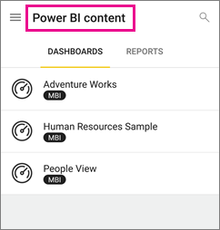

<properties 
   pageTitle="Groups in the Android app"
   description="Power BI groups are built on Office 365 groups. Read about viewing and interacting with group dashboards in the Android mobile app for Power BI"
   services="powerbi" 
   documentationCenter="" 
   authors="maggiesMSFT" 
   manager="mblythe" 
   backup=""
   editor=""
   tags=""
   qualityFocus="no"
   qualityDate=""/>
 
<tags
   ms.service="powerbi"
   ms.devlang="NA"
   ms.topic="article"
   ms.tgt_pltfrm="NA"
   ms.workload="powerbi"
   ms.date="10/03/2016"
   ms.author="maggies"/>

# Groups in the Android app for Power BI  

Power BI groups offer a powerful collaborative experience built on Office 365 groups. Read more about <bpt id="p1">[</bpt>groups in Office 365<ept id="p1">](https://support.office.com/article/Create-a-group-in-Office-365-7124dc4c-1de9-40d4-b096-e8add19209e9)</ept>. Groups are available with the <bpt id="p1">[</bpt>Power BI Pro<ept id="p1">](powerbi-power-bi-pro-content-what-is-it.md)</ept> experience.

You <bpt id="p1">[</bpt>create groups in the Power BI service<ept id="p1">](powerbi-service-create-a-group-in-power-bi.md)</ept>, and add dashboards to them there.

Then you see and interact with group dashboards in the Microsoft <bpt id="p1">[</bpt>Power BI for Android app<ept id="p1">](powerbi-mobile-android-app-get-started.md)</ept>.  

## Interact with groups content  
1.  Open the Android app for Power BI.

    Need to <bpt id="p1">[</bpt>download the Android app<ept id="p1">](http://go.microsoft.com/fwlink/?LinkID=544867)</ept> first?

2.  Under My Workspace, select a group.  

    

3.  Your group page displays the dashboards and reports that have been published to the group workspace.  

    

4.  <bpt id="p1">[</bpt>Select a dashboard<ept id="p1">](powerbi-mobile-dashboards-in-the-android-app.md)</ept> to open and view it in the group workspace.  

### Consulte también  
-  <bpt id="p1">[</bpt>Download the Android app<ept id="p1">](http://go.microsoft.com/fwlink/?LinkID=544867)</ept> from Google play  
-  [Get started with the Android app for Power BI](powerbi-mobile-android-app-get-started.md)  
-  [Get started with Power BI](powerbi-service-get-started.md)  
-  Questions? [Try asking the Power BI Community](http://community.powerbi.com/)