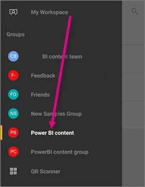

<properties 
   pageTitle="Grupos en la aplicación Android"
   description="Grupos de Power BI se basan en grupos de Office 365. Lea acerca de cómo ver e interactuar con los paneles del grupo en la aplicación móvil Android para Power BI"
   services="powerbi" 
   documentationCenter="" 
   authors="maggiesMSFT" 
   manager="mblythe" 
   backup=""
   editor=""
   tags=""
   qualityFocus="no"
   qualityDate=""/>
 
<tags
   ms.service="powerbi"
   ms.devlang="NA"
   ms.topic="article"
   ms.tgt_pltfrm="NA"
   ms.workload="powerbi"
   ms.date="10/03/2016"
   ms.author="maggies"/>

# Grupos en la aplicación Android para Power BI  

Grupos de Power BI proporcionan una experiencia de colaboración eficaces basada en grupos de Office 365. Obtenga más información sobre [grupos en Office 365](https://support.office.com/article/Create-a-group-in-Office-365-7124dc4c-1de9-40d4-b096-e8add19209e9). Los grupos están disponibles con el [Power BI Pro](powerbi-power-bi-pro-content-what-is-it.md) experimentar.

Se [crear grupos en el servicio Power BI](powerbi-service-create-a-group-in-power-bi.md), y agregar paneles a los mismos allí.

A continuación, puede ver e interactuar con paneles de grupo en Microsoft [Power BI para aplicación Android](powerbi-mobile-android-app-get-started.md).  

## Interactuar con el contenido de los grupos  
1.  Abra la aplicación Android para Power BI.

    ¿Necesita [Descargar la aplicación Android](http://go.microsoft.com/fwlink/?LinkID=544867) primera?

2.  En Mi área de trabajo, seleccione un grupo.  

    

3.  La página de grupo muestra los paneles e informes que se han publicado en el área de trabajo del grupo.  

    

4.  
            [Seleccione un panel](powerbi-mobile-dashboards-in-the-android-app.md) para abrir y ver en el área de trabajo del grupo.  

### Consulte también  
-  
            [Descargue la aplicación Android](http://go.microsoft.com/fwlink/?LinkID=544867) de Google play  
-  [Introducción a la aplicación Android para Power BI](powerbi-mobile-android-app-get-started.md)  
-  [Introducción a Power BI](powerbi-service-get-started.md)  
-  ¿Tiene preguntas? [Pruebe a formular a la Comunidad de Power BI](http://community.powerbi.com/)