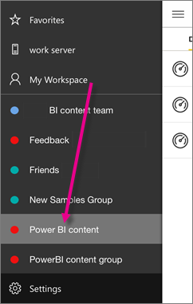

<properties 
   pageTitle="Grupos en la aplicación de iPhone"
   description="Grupos de Power BI se basan en grupos de Office 365. Lea acerca de cómo ver e interactuar con los paneles del grupo en la aplicación móvil iOS de Power BI para el iPhone."
   services="powerbi" 
   documentationCenter="" 
   authors="maggiesMSFT" 
   manager="mblythe" 
   backup=""
   editor=""
   tags=""
   qualityFocus="no"
   qualityDate=""/>
 
<tags
   ms.service="powerbi"
   ms.devlang="NA"
   ms.topic="article"
   ms.tgt_pltfrm="NA"
   ms.workload="powerbi"
   ms.date="10/03/2016"
   ms.author="maggies"/>

# Grupos en la aplicación de iPhone (Power BI para iOS)  

Grupos de Power BI proporcionan una experiencia de colaboración eficaces basada en grupos de Office 365. Obtenga más información sobre [grupos en Office 365](https://support.office.com/article/Create-a-group-in-Office-365-7124dc4c-1de9-40d4-b096-e8add19209e9). Grupos están disponibles con la experiencia de Power BI de pago. 

Se [crear un grupo en el servicio Power BI](powerbi-service-create-a-group-in-power-bi.md). A continuación, puede ver e interactuar con paneles de grupo en Microsoft [aplicación de iOS de Power BI para el iPhone](powerbi-mobile-ipad-app-get-started.md). 

Power BI envía una notificación a su iPhone cuando alguien agrega un nuevo panel a cualquier grupo al que pertenece. 

## Interactuar con los grupos de Power BI  
1.  Abra la aplicación Power BI para iOS para el iPhone. 

    ¿Necesita [descargar e instalar la aplicación de iOS para el iPhone](http://go.microsoft.com/fwlink/?LinkId=522062) primera?

2.  En Mi área de trabajo, seleccione un grupo. 
 
    

3.  La página de grupo muestra los paneles que se han publicado en el área de trabajo del grupo.  

    

4.  
            [Seleccione un panel](powerbi-mobile-dashboards-in-the-iphone-app.md) para abrirla y verla.

### Consulte también
- [Introducción a la aplicación de iPhone para Power BI](powerbi-mobile-iphone-app-get-started.md)
- [Introducción a Power BI](powerbi-service-get-started.md)
- ¿Tiene preguntas? [Pruebe a formular a la Comunidad de Power BI](http://community.powerbi.com/)  