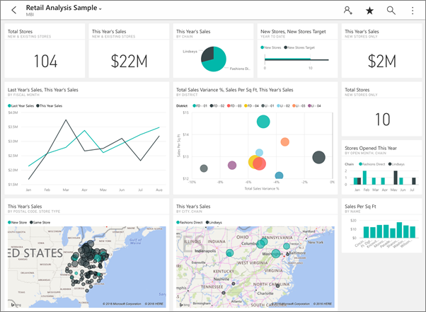
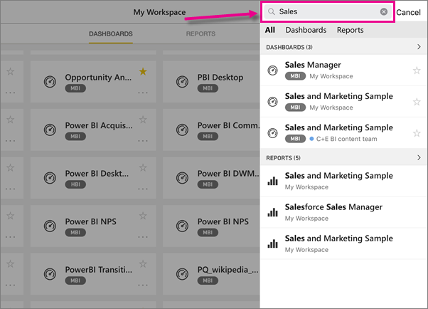

<properties 
   pageTitle="Introducción a la aplicación de iPad"
   description="Microsoft Power BI para aplicación de iOS en el iPad es una parte clave de la experiencia móvil de BI para Power BI y Reporting Services."
   services="powerbi" 
   documentationCenter="" 
   authors="maggiesMSFT" 
   manager="erikre" 
   backup=""
   editor=""
   tags=""
   qualityFocus="identified"
   qualityDate="08/08/2016"/>
 
<tags
   ms.service="powerbi"
   ms.devlang="NA"
   ms.topic="article"
   ms.tgt_pltfrm="NA"
   ms.workload="powerbi"
   ms.date="10/12/2016"
   ms.author="maggies"/>

# Introducción a la aplicación de iPad (Power BI para iOS)  

La aplicación de iPad para Microsoft Power BI para iOS forma parte de la experiencia móvil de BI para Power BI y Reporting Services. Con acceso móvil directo y táctil a la información empresarial importante de forma local y en la nube, puede ver e interactuar con los informes y paneles empresariales fácilmente, desde cualquier lugar. Explorar los datos en paneles y compártalos con sus colegas en mensajes de correo electrónico o texto.  

Se [crear paneles e informes en el servicio de Power BI](powerbi-service-get-started.md) con los datos. 

A continuación, interactuar con los paneles e informes, explorar los datos y compartirlos desde la aplicación de iPad para Power BI.

También puede [Ver informes móviles para los datos locales y Reporting Services KPI](powerbi-mobile-ipad-kpis-mobile-reports.md) en la aplicación de iPad para Power BI. Se [crear los KPI y los informes de dispositivos móviles con el publicador de SQL Server Mobile informe](https://msdn.microsoft.com/library/mt652547.aspx).

Descubra [Novedades en las aplicaciones móviles de Power Bi](powerbi-mobile-whats-new-in-the-mobile-apps.md).

## Descargar la aplicación de iOS para el iPad  

            [Descargue la aplicación de iPad](http://go.microsoft.com/fwlink/?LinkId=522062) desde la tienda de aplicaciones de Apple.

> [AZURE.NOTE]  Debe ejecutar al menos el iPad iOS 9.0. 

## Registrarse para el servicio Power BI

Vaya a [Power BI para suscribirse](http://go.microsoft.com/fwlink/?LinkID=513879) para el servicio, si no lo ha hecho ya. Es gratuito.

## Introducción a la aplicación Power BI 

1.  En el iPad, abra la aplicación Power BI.
  
2.  Para ver los informes y paneles de Power BI, puntee **Power BI**. Inicie sesión con las mismas credenciales de su cuenta de Power BI en la web. 

    Para ver los informes de Reporting Services móviles y KPI, puntee **SQL Server Reporting Services**. Inicie sesión con sus credenciales de SQL Server Reporting Services.

    

    >
            **Sugerencia**: cuando se encuentra en la aplicación, puntee en el botón de navegación global  en la esquina superior izquierda para desplazarse entre los dos servicios. 

## Pruebe los ejemplos de Power BI y Reporting Services  
Incluso sin registrarse, puede reproducir con los ejemplos de Power BI y Reporting Services. Después de descargar la aplicación, puede ver los ejemplos o empezar a trabajar. Volver a los ejemplos siempre que lo desee desde la página principal de paneles.

### Ejemplos de Power BI

Puede ver e interactuar con los ejemplos de panel de Power BI, pero hay algunas cosas que no puede hacer con ellos. No se puede abrir los informes de los paneles, compartir los ejemplos con otros usuarios o que sean sus favoritos.

1.   Puntee en el botón de navegación global  en la esquina superior izquierda.
  
2.   Puntee en **ejemplos de Power BI**, elija un rol y explore el panel de ejemplo para ese rol.  

    

    >
            **Nota**: no todas las características están disponibles en los ejemplos. Por ejemplo, no puede ver los informes de ejemplo que subyacen a los paneles. 

### Ejemplos de Reporting Services informe móvil

1.   Puntee en el botón de navegación global  en la esquina superior izquierda.

2.  Puntee en **ejemplos de Reporting Services**, a continuación, abra los informes de venta directa o la carpeta de informes de ventas para explorar sus KPI y los informes de dispositivos móviles.

    

## Buscar un panel o informe

* Puntee en la lupa en la esquina superior derecha , a continuación, escriba el término de búsqueda.

    

    De forma predeterminada busca todos los paneles e informes, pero puede buscar sólo una u otra.

## Más con paneles de Power BI e informes en las aplicaciones móviles 
Vea lo que puede hacer con la aplicación de iPad y paneles e informes en Power BI y los informes de Reporting Services móviles y KPI en el portal web de Reporting Services.

-   Ver su [paneles de Power BI](powerbi-mobile-dashboards-on-the-ipad-app.md).
-   Interactuar con [iconos en los paneles de Power BI](powerbi-mobile-tiles-in-the-ipad-app.md).
-   Abra [informes de Power BI](powerbi-mobile-reports-on-the-ipad-app.md) desde el panel.
-   
            [Compartir paneles de Power BI](powerbi-mobile-share-dashboards-from-the-ipad-app.md).
-   
            [Anotar y compartir una instantánea](powerbi-mobile-annotate-and-share-a-snapshot-from-the-ipad-app.md) de un mosaico.
-   Ver su [paneles de Power BI e informes de los grupos](powerbi-service-mobile-groups-in-the-ipad-app.md).
-   
            [Establecer alertas de datos](powerbi-mobile-set-data-alerts-in-the-iphone-app.md) para recibir notificaciones cuando los datos cambian.
-   Vista [notificaciones sobre las actualizaciones a su cuenta de Power BI](powerbi-mobile-notification-center.md), como paneles de colegas compartan con usted.
   
    

## Más con los informes de Reporting Services móviles y KPI

- 
            [Ver informes de Reporting Services móviles y KPI](powerbi-mobile-ipad-kpis-mobile-reports.md) en el portal web de Reporting Services.
- Crear [KPI en el portal web de Reporting Services](https://msdn.microsoft.com/library/mt683632.aspx).
- 
            [Crear sus propios informes móviles con el publicador de informes de SQL Server Mobile](https://msdn.microsoft.com/library/mt652547.aspx), y publíquelos en el portal web de Reporting Services.

### Consulte también  
- 
            [Introducción a la aplicación de iPhone para Power BI](powerbi-mobile-ipad-app-get-started.md)  
- 
            [Introducción a Power BI](powerbi-service-get-started.md)  
- ¿Tiene preguntas? Pruebe a formular la [Comunidad de Power BI](http://community.powerbi.com/)

