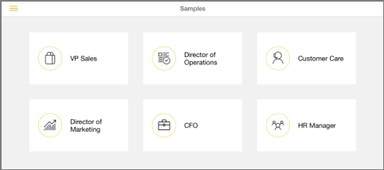
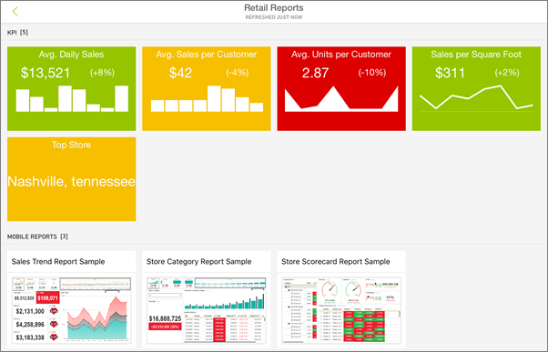
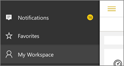

<properties 
   pageTitle="Get started with the iPad app"
   description="The Microsoft Power BI for iOS app on the iPad is a key part of the mobile BI experience for Power BI and Reporting Services."
   services="powerbi" 
   documentationCenter="" 
   authors="maggiesMSFT" 
   manager="erikre" 
   backup=""
   editor=""
   tags=""
   qualityFocus="identified"
   qualityDate="08/08/2016"/>
 
<tags
   ms.service="powerbi"
   ms.devlang="NA"
   ms.topic="article"
   ms.tgt_pltfrm="NA"
   ms.workload="powerbi"
   ms.date="10/12/2016"
   ms.author="maggies"/>

# Get started with the iPad app (Power BI for iOS)  

The iPad app for Microsoft Power BI for iOS is part of the mobile BI experience for Power BI and Reporting Services. With live, touch-enabled mobile access to your important business information on premises and in the cloud, you can view and interact with your company dashboards and reports easily, from anywhere. Explore the data in dashboards, and share them with your colleagues in email or text messages.  

You <bpt id="p1">[</bpt>create dashboards and reports in the Power BI service<ept id="p1">](powerbi-service-get-started.md)</ept> with your data. 

Then interact with your dashboards and reports, explore the data, and share them, all from the iPad app for Power BI.

You can also <bpt id="p1">[</bpt>view Reporting Services KPIs and mobile reports for your on-premises data<ept id="p1">](powerbi-mobile-ipad-kpis-mobile-reports.md)</ept> in the iPad app for Power BI. You <bpt id="p1">[</bpt>create those KPIs and mobile reports with the SQL Server Mobile Report Publisher<ept id="p1">](https://msdn.microsoft.com/library/mt652547.aspx)</ept>.

Find out <bpt id="p1">[</bpt>what's new in the Power Bi mobile apps<ept id="p1">](powerbi-mobile-whats-new-in-the-mobile-apps.md)</ept>.

## Download the iOS app for the iPad  
<bpt id="p1">[</bpt>Download the iPad app<ept id="p1">](http://go.microsoft.com/fwlink/?LinkId=522062)</ept> from the Apple App Store.

> [AZURE.NOTE]  Your iPad needs to be running at least iOS 9.0. 

## Sign up for the Power BI service

Go to <bpt id="p1">[</bpt>Power BI to sign up<ept id="p1">](http://go.microsoft.com/fwlink/?LinkID=513879)</ept> for the service, if you haven't already. It's free.

## Get started with the Power BI app 

1.  In the iPad, open the Power BI app.
  
2.  To view your Power BI dashboards and reports, tap <bpt id="p1">**</bpt>Power BI<ept id="p1">**</ept>. Sign in with the same credentials as your Power BI account on the web. 

    To view your Reporting Services mobile reports and KPIs, tap <bpt id="p1">**</bpt>SQL Server Reporting Services<ept id="p1">**</ept>. Sign in with your SQL Server Reporting Services credentials.

    

    ><bpt id="p1">**</bpt>Tip<ept id="p1">**</ept>: When you're in the app, tap the global navigation button <ph id="ph1"></ph> in the upper-left corner to go between the two services. 

## Try the Power BI and Reporting Services samples  
Even without signing up, you can play with the Power BI and Reporting Services samples. After you download the app, you can view the samples or get started. Go back to the samples whenever you want from the dashboards home page.

### Power BI samples

You can view and interact with the Power BI dashboard samples, but there are a few things you can't do with them. You can't open the reports behind the dashboards, share the samples with others, or make them your favorites.

1.   Tap the global navigation button <ph id="ph1"></ph> in the upper-left corner.
  
2.   Tap <bpt id="p1">**</bpt>Power BI samples<ept id="p1">**</ept>, then pick a role and explore the sample dashboard for that role.  

    

    ><bpt id="p1">**</bpt>Note<ept id="p1">**</ept>:  Not all features are available in the samples. For example, you can't view the sample reports that underlie the dashboards. 

### Reporting Services mobile report samples

1.   Tap the global navigation button <ph id="ph1"></ph> in the upper-left corner.

2.  Tap <bpt id="p1">**</bpt>Reporting Services samples<ept id="p1">**</ept>, then open either the Retail Reports or the Sales Reports folder to explore their KPIs and mobile reports.

    

## Search for a dashboard or report

* Tap the magnifying glass in the upper-right corner <ph id="ph1"></ph>, then type the term to find.

    

    By default it searches all dashboards and reports, but you can search just one or the other.

## More with Power BI dashboards and reports in the mobile apps 
See what else you can do in the iPad app with dashboards and reports in Power BI, and Reporting Services mobile reports and KPIs in the Reporting Services web portal.

-   View your <bpt id="p1">[</bpt>Power BI dashboards<ept id="p1">](powerbi-mobile-dashboards-on-the-ipad-app.md)</ept>.
-   Interact with <bpt id="p1">[</bpt>tiles on your Power BI dashboards<ept id="p1">](powerbi-mobile-tiles-in-the-ipad-app.md)</ept>.
-   Open <bpt id="p1">[</bpt>Power BI reports<ept id="p1">](powerbi-mobile-reports-on-the-ipad-app.md)</ept> from your dashboard.
-   <bpt id="p1">[</bpt>Share Power BI dashboards<ept id="p1">](powerbi-mobile-share-dashboards-from-the-ipad-app.md)</ept>.
-   <bpt id="p1">[</bpt>Annotate and share a snapshot<ept id="p1">](powerbi-mobile-annotate-and-share-a-snapshot-from-the-ipad-app.md)</ept> of a tile.
-   View your <bpt id="p1">[</bpt>groups' Power BI dashboards and reports<ept id="p1">](powerbi-service-mobile-groups-in-the-ipad-app.md)</ept>.
-   <bpt id="p1">[</bpt>Set data alerts<ept id="p1">](powerbi-mobile-set-data-alerts-in-the-iphone-app.md)</ept> to get notifications when your data changes.
-   View <bpt id="p1">[</bpt>notifications about updates to your Power BI account<ept id="p1">](powerbi-mobile-notification-center.md)</ept>, such as dashboards that colleagues share with you.
   
    

## More with Reporting Services mobile reports and KPIs

- <bpt id="p1">[</bpt>View Reporting Services mobile reports and KPIs<ept id="p1">](powerbi-mobile-ipad-kpis-mobile-reports.md)</ept> on the Reporting Services web portal.
- Create <bpt id="p1">[</bpt>KPIs on the Reporting Services web portal<ept id="p1">](https://msdn.microsoft.com/library/mt683632.aspx)</ept>.
- <bpt id="p1">[</bpt>Create your own mobile reports with the SQL Server Mobile Report Publisher<ept id="p1">](https://msdn.microsoft.com/library/mt652547.aspx)</ept>, and publish them to the Reporting Services web portal.

### Consulte también  
- <bpt id="p1">[</bpt>Get started with the iPhone app for Power BI<ept id="p1">](powerbi-mobile-ipad-app-get-started.md)</ept>  
- <bpt id="p1">[</bpt>Get started with Power BI<ept id="p1">](powerbi-service-get-started.md)</ept>  
- Questions? Try asking the <bpt id="p1">[</bpt>Power BI Community<ept id="p1">](http://community.powerbi.com/)</ept>

