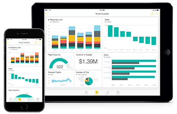

<properties 
   pageTitle="Power BI mobile app for iOS devices"
   description="View and interact with your company's Power BI dashboards and reports, and Reporting Services mobile reports and KPIs, from anywhere."
   services="powerbi" 
   documentationCenter="" 
   authors="maggiesMSFT" 
   manager="mblythe" 
   backup=""
   editor=""
   tags=""
   qualityFocus="no"
   qualityDate=""/>
 
<tags
   ms.service="powerbi"
   ms.devlang="NA"
   ms.topic="article"
   ms.tgt_pltfrm="NA"
   ms.workload="powerbi"
   ms.date="09/30/2016"
   ms.author="maggies"/>

# Power BI mobile app for iOS: Your dashboards and reports on iPad, iPhone, Apple Watch, and iPod Touch

The Microsoft Power BI app for iOS delivers the mobile BI experience on iPad, iPhone, Apple Watch, and iPod Touch. The apps provide live, touch-enabled mobile access to your important business information, so you can view and interact with your company's Power BI dashboards and reports, and Reporting Services mobile reports and KPIs, from anywhere. Explore the data in your dashboards, and share them with your colleagues in email or text messages.

Go to <bpt id="p1">[</bpt>Power BI<ept id="p1">](http://go.microsoft.com/fwlink/?LinkID=513879)</ept> to sign up for the Power BI service.

See <bpt id="p1">[</bpt>what's new in the Power BI mobile apps<ept id="p1">](powerbi-mobile-whats-new-in-the-mobile-apps.md)</ept>.

## iPad app for Power BI

Get started with the <bpt id="p1">[</bpt>iPad app for Power BI for iOS<ept id="p1">](powerbi-mobile-ipad-app-get-started.md)</ept>.

-   Download the <bpt id="p1">[</bpt>iPad app<ept id="p1">](http://go.microsoft.com/fwlink/?LinkId=522062)</ept> (Power BI for iOS).

### Power BI dashboards and reports

-   View your <bpt id="p1">[</bpt>Power BI dashboards<ept id="p1">](powerbi-mobile-dashboards-on-the-ipad-app.md)</ept>.
-   Interact with <bpt id="p1">[</bpt>tiles on your Power BI dashboards<ept id="p1">](powerbi-mobile-tiles-in-the-ipad-app.md)</ept>.
-   Open <bpt id="p1">[</bpt>Power BI reports<ept id="p1">](powerbi-mobile-reports-on-the-ipad-app.md)</ept> from your dashboard.
-   <bpt id="p1">[</bpt>Share Power BI dashboards<ept id="p1">](powerbi-mobile-share-dashboards-from-the-ipad-app.md)</ept>.
-   <bpt id="p1">[</bpt>Annotate and share a snapshot<ept id="p1">](powerbi-mobile-annotate-and-share-a-snapshot-from-the-ipad-app.md)</ept> of a tile.
-   View your <bpt id="p1">[</bpt>groups' Power BI dashboards and reports<ept id="p1">](powerbi-service-mobile-groups-in-the-ipad-app.md)</ept>.

### Mobile reports and KPIs in the Reporting Services web portal

- <bpt id="p1">[</bpt>View SQL Server mobile reports and KPIs<ept id="p1">](powerbi-mobile-ipad-kpis-mobile-reports.md)</ept> on the Reporting Services web portal.
- Create <bpt id="p1">[</bpt>KPIs on the Reporting Services web portal<ept id="p1">](https://msdn.microsoft.com/library/mt683632.aspx)</ept>.
- <bpt id="p1">[</bpt>Create your own mobile reports with the SQL Server Mobile Report Publisher<ept id="p1">](https://msdn.microsoft.com/library/mt652547.aspx)</ept>, and publish them to the Reporting Services web portal.

## Power BI app for iOS for iPhone, Apple Watch, or iPod Touch

Get started with the <bpt id="p1">[</bpt>Power BI app for iOS<ept id="p1">](powerbi-mobile-iphone-app-get-started.md)</ept> on an iPhone, Apple Watch, or iPod Touch.

-   Download the <bpt id="p1">[</bpt>Power BI app for iOS<ept id="p1">](http://go.microsoft.com/fwlink/?LinkId=522062)</ept>.

### Power BI dashboards and reports

-   View your <bpt id="p1">[</bpt>Power BI dashboards<ept id="p1">](powerbi-mobile-dashboards-in-the-iphone-app.md)</ept>.
-   Interact with <bpt id="p1">[</bpt>tiles<ept id="p1">](powerbi-mobile-tiles-in-the-iphone-app.md)</ept> on your dashboards.
-   Set <bpt id="p1">[</bpt>data alerts<ept id="p1">](powerbi-mobile-set-data-alerts-in-the-iphone-app.md)</ept> for your data.
-   Share <bpt id="p1">[</bpt>Power BI dashboards<ept id="p1">](powerbi-mobile-share-a-dashboard-from-the-iphone-app.md)</ept>.
-   Annotate and <bpt id="p1">[</bpt>share tiles<ept id="p1">](powerbi-mobile-annotate-and-share-a-tile-from-the-iphone-app.md)</ept>.
-   <bpt id="p1">[</bpt>Scan a Power BI QR code<ept id="p1">](powerbi-mobile-qr-code-for-tile.md)</ept> from your iPhone
-   <bpt id="p1">[</bpt>Create picture tiles<ept id="p1">](powerbi-mobile-picture-tiles-in-the-iphone-app.md)</ept> with your iPhone app

### Mobile reports and KPIs in the Reporting Services web portal

- <bpt id="p1">[</bpt>View SQL Server mobile reports and KPIs<ept id="p1">](powerbi-mobile-iphone-kpis-mobile-reports.md)</ept> on the Reporting Services web portal.
- Create <bpt id="p1">[</bpt>KPIs on the Reporting Services web portal<ept id="p1">](https://msdn.microsoft.com/library/mt683632.aspx)</ept>.
- <bpt id="p1">[</bpt>Create your own mobile reports with the SQL Server Mobile Report Publisher<ept id="p1">](https://msdn.microsoft.com/library/mt652547.aspx)</ept>, and publish them to the Reporting Services web portal.

## Get started with Power BI

Start by <bpt id="p1">[</bpt>getting your data<ept id="p1">](powerbi-service-get-data.md)</ept> from sources as varied as Excel spreadsheets, SQL Server Analysis Services, Salesforce, and and GitHub.

Then bring your data together by creating <bpt id="p1">[</bpt>dashboards<ept id="p1">](powerbi-service-dashboards.md)</ept> and <bpt id="p2">[</bpt>reports<ept id="p2">](powerbi-service-reports.md)</ept> in Power BI.

Now experience them in the Power BI apps for iOS.

### Consulte también

- [Get started with Power BI](powerbi-service-get-started.md)
- Questions? [Try asking the Power BI Community](http://community.powerbi.com/)
