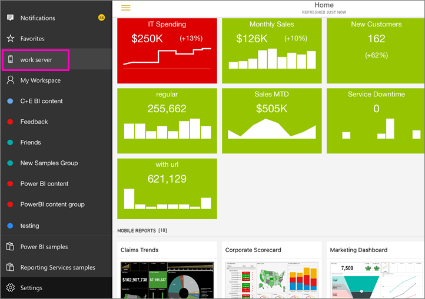
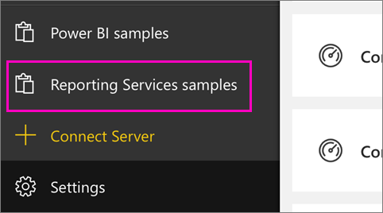
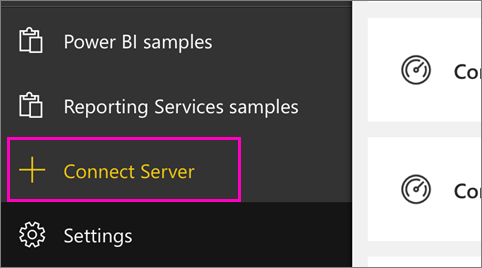
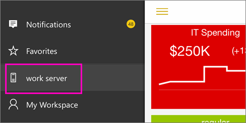
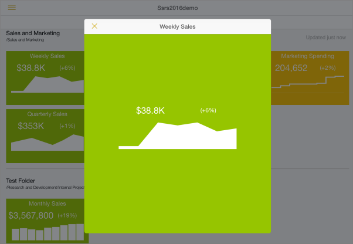
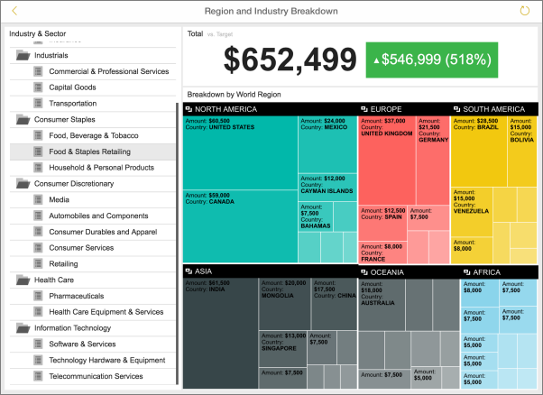
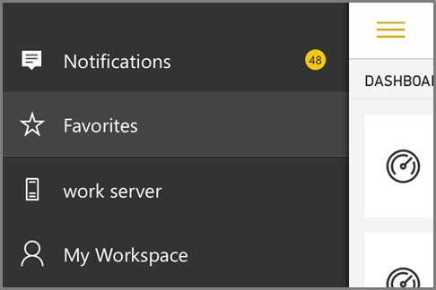
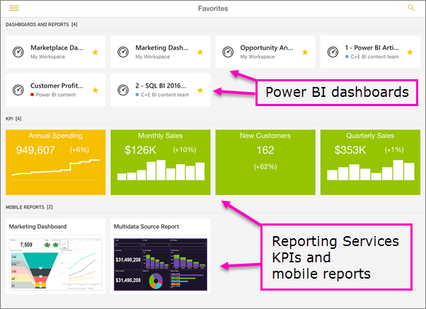

<properties 
   pageTitle="View Reporting Services mobile reports and KPIs in the iPad app"
   description="The iPad app (Power BI for iOS) offers live, touch-enabled mobile access to your important on-premises business information."
   services="powerbi" 
   documentationCenter="" 
   authors="maggiesMSFT" 
   manager="erikre" 
   backup=""
   editor=""
   tags=""
   qualityFocus="no"
   qualityDate=""/>
 
<tags
   ms.service="powerbi"
   ms.devlang="NA"
   ms.topic="article"
   ms.tgt_pltfrm="NA"
   ms.workload="powerbi"
   ms.date="10/11/2016"
   ms.author="maggies"/>

# View Reporting Services mobile reports and KPIs in the iPad app (Power BI for iOS)  

The iPad app for Microsoft Power BI for iOS offers live, touch-enabled mobile access to your important on-premises business information. 

First things first:

-  Create <bpt id="p1">[</bpt>Reporting Services mobile reports<ept id="p1">](https://msdn.microsoft.com/library/mt652547.aspx)</ept> with SQL Server Mobile Report Publisher and publish them to the <bpt id="p2">[</bpt>Reporting Services web portal<ept id="p2">](https://msdn.microsoft.com/library/mt637133.aspx)</ept>. 
-  Create <bpt id="p1">[</bpt>KPIs on the Reporting Services web portal<ept id="p1">](https://msdn.microsoft.com/library/mt683632.aspx)</ept>. Organize them in folders and mark your favorites, so you can find them easily. 

Then in the iPad app for Power BI, view the mobile reports and KPIs, organized in folders or collected as favorites. 

> [AZURE.NOTE]  Your iPad needs to be running at least iOS 8.0. 

## Explore samples without an SSRS server

Even if you don't have access to a Reporting Services web portal, you can still explore the features of Reporting Services mobile reports. 

-  Tap the global navigation button <ph id="ph1"></ph> in the upper-left corner, scroll down and tap <bpt id="p1">**</bpt>Reporting Services samples<ept id="p1">**</ept>.

    

Browse the samples to interact with KPIs and mobile reports.

## Connect to a server to view Reporting Services mobile reports 

1.  In the iPad, open the Power BI app.
  
2.  Tap the global navigation button <ph id="ph1"></ph> in the upper-left corner, and tap <bpt id="p1">**</bpt>Connect Server<ept id="p1">**</ept>.

    

4. Fill in the server address and your user name and password.

    ><bpt id="p1">**</bpt>Note<ept id="p1">**</ept>: Include <bpt id="p2">**</bpt>http<ept id="p2">**</ept> or <bpt id="p3">**</bpt>https<ept id="p3">**</ept> in front of the connection string. For example, http://<bpt id="p1">*</bpt>servername<ept id="p1">*</ept>.com/reports.

    (Optional) Tap <bpt id="p1">**</bpt>Advanced options<ept id="p1">**</ept> to give the server a name.

5.  Tap <bpt id="p1">**</bpt>Connect<ept id="p1">**</ept>. 

6.  Now you see the server in the left navigation bar.

    

><bpt id="p1">**</bpt>Tip<ept id="p1">**</ept>: Tap the global navigation button <ph id="ph1"></ph> anytime to go between your Reporting Services mobile reports and your dashboards in the Power BI service. 

## View Reporting Services KPIs and mobile reports in the Power BI app

Reporting Services KPIs and mobile reports are displayed in the same folders they're in on the Reporting Services web portal. 

- Tap a KPI to see it in focus mode.

    

- Tap a mobile report to open and interact with it in the Power BI app.

    

## View your favorite KPIs and reports

You can mark KPIs and mobile reports as favorites on your Reporting Services web portal, and then view them in one convenient folder on your iPad, along with your Power BI favorite dashboards and reports.

-  Tap <bpt id="p1">**</bpt>Favorites<ept id="p1">**</ept>.

    
   
    Your favorites from the web portal are all on this page.

    

## Remove a connection to a report server

You can only be connected to one report server at a time from your iPad app. If you want to connect to a different server, you need to disconnect from the current one.

1. At the bottom of the left navigation bar, tap <bpt id="p1">**</bpt>Settings<ept id="p1">**</ept>.
2. Tap the server name you don't want to be connected to.
3. Tap <bpt id="p1">**</bpt>Remove Connection<ept id="p1">**</ept>.

## Create Reporting Services mobile reports and KPIs

You don't create Reporting Services KPIs and mobile reports in the Power BI mobile app. You create them in SQL Server Mobile Report Publisher and a SQL Server 2016 Reporting Services web portal.

- <bpt id="p1">[</bpt>Create your own Reporting Services mobile reports<ept id="p1">](https://msdn.microsoft.com/library/mt652547.aspx)</ept>, and publish them to the Reporting Services web portal.
- Create <bpt id="p1">[</bpt>KPIs on the Reporting Services web portal<ept id="p1">](https://msdn.microsoft.com/library/mt683632.aspx)</ept>

### Consulte también  
- <bpt id="p1">[</bpt>Get started with the iPad app for Power BI<ept id="p1">](powerbi-mobile-ipad-app-get-started.md)</ept>  
- <bpt id="p1">[</bpt>Get started with Power BI<ept id="p1">](powerbi-service-get-started.md)</ept>  
- Questions? <bpt id="p1">[</bpt>Try asking the Power BI Community<ept id="p1">](http://community.powerbi.com/)</ept>