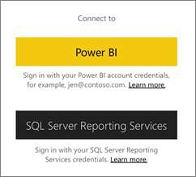
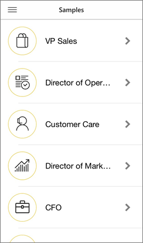

<properties 
   pageTitle="Get started with the Power BI app for iOS on an iPhone"
   description="The Microsoft Power BI app for iOS on the iPhone or iPod Touch is part of the mobile BI experience for Power BI and Reporting Services."
   services="powerbi" 
   documentationCenter="" 
   authors="maggiesMSFT" 
   manager="mblythe" 
   backup=""
   editor=""
   tags=""
   qualityFocus="complete"
   qualityDate="05/02/2016"/>
 
<tags
   ms.service="powerbi"
   ms.devlang="NA"
   ms.topic="article"
   ms.tgt_pltfrm="NA"
   ms.workload="powerbi"
   ms.date="10/03/2016"
   ms.author="maggies"/>

# Get started with the Power BI app for iOS on an iPhone or iPod Touch

The Microsoft Power BI for iOS app, on the iPhone or iPod Touch, is part of the mobile BI experience for Power BI and Reporting Services. With live, touch-enabled mobile access to your important business information on premises and in the cloud, you can view and interact with your company dashboards easily, from anywhere. Explore the data in dashboards, and share them with your colleagues in email or text messages. And keep up to date with your most timely data on your <bpt id="p1">[</bpt>Apple Watch<ept id="p1">](powerbi-mobile-apple-watch.md)</ept>.  

You <bpt id="p1">[</bpt>create dashboards and reports in the Power BI service<ept id="p1">](powerbi-service-get-started.md)</ept> with your data. 

Then interact with your dashboards and reports, explore the data, and share them, all from the iPhone app for Power BI.

You can also <bpt id="p1">[</bpt>view Reporting Services KPIs and mobile reports for your on-premises data<ept id="p1">](powerbi-mobile-ipad-kpis-mobile-reports.md)</ept> in the iPhone app for Power BI. You <bpt id="p1">[</bpt>create those KPIs and mobile reports with the SQL Server Mobile Report Publisher<ept id="p1">](https://msdn.microsoft.com/library/mt652547.aspx)</ept>.

Find out <bpt id="p1">[</bpt>what's new in the Power Bi mobile apps<ept id="p1">](powerbi-mobile-whats-new-in-the-mobile-apps.md)</ept>.

## Download the app

<bpt id="p1">[</bpt>Download the iOS app<ept id="p1">]</ept><bpt id="p2">(http://go.microsoft.com/fwlink/?LinkId=522062 "</bpt>Download the iPhone app<ept id="p2">")</ept>  from the Apple App Store to your iPhone or iPod Touch.

><bpt id="p1">**</bpt>Note<ept id="p1">**</ept>: You can run the Power BI for iOS app on iPhone 5 and above, with iOS 9.0 or later. You can also run it on an iPod Touch with iOS 9.0 or later.

## Sign up for the Power BI service

Go to <bpt id="p1">[</bpt>Power BI to sign up<ept id="p1">](http://go.microsoft.com/fwlink/?LinkID=513879)</ept> for the service, if you haven't already. It's free.

## Get started with the Power BI app 

1.  In the iPhone, open the Power BI app.
  
2.  To view your Power BI dashboards, tap <bpt id="p1">**</bpt>Power BI<ept id="p1">**</ept>.  
   To view your Reporting Services mobile reports and KPIs, tap <bpt id="p1">**</bpt>SQL Server Reporting Services<ept id="p1">**</ept>.

    

    ><bpt id="p1">**</bpt>Tip<ept id="p1">**</ept>: When you're in the app, tap the global navigation button <ph id="ph1"></ph> in the upper-left corner to go between the two. 

## Try the Power BI and Reporting Services samples  
Even without signing up, you can play with the Power BI and Reporting Services samples. After you download the app, you can view the samples or get started. Go back to the samples whenever you want from the global navigation.

### Power BI samples

You can view and interact with the Power BI dashboard samples, but there are a few things you can't do with them. You can't open the reports behind the dashboards, share the samples with others, or make them your favorites.

1.   Tap the global navigation button <ph id="ph1"></ph> in the upper-left corner.
  
2.   Tap <bpt id="p1">**</bpt>Power BI samples<ept id="p1">**</ept>, then pick a role and explore the sample dashboard for that role.  

    

    ><bpt id="p1">**</bpt>Note<ept id="p1">**</ept>:  Not all features are available in the samples. For example, you can't view the sample reports that underlie the dashboards. 

### Reporting Services mobile report samples

1.   Tap the global navigation button <ph id="ph1"></ph> in the upper-left corner.

2.  Tap <bpt id="p1">**</bpt>Reporting Services samples<ept id="p1">**</ept>, then open either the Retail Reports or the Sales Reports folder to explore their KPIs and mobile reports.

    

## ¿Qué debo hacer a continuación?

See what else you can do in the iPhone app with dashboards in Power BI, and Reporting Services mobile reports and KPIs in the Reporting Services web portal.

### Power BI dashboards

-   View your <bpt id="p1">[</bpt>Power BI dashboards<ept id="p1">](powerbi-mobile-dashboards-in-the-iphone-app.md)</ept>.
-   Interact with <bpt id="p1">[</bpt>tiles<ept id="p1">](powerbi-mobile-tiles-in-the-iphone-app.md)</ept> on your dashboards.
-   View your Power BI tiles on your <bpt id="p1">[</bpt>Apple Watch<ept id="p1">](powerbi-mobile-apple-watch.md)</ept>.
-   Set <bpt id="p1">[</bpt>data alerts<ept id="p1">](powerbi-mobile-set-data-alerts-in-the-iphone-app.md)</ept> for your data.
-   Share <bpt id="p1">[</bpt>Power BI dashboards<ept id="p1">](powerbi-mobile-share-a-dashboard-from-the-iphone-app.md)</ept>.
-   Annotate and <bpt id="p1">[</bpt>share tiles<ept id="p1">](powerbi-mobile-annotate-and-share-a-tile-from-the-iphone-app.md)</ept>.
-   <bpt id="p1">[</bpt>Scan a Power BI QR code<ept id="p1">](powerbi-mobile-qr-code-for-tile.md)</ept> from your iPhone
-   <bpt id="p1">[</bpt>Create picture tiles<ept id="p1">](powerbi-mobile-picture-tiles-in-the-iphone-app.md)</ept> with your iPhone app.
-   View <bpt id="p1">[</bpt>notifications about updates to your Power BI account<ept id="p1">](powerbi-mobile-notification-center.md)</ept>, such as dashboards that colleagues share with you.

### Reporting Services mobile reports and KPIs

- <bpt id="p1">[</bpt>View Reporting Services mobile reports and KPIs<ept id="p1">](powerbi-mobile-iphone-kpis-mobile-reports.md)</ept> on the Reporting Services web portal.
- Create <bpt id="p1">[</bpt>KPIs on the Reporting Services web portal<ept id="p1">](https://msdn.microsoft.com/library/mt683632.aspx)</ept>.
- Create <bpt id="p1">[</bpt>your own mobile reports with the SQL Server Mobile Report Publisher<ept id="p1">](https://msdn.microsoft.com/library/mt652547.aspx)</ept>, and publish them to the Reporting Services web portal.

### Consulte también

- [Get started with Power BI](powerbi-service-get-started.md)
- Questions? [Try asking the Power BI Community](http://community.powerbi.com/)