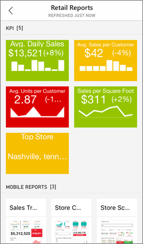

<properties 
   pageTitle="Introducción a la aplicación de Power BI para iOS en un iPhone"
   description="La aplicación Microsoft Power BI para iOS en el iPhone o iPod Touch forma parte de la experiencia móvil de BI para Power BI y Reporting Services."
   services="powerbi" 
   documentationCenter="" 
   authors="maggiesMSFT" 
   manager="mblythe" 
   backup=""
   editor=""
   tags=""
   qualityFocus="complete"
   qualityDate="05/02/2016"/>
 
<tags
   ms.service="powerbi"
   ms.devlang="NA"
   ms.topic="article"
   ms.tgt_pltfrm="NA"
   ms.workload="powerbi"
   ms.date="10/03/2016"
   ms.author="maggies"/>

# Introducción a la aplicación de Power BI para iOS en un iPhone o iPod Touch

Microsoft Power BI para aplicación de iOS, en el iPhone o iPod Touch, forma parte de la experiencia móvil de BI para Power BI y Reporting Services. Con acceso móvil directo y táctil a la información empresarial importante de forma local y en la nube, puede ver e interactuar con sus paneles de empresa fácilmente, desde cualquier lugar. Explorar los datos en paneles y compártalos con sus colegas en mensajes de correo electrónico o texto. Y mantener al día con los datos más puntual en su [de Apple Watch](powerbi-mobile-apple-watch.md).  

Se [crear paneles e informes en el servicio de Power BI](powerbi-service-get-started.md) con los datos. 

A continuación, interactuar con los paneles e informes, explorar los datos y compartirlos desde la aplicación de iPhone para Power BI.

También puede [Ver informes móviles para los datos locales y Reporting Services KPI](powerbi-mobile-ipad-kpis-mobile-reports.md) en la aplicación de iPhone para Power BI. Se [crear los KPI y los informes de dispositivos móviles con el publicador de SQL Server Mobile informe](https://msdn.microsoft.com/library/mt652547.aspx).

Descubra [Novedades en las aplicaciones móviles de Power Bi](powerbi-mobile-whats-new-in-the-mobile-apps.md).

## Descargar la aplicación

            [Descargar la aplicación iOS](http://go.microsoft.com/fwlink/?LinkId=522062 "Descargar la aplicación de iPhone")  desde la tienda de aplicaciones de Apple en su iPhone o iPod Touch.

>
            **Nota**: puede ejecutar Power BI para aplicación de iOS en iPhone 5 y versiones posteriores, con iOS 9.0 o posterior. También se puede ejecutar en un iPod Touch con iOS 9.0 o posterior.

## Registrarse para el servicio Power BI

Vaya a [Power BI para suscribirse](http://go.microsoft.com/fwlink/?LinkID=513879) para el servicio, si no lo ha hecho ya. Es gratuito.

## Introducción a la aplicación Power BI 

1.  En el explorador, abra la aplicación Power BI.
  
2.  Para ver los paneles de Power BI, puntee **Power BI**.  
   Para ver los informes de Reporting Services móviles y KPI, puntee **SQL Server Reporting Services**.

    

    >
            **Sugerencia**: cuando se encuentra en la aplicación, puntee en el botón de navegación global  en la esquina superior izquierda para desplazarse entre los dos. 

## Pruebe los ejemplos de Power BI y Reporting Services  
Incluso sin registrarse, puede reproducir con los ejemplos de Power BI y Reporting Services. Después de descargar la aplicación, puede ver los ejemplos o empezar a trabajar. Volver a los ejemplos siempre que desee en la barra de navegación global.

### Ejemplos de Power BI

Puede ver e interactuar con los ejemplos de panel de Power BI, pero hay algunas cosas que no puede hacer con ellos. No se puede abrir los informes de los paneles, compartir los ejemplos con otros usuarios o que sean sus favoritos.

1.   Puntee en el botón de navegación global  en la esquina superior izquierda.
  
2.   Puntee en **ejemplos de Power BI**, elija un rol y explore el panel de ejemplo para ese rol.  

    

    >
            **Nota**: no todas las características están disponibles en los ejemplos. Por ejemplo, no puede ver los informes de ejemplo que subyacen a los paneles. 

### Ejemplos de Reporting Services informe móvil

1.   Puntee en el botón de navegación global  en la esquina superior izquierda.

2.  Puntee en **ejemplos de Reporting Services**, a continuación, abra los informes de venta directa o la carpeta de informes de ventas para explorar sus KPI y los informes de dispositivos móviles.

    

## ¿Qué debo hacer a continuación?

Vea lo que puede hacer en la aplicación de iPhone con paneles de Power BI, informes de Reporting Services móviles y KPI en el portal web de Reporting Services.

### Paneles de Power BI

-   Ver su [paneles de Power BI](powerbi-mobile-dashboards-in-the-iphone-app.md).
-   Interactuar con [mosaicos](powerbi-mobile-tiles-in-the-iphone-app.md) en los paneles.
-   Vista en mosaico su Power BI en su [de Apple Watch](powerbi-mobile-apple-watch.md).
-   Establecer [alertas de datos](powerbi-mobile-set-data-alerts-in-the-iphone-app.md) para los datos.
-   Recurso compartido [paneles de Power BI](powerbi-mobile-share-a-dashboard-from-the-iphone-app.md).
-   Anotar y [compartir mosaicos](powerbi-mobile-annotate-and-share-a-tile-from-the-iphone-app.md).
-   
            [Analizar un código QR de Power BI](powerbi-mobile-qr-code-for-tile.md) en su iPhone
-   
            [Crear iconos de imagen](powerbi-mobile-picture-tiles-in-the-iphone-app.md) con su aplicación de iPhone.
-   Vista [notificaciones sobre las actualizaciones a su cuenta de Power BI](powerbi-mobile-notification-center.md), como paneles de colegas compartan con usted.

### Informes informes de servicios móviles y KPI

- 
            [Ver informes de Reporting Services móviles y KPI](powerbi-mobile-iphone-kpis-mobile-reports.md) en el portal web de Reporting Services.
- Crear [KPI en el portal web de Reporting Services](https://msdn.microsoft.com/library/mt683632.aspx).
- Crear [sus propios informes con el publicador de informes de SQL Server Mobile móviles](https://msdn.microsoft.com/library/mt652547.aspx), y publíquelos en el portal web de Reporting Services.

### Consulte también

- [Introducción a Power BI](powerbi-service-get-started.md)
- ¿Tiene preguntas? [Pruebe a formular a la Comunidad de Power BI](http://community.powerbi.com/)