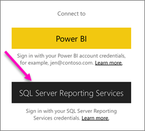
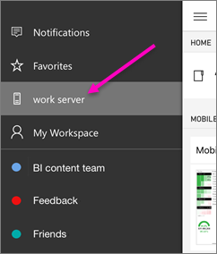
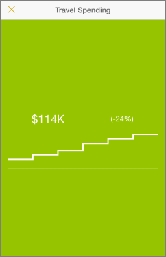
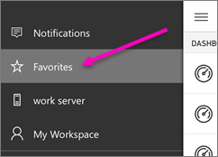

<properties 
   pageTitle="Ver informes de Reporting Services móviles y los KPI en la aplicación de iPhone"
   description="La aplicación de iPhone (Power BI para iOS) ofrece acceso móvil directo y táctil a la información de negocios importante en local."
   services="powerbi" 
   documentationCenter="" 
   authors="maggiesMSFT" 
   manager="mblythe" 
   backup=""
   editor=""
   tags=""
   qualityFocus="no"
   qualityDate=""/>
 
<tags
   ms.service="powerbi"
   ms.devlang="NA"
   ms.topic="article"
   ms.tgt_pltfrm="NA"
   ms.workload="powerbi"
   ms.date="10/18/2016"
   ms.author="maggies"/>

# Ver informes de Reporting Services de SQL Server mobile y KPI en la aplicación de iPhone (Power BI para iOS)  

La aplicación de iPhone para Microsoft Power BI para iOS ofrece acceso móvil directo y táctil a la información de negocios importante en local. 

 

            [Crear informes de Reporting Services móviles](https://msdn.microsoft.com/library/mt652547.aspx) con el publicador de SQL Server Mobile informes y publicarlos en la [portal web de Reporting Services](https://msdn.microsoft.com/library/mt637133.aspx). Crear KPI derecha en el portal web. Organizarlos en carpetas y marcar los favoritos para que pueda encontrar fácilmente. 

A continuación, en la aplicación de iPhone para Power BI, ver los informes móviles y KPI, organizados en carpetas o recopilados como favoritos. 

>
            **Nota**: su iPhone debe ser al menos un iPhone 5, que se ejecute como mínimo iOS 9.0.

## Explorar ejemplos sin un servidor SSRS

Incluso si no tiene acceso a un portal web de Reporting Services, todavía puede explorar las características de informes de Reporting Services móviles. 

1. Puntee en el botón de navegación global  en la esquina superior izquierda, desplácese hacia abajo y pulsa **ejemplos de Reporting Services**.

2.  Vaya a interactuar con los ejemplos de KPI y los informes móviles.

    

## Conectarse a un servidor para ver los informes de Reporting Services móviles 

1.  En el explorador, abra la aplicación Power BI.
  
2.  Para ver los informes de Reporting Services móviles y KPI, puntee **SQL Server Reporting Services**.

    

    Si ya está en la aplicación Power BI, puntee en el botón de navegación global  en la esquina superior izquierda y puntee **Conectar servidor**.

    

4. Rellene la dirección del servidor y su nombre de usuario y contraseña.

    >
            **Nota**: incluir **http** o **https** delante de la cadena de conexión. Por ejemplo, http://*nombreDeServidor*.com/reports.

    Puntee en **opción avanzada** para asignar al servidor un nombre, si lo desea.

5.  Ahora verá que el servidor en la barra de navegación izquierdo, en este ejemplo, llama "profesional de servidor".

    

>
            **Sugerencia**: pulse el botón de navegación global  en cualquier momento a vaya entre los informes de Reporting Services móviles y los paneles en el servicio Power BI. 

## KPI de vista Reporting Services e informes móviles en la aplicación Power BI

Reporting Services KPI e informes móviles se muestran en las mismas carpetas estuvieran en el portal web de Reporting Services. 

- Puntee en un KPI para verlo en modo de enfoque.

    

- Puntee en un informe móvil para abrir e interactuar con él en la aplicación de Power BI.

    

## Ver los KPI y los informes favoritos

Puede marcar KPI e informes móviles como favoritos en el portal web de Reporting Services y, a continuación, verlos en una carpeta adecuada en su iPhone, junto con los informes y paneles de Power BI favoritos.

-  Puntee en **favoritos**.

    
   
    Son los favoritos desde el portal web en esta página.

    

## Quitar una conexión a un servidor de informes

Solo se conectar a un servidor de informes a la vez desde su aplicación de iPhone. Si desea conectarse a un servidor diferente, debe desconectar de la actual.

1. En la parte inferior de la barra de navegación izquierdo, puntee **configuración**.
2. Puntee en el nombre del servidor que no desea estar conectado a.
3. Puntee en **Quitar servidor**.

## Crear informes de Reporting Services móviles y KPI

No se crean informes móviles y Reporting Services KPI en la aplicación móvil de Power BI. Se crea en el publicador de SQL Server Mobile informes y un portal web de SQL Server 2016 Reporting Services.

- 
            [Crear sus propios informes de Reporting Services móviles](https://msdn.microsoft.com/library/mt652547.aspx), y publíquelos en el portal web de Reporting Services.
- Crear [KPI en el portal web de Reporting Services](https://msdn.microsoft.com/library/mt683632.aspx)

### Consulte también  
- 
            [Introducción a la aplicación de iPhone para Power BI](powerbi-mobile-iphone-app-get-started.md)  
- 
            [Introducción a Power BI](powerbi-service-get-started.md)  
- ¿Tiene preguntas? 
            [Pruebe a formular a la Comunidad de Power BI](http://community.powerbi.com/)